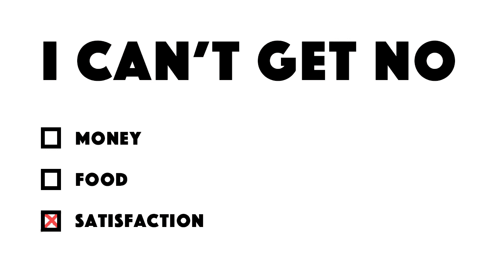

# 这就是为什么我们得不到任何满足

> 原文：<https://medium.com/swlh/this-is-why-we-cant-get-no-satisfaction-5f41aac88606>

## 也不是你想的那样。

自从滚石乐队发布他们的热门歌曲*‘(我不能不)满意’*以来，差不多 55 年过去了，然而今天它似乎比以往任何时候都更有意义。

**我们生活在一个缺乏满足感的世界。无论我们多么努力——无论我们做什么或去哪里——都永远不够。我的工作报酬很高，但我还能挣更多。我的国外旅行很有趣…**