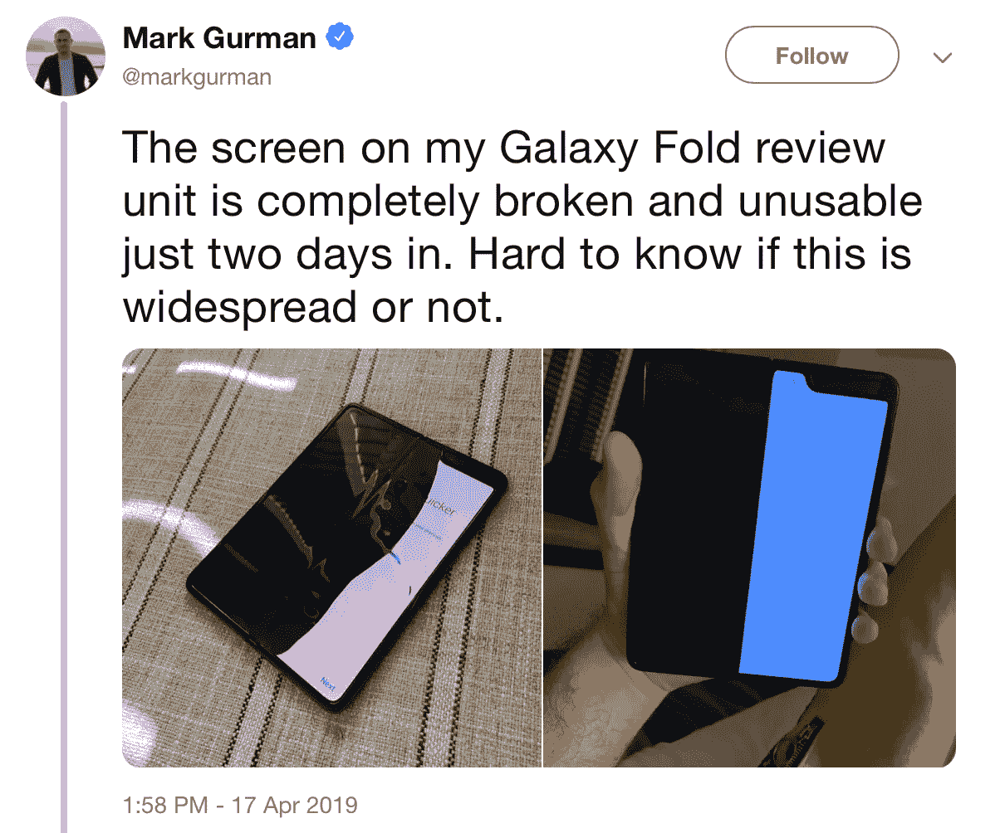

# 这就是为什么我们不运送原型

> 原文：<https://medium.com/swlh/this-is-why-we-dont-ship-prototypes-438400171a1e>

Spoiler alert: [Mark Gurman](https://twitter.com/markgurman/status/1118574467255418880) is not the only person with a broken Samsung Galaxy Fold.

三星 Galaxy Fold 甚至还没有推出，就已经开始陆续出现问题。

折叠计算设备的想法具有值得探索的优点。但是——但是——想法是廉价的。执行是昂贵的。

三星正在艰难地学习这一点。

三星正在用糟糕的实现方式推出早期技术。这是让市场变酸的好方法…