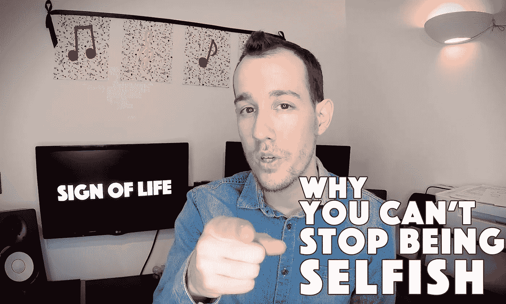

# 这就是为什么你不能停止自私

> 原文：<https://medium.com/swlh/this-is-why-you-cant-stop-being-selfish-3097d2e3cff7>

## 什么，你真的认为你不是吗？

在她的书*《自私的美德》中，安·兰德写道:*

> *"在流行用法中,‘自私’一词是邪恶的同义词."*

*她说得有道理。
如果我让你想到一个自私的人，会是谁？
**我们将“自私”这个词与消极联系在一起**。很可能是你…*