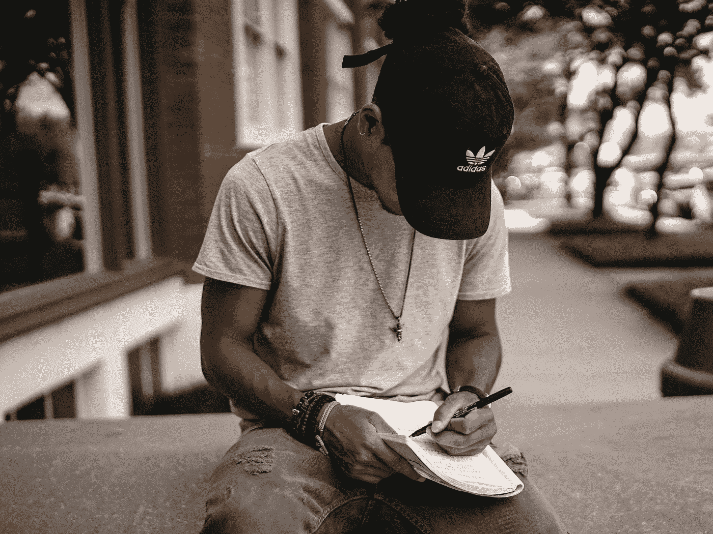

# 这就是你作为一个创意者不成功的原因

> 原文：<https://medium.com/swlh/this-is-why-youre-not-succeeding-as-a-creative-c368852ac931>

## 遇到抵抗，你新的最大的敌人

Photo by [Brad Neathery](https://unsplash.com/@bradneathery?utm_source=unsplash&utm_medium=referral&utm_content=creditCopyText) on [Unsplash](https://unsplash.com/search/photos/writing?utm_source=unsplash&utm_medium=referral&utm_content=creditCopyText)

每个作家、艺术家和创意人员都知道，在工作中有一件事是肯定的。最难的不是创作本身。最难的部分是坐下来创作。

当然，我们热爱我们的工作。我们享受这个过程。一旦我们全力以赴，我们就势不可挡。但是…