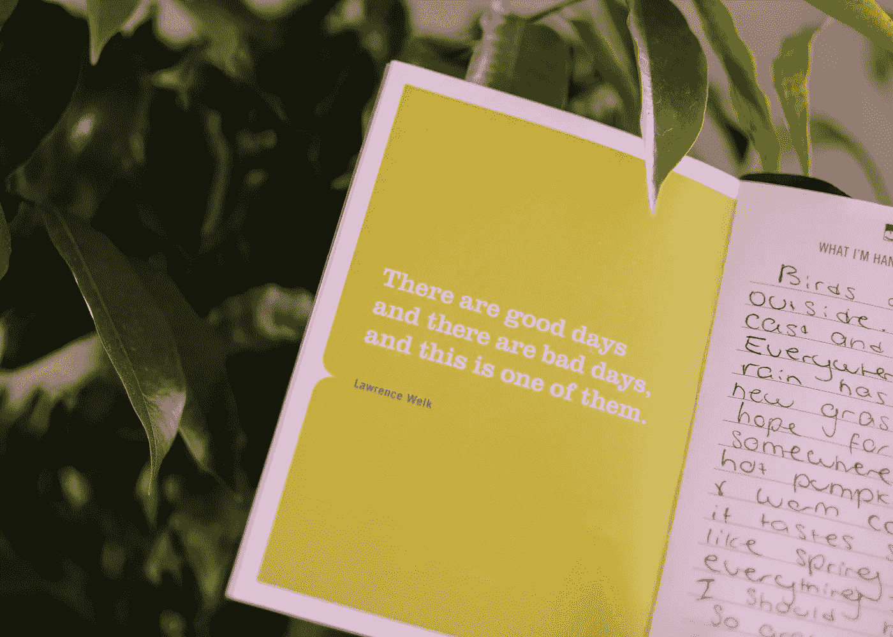

# 这本正念日志改变了我的思考方式。

> 原文：<https://medium.com/swlh/this-mindfulness-journal-has-changed-the-way-i-think-bdfc7d662f7>

我的姐姐在世界的另一端，在渥太华——一个对我来说很遥远的世界，这让我很担心。我最近过生日时，她送了我一本改变人生的日记，内容来自:

This journal has changed the way I think.

*一切都会好的:当我被逼近的灾难感和占据我的思想、身体和灵魂的明确和模糊的无所不包的恐惧所淹没时，一本安慰自己的日记……*

这只是标题的一半。但是请原谅我，这个日志的前提很简单。每一页都有一句你从未听说过的人的漂亮、振奋人心的话，在另一页有几行可以填写“为什么你今天坚持希望”。

过去一个月的每一天，我都花五分钟——手里拿着我最喜欢的笔和一杯甜茶——在这本日记中简单地写下*我为什么坚持今天的希望*。

# 5 分钟可以改变你的一天。

我今天过得很糟糕。没有什么特别的原因，我情绪低落，感觉就像透过一扇下雨的窗户看着周围的世界——遥远而寒冷。我们有时都会有这种感觉，但如果没有隐喻，我们无法有效地概括这种麻木的感觉。

> 有时候情绪可能是如此复杂，我们只能通过用隐喻来描述它们来开始理解它们。

我瘫在床上。我没有屈服于在毯子下爬行和在沙发上狂欢的冲动，而是伸手去拿我的日记。

我花了五分钟，我存在了一段时间。此刻。写下我周围的所见所感:

> “鸟儿在外面跳舞。天气阴阴的，很美。到处都是绿色的，雨水为某处的农民买了新草和希望……我应该感激。

真的很感激。也许只有五分钟，但这足以让我的头脑清醒一会儿。在世俗中寻找希望，然后无忧无虑地存在一段时间。

@jordan.white306 on Unspalsh. (me)

这个简单的正念行为改变了我的一天。不，我没有突然变得快乐和精力充沛——但是我很满足。心满意足地洗碗，而不是闷闷不乐。满足于我当时的感受，而不是为悲伤而悲伤。当你的大脑不想做任何事情，而是提醒你所有需要做的事情时，这可能是一个恶性循环。

# 它改变了我的思维方式。

> 忘记穿着别人的鞋子走一英里，试着在他们的脑海里度过一天。

我们都有挣扎、烦恼和焦虑。有些人比其他人更喜欢。

我是一个长期紧张的人，总的来说是一个焦虑的人。我对大学即将到来的最后期限感到紧张，尽管事实上还有几个月。我可以在脑海里一遍又一遍地回放社交互动，一玩就是几个小时，花很长时间才能睡着，因为我想啊想啊想。我会担心自己，直到感到恶心——我称之为*将自己遗忘*。

感觉到这些情绪是正常的，很好，但是我们的情绪不应该控制我们。*说起来容易做起来难，对吧？是的，我知道。*

我试过正念、冥想几个小时、怪异的呼吸练习以及与大自然联系，但都无济于事。

> 很少有事情能让我平静下来。

正念让我们暂时逃离烦恼。它活在当下，意识到现在的*。它采取多种形式——冥想、瑜伽、呼吸练习——来达到同样的效果。*

*写下我感激的事情这一简单的行为足以帮助我逃离，哪怕只是一小会儿。*

**

*“There are good days and there are bad days, and this is one of them.” Indeed it was.*

# *当你不确定要做什么时，试着做*自己*。*

*你不需要一本花哨的杂志来找到你生活中这种层次的内容。拿起记事本，你最喜欢的笔，坐一会儿。就写吧。*

> *写下你看到的，你感受到的，或者任何你他妈想写的。*

*这会帮助你理清思路，即使只是一小会儿。清理你的大脑五分钟可能不会扭转你糟糕的一天，但它会让你走上正确的轨道。*

*你可以带着这个。如果不是你的日志，那么你的技巧就是*用心地*。*

*当我在公交车上时——这个疯狂的司机以不可思议的速度在安静、多雨的阿德莱德街道上转弯——我环顾四周，把我看到的写在手机上。它帮助我逃离对即将到来的评估的恐惧，哪怕只是一小会儿。*

*我们都有烦恼和问题。要支付的账单，即将到来的最后期限；想知道我们如何度过这一周，并在周五晚上去酒吧。但是我们不能积极地解决问题，除非我们停止担忧并开始计划如何解决。*

*与其担心有多少事情要做，不如计划好如何完成。要做到这一点——停止担忧并开始计划——你需要理清思绪，暂时活在当下。*

*记住:有时候，你只需要五分钟就能让*成为*。*