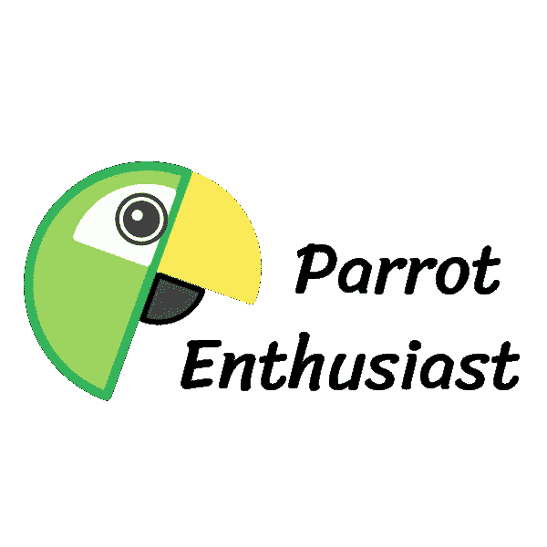
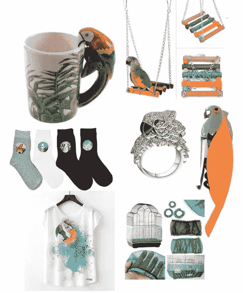
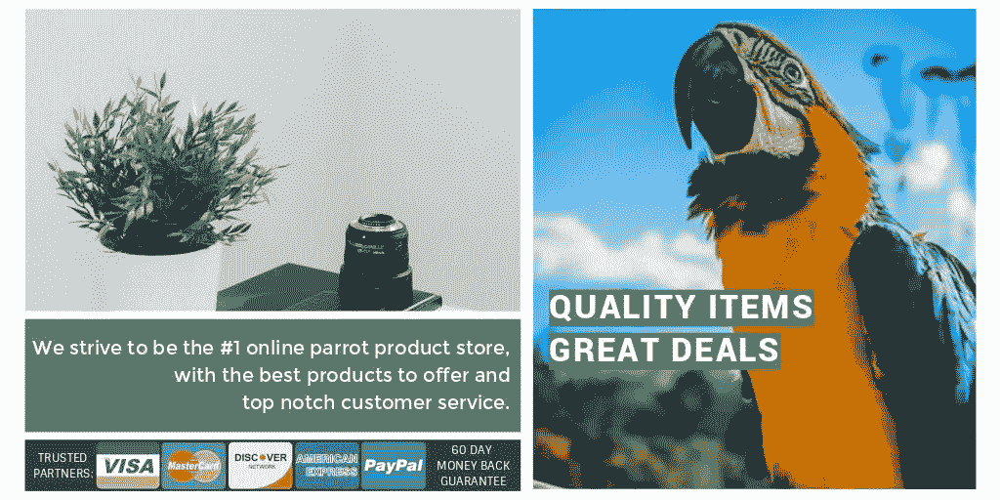

# 这只鹦鹉让我想起了卓越的企业家精神

> 原文：<https://medium.com/swlh/this-parrot-haunts-me-into-entrepreneurial-excellence-5587a3250686>

Photo by [Roberto Nickson](https://unsplash.com/@rpnickson?utm_source=medium&utm_medium=referral) on [Unsplash](https://unsplash.com?utm_source=medium&utm_medium=referral)

## 尽量不要评价太多。

有许多人开始创业时，首先应该记住他们为什么要这样做。在这种情况下，我忽略了“为什么”,而更多地关注于“如何”。我怎么能兼职赚更多的钱呢？

让我以我自己为例，这样你就可以花更多的时间在正确的“为什么”上。你的为什么。

对于那些精明的网上赚钱，你已经意识到现在有多种方法。这些包括带广告的博客，在出版物上写作，在易贝上销售，在亚马逊上销售，张贴附属链接，以及直运受欢迎的商品。

让我们放大一下我选择的方法。

直运是这样一个过程:找到一个没有得到满足的利基市场，通过在你的网站上为制造商的产品做广告，将这个利基市场中的人与制造商联系起来。

直运物品可以是任何东西，从适合户外露营者的时尚登山杖，到适合女性的“狗妈妈”t 恤，上面有一只对她们来说就像孩子一样的比熊犬。

我浏览网站，寻找已经服务于不同的直运利基市场的企业。金毛猎犬？[摄](https://www.officialgoldenretriever.com/shop-online?page=1)。兔子？[摄](http://www.bunnybunchboutique.com/store/)。不过，我在市场上发现了一个缺口:鹦鹉。

没有任何网上商店将鹦鹉所有者与鹦鹉玩具和古怪的鸟类主题衬衫和杯子联系起来！我不太喜欢鹦鹉和金刚鹦鹉，我的意思是它们很酷，但是谁能忽视这个开放的市场呢？

我创办了 ParrotEnthusiast.com，为鹦鹉和那些喜欢鹦鹉的人在网站上下载了几十件商品。

一旦在我的网站上购买了一件商品，我就会向一家中国制造商下订单，这家制造商会将产品直接邮寄给最终客户。电子包的运费只需一两美元，所以我把这笔费用算在价格里，并把我的产品作为“包括免费运费”出售。

天才。创新。我等不及电影翻拍了。

ParrotEnthusiast.com Logo that I created on Fotor.com

我开了一个 Instagram 页面。我开了一个脸书账户。我发了帖子，

并发布，

并发布，

…向美国的观众讲述鹦鹉，顺便说一下，这些观众大多是生活在温暖的州的中年妇女。

我创作了反映我精力水平的充满活力的广告:精力充沛。

然而，在一项新业务的兴奋消退后，我强迫嗡嗡的提醒悄悄进入我的一天，告诉我发布另一张照片，另一个迷因，另一个鹦鹉咀嚼玩具 30%的折扣。

但后来我终于意识到。

你在开玩笑吗？我在做什么？

我全身心地投入到这个主题中。我正在阅读有关锻炼技巧、营养知识、玩具安全和受欢迎的鹦鹉品种的信息。我强迫自己每天在网上发帖，这样我就能成为鹦鹉社区的一员。

但是后来帖子越来越少了。在一周的广播沉默后，我终于发现我不是在谈论鹦鹉，因为我喜欢它；我从事这个利基市场是因为我认为它能在网上赚钱。

不要误会我的意思，脸书的胡安妮塔、克劳地和贝蒂·罗斯正在用 20%的折扣购买金刚鹦鹉咖啡杯，吃掉我的傻鹦鹉图片。

但我没有。

**这里的妙语是，你不应该为了钱而创业，因为你最终会失去动力。**

对你来说，与你的客户打交道应该很有趣，因为*那群*人也是*你的*社区。

问问广大冲浪板店和攀岩馆老板。你认为他们是为了损益表、营业费用和员工税而来的吗？

自从我意识到这一点后，我就关闭了这个网站，将企业家的精力重新投入到我知道并愿意参与的领域。我开始对我所拥有的出租房产进行翻新，迫使房子升值。如果你问我是喜欢在我的脸书墙上贴鹦鹉图片，还是喜欢在我的浴室墙上贴瓷砖，我很乐意选择后者。

在从事一个需要宝贵时间、最不可偿还和有限资源的新项目之前，我记得我那可怕的警告:

> "只是不要让这是另一个鹦鹉爱好者网站."

## 好的一面

经营网店让我学到了新技能。如果你开了一家直运商店，你也将学习如何创建脸书广告、促销优惠和网站主页。

最重要的是，在我职业生涯的早期，我重视这个持续的**取样期**。

> 取样至关重要。

像挥动高尔夫球杆、下棋或组装宜家家具这样的程序性工作能更快地反馈你做得是否正确。程序性工作在开始时也有较高的满意率，因为你可以衡量进展。

然而，创业需要创造性的工作，这会让人感到抽象和沮丧。你会怀疑自己是否在正确的轨道上。积累一般技能的行为，也称为抽样，是让创造性工作者进步的原因。

企业家不会被给予同样的问题去解决或同样的程序去执行。*这个*客户可能需要与那个客户*不同的说服。*

变化就是为什么取样不同的小企业，就像我的鹦鹉商店，给你工具和经验来应对创造性工作遇到的新问题。失败是你前进的方式。

> 你想要成功的公式吗？双倍的失败率。
> 
> — IBM 的托马斯·J·沃森

有许多人开始创业时，首先应该记住他们为什么要这样做。在这种情况下，我忽略了“为什么”,而更多地关注于“如何”。不管“如何”有多好，我们都可以用[来提醒](/@scottwritescopy/want-to-ask-the-right-questions-place-a-tennis-ball-on-your-desk-a7e0e73ac2af)去解决一个对我们来说很重要的问题。我们的“为什么”

## **通过尝试新的行业，给自己一个发现新技能的机会。**

出问题的时候不要苛责自己。我试图在大联盟中建立一个网上鹦鹉商品商店，但失败了。

现在我将永远被一只鹦鹉困扰；它提醒我关注我热爱的社区，而不是金刚鹦鹉杯。

顺便说一句，goodsthingspotting.com 的[也有好事情发生。](https://goodthingspotting.com/)