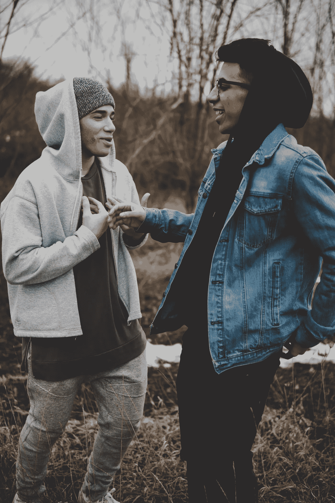

# 喜欢曾经讨厌的人的三课

> 原文：<https://medium.com/swlh/three-lessons-in-liking-someone-i-once-hated-59c7243fddb1>

By whereslugo from Unsplash.com

老实说，你讨厌很多东西。

你可能讨厌你的长鼻子、弯曲的膝盖、脸上的粉刺、乳房的大小，或者你有多矮。

你可能讨厌你的工作、生活状况、你开的车、你上班的通勤以及你公寓的风格。

这很好。