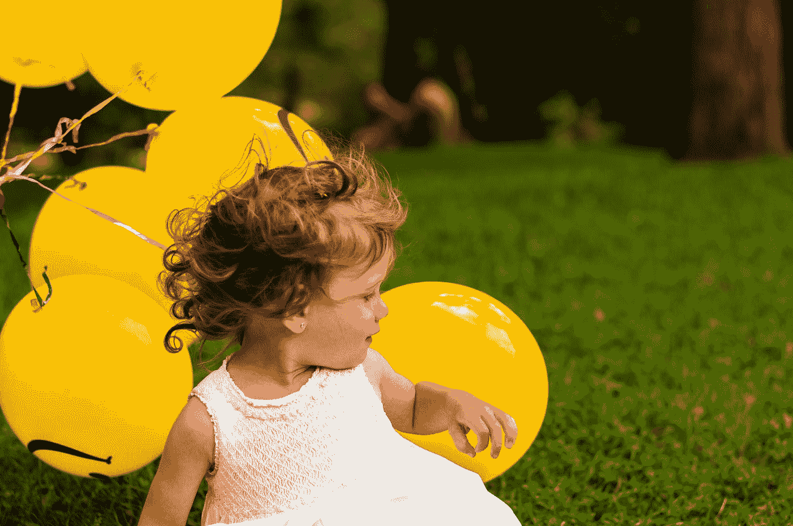

# 孩子本能地知道但大多数成年人却忘记了的三件事

> 原文：<https://medium.com/swlh/three-things-kids-know-instinctively-that-most-adults-have-forgotten-9a397f8c8c58>

## 以及它们为什么重要

Photo by [Senjuti Kundu](https://unsplash.com/@senjuti?utm_source=medium&utm_medium=referral) on [Unsplash](https://unsplash.com?utm_source=medium&utm_medium=referral)

拜托，大家，我们都知道这三个事实。或者我们应该。不过，我认为，在这个过程中的某个地方，我们忘记了它们有多重要。

# 1.第一个大实话

## 几乎任何孩子都会告诉你，**玩耍是必要的**