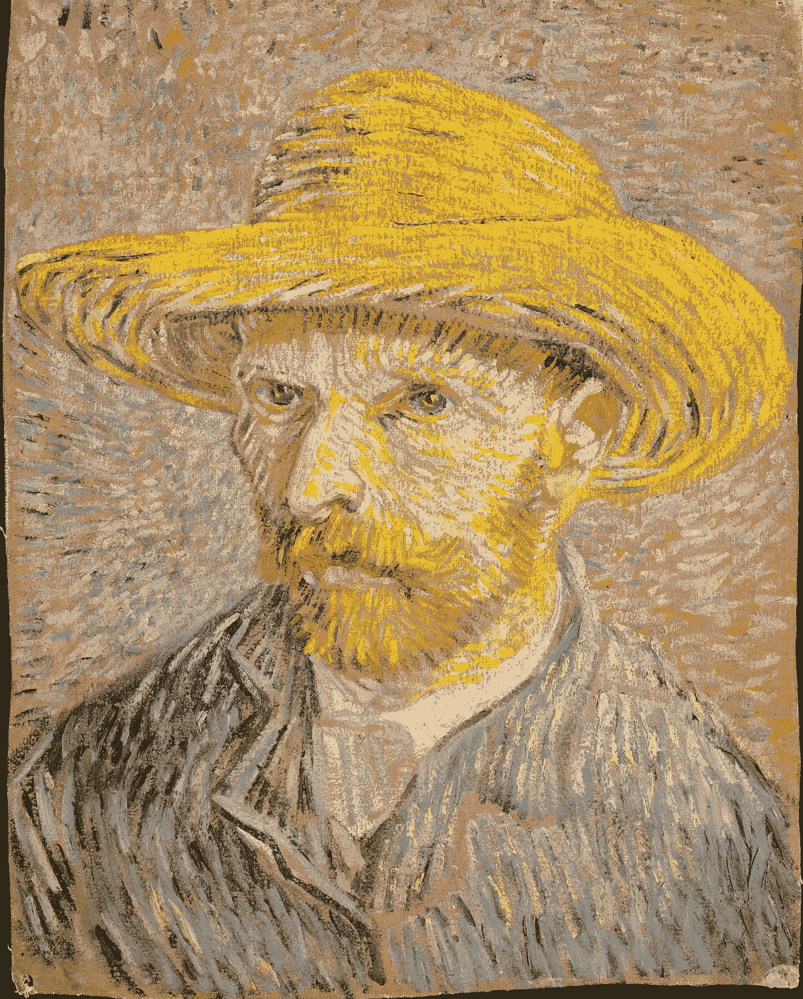

# 梵高教我的关于培养技能的三件事

> 原文：<https://medium.com/swlh/three-things-van-gogh-taught-me-about-growing-any-skill-824bebdd0fc5>

Van Gogh Self-Portrait

我订阅的 HBR 是一笔巨大的财富；我的藏书教会了我很多；朋友和导师给了我很多建议。然而，我从一个人身上学到了一些简单的东西，这个人在精神病院割下了自己的耳朵，几乎每天创作一幅画:文森特·梵高。

我最近和家人去了阿姆斯特丹的梵高博物馆。博物馆当然是非凡的:吃土豆者的鲜明场景，美丽的风景，迷人的向日葵，等等。我特别喜欢的一个元素是展出的梵高的亲密感。馆长展示了他的信件、素描和引文，让你真正了解梵高。由此，我对梵高完善自己技艺的方式产生了兴趣。具体来说，我被三个关键想法吸引住了:

1.  找到一个部落
2.  有意独处
3.  关注基本面

博物馆解释说，梵高的创作方向在 1886 年发生了重大转变，当时他搬到了巴黎，加入了这个志同道合的艺术家群体。关于理想的集体规模有各种各样的想法和出版物(马尔科姆·格拉德威尔的 **The Tipping Point** 对 150 人的最大规模进行了一些有趣的观察)，但简单地说，梵高有意让自己与具有类似灵感和方向的创意人员接触，这些创意人员也会挑战他。找到一群有着相似愿望和信念，但实现这些信念和愿望的方法不同的人是至关重要的。梵高成功地继承了来自巴黎前卫*部落*的大量想法和创造力。你是如何与那些既能激励你又能挑战你的愿景的创意伙伴们相处的？

在大学里，我意识到我只是认为我需要这种*式的全方位导师:*某个知道一切并能反过来教会我一切的人。可悲的是，这远远不现实；我到底在找什么？一个部落。一群不同的人，他们将真正塑造我，挑战我。

然而，梵高的这个部落并不意味着他缺乏独处的时间。更确切地说，他有意独处是为了理清自己的想法和想象(有时，甚至到了对自己不利的地步)。我意识到我最好的想法来自两个地方:独处或与密友或同事相处的时间。中间区域是一个暧昧、嘈杂的人群。没有亲密也没有沉默。独自一人独处的时间对于发展新想法至关重要。众所周知，像爱迪生这样的伟人白天会花时间，但却什么也不做。我相信当我们独自思考时，会有一种深刻的清晰和平静。

当我第一次开始练习冥想时，我被那些在漫长的一天工作后试图让自己安静下来时冒出来的噪音所困扰。后来，我开始注意到内在的干扰，并简单地注意到它们。我意识到，一旦我静止了，想法和其他联系就会出现，我可以在冥想后进一步详述。有足够多的冥想应用程序(我喜欢平静)，但我的简单建议是保持静止，并简单地意识到当你静止时会有什么浮出水面。

我承认我是一个艺术新手，但我对梵高专注于磨砺他的基础很感兴趣。有一整个房间专门用于他的色彩理论和素描实验。太多时候，我认为创作过程是发生在两杯咖啡和三杯啤酒之间的混乱。相反，所有类型的创作——数据分析、写作和演示——都需要关键的基本技能和过程。梵高对素描和色彩理论的关注揭示了对基本功的关注。

比如我的背景是管理咨询。早期，一位导师告诉我，要成为一名出色的顾问，我需要磨练看似简单的技能，用幻灯片标题讲述一个故事，并确保标题与幻灯片内容相关联。他没有就浮华的仪表盘或有趣的交易评估框架给出建议。相反，他指出了我为了成功需要磨练的基本技能。对你的工作或爱好来说，最基本的技能是什么？你怎么能专注于这些并完善它们呢？

这些想法无论如何都不是突破性的，但是看到除了生活教练之外的其他人实践实践和独处的社区是令人信服的。看到它们在一位荷兰画家身上成形，真是耐人寻味。

找到你的部落，练习独处，磨练你的基本技能。