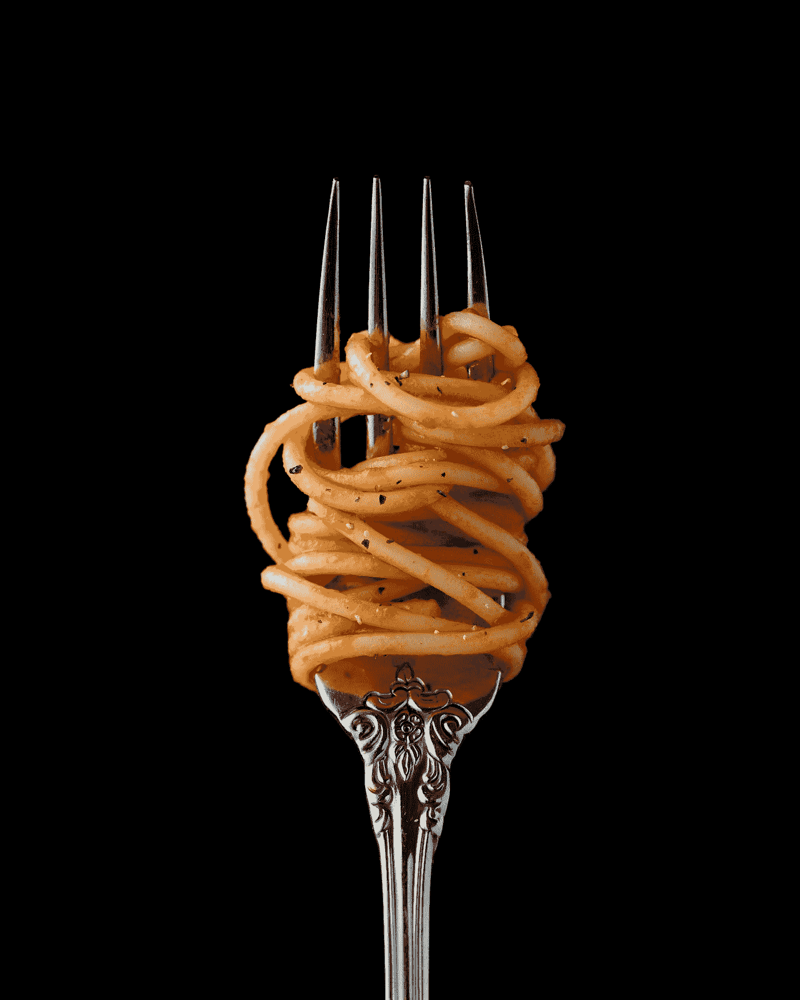

# 把它扔到墙上，看看有什么粘在上面

> 原文：<https://medium.com/swlh/throw-it-at-the-wall-and-see-what-sticks-23ea61ba99f7>

## 让你的写作像煮意大利面条一样。

Photo by [Mae Mu](https://unsplash.com/@picoftasty?utm_source=medium&utm_medium=referral) on [Unsplash](https://unsplash.com?utm_source=medium&utm_medium=referral)

## 自我约束

出于习惯或恐惧，作家型的人有时会把自己局限在狭小的空间里。他们喜欢自己最熟悉的舒适角落，很少离开。这种做法剥夺了这个世界上所有你必须提供的、不适合放入一个整洁的盒子里的令人惊奇的东西。