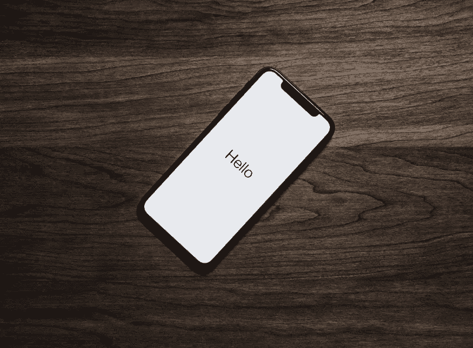

# 蒂姆·库克，也许苹果应该付钱给我来使用 iPhone X

> 原文：<https://medium.com/swlh/tim-cook-maybe-apple-should-be-paying-me-to-use-the-iphone-x-732fb722018d>

Would you be more interested if Apple paid *you* $1000?

为什么你*不*想要一部 iPhone Xs？

几周前，我发现自己在问这个问题，因为我的 iPhone 6 开始出问题了。我在它发布后不久(如果我没记错的话，是 2014 年末)买的，它终于开始出现问题——软件死机、电池问题、音频插孔故障——可能是摔得太多的结果。