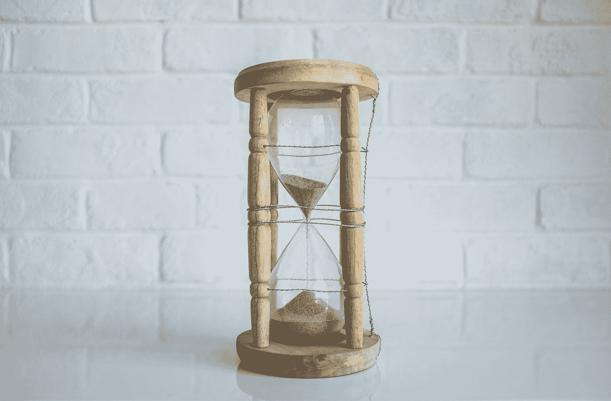

# 时间

> 原文：<https://medium.com/swlh/time-9e85936090b7>

Photo by [NeONBRAND](https://unsplash.com/@neonbrand?utm_source=medium&utm_medium=referral) on [Unsplash](https://unsplash.com?utm_source=medium&utm_medium=referral)

## 你如何管理你的？

## 刚刚[什么是时间](http://www.exactlywhatistime.com/definition-of-time/)？

> 时间是我们每天都要处理的事情，也是每个人都认为自己明白的事情。然而，事实证明，时间的一个紧凑而可靠的定义是非常棘手和难以捉摸的。