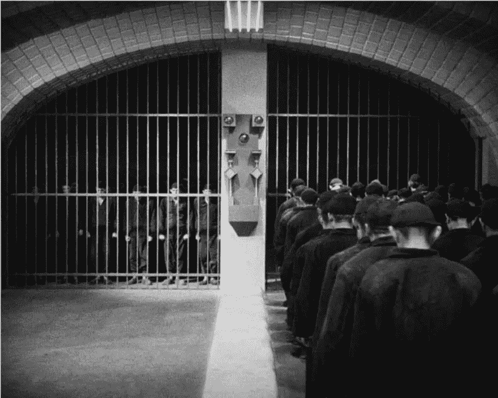

# 时间不是金钱；生产力是

> 原文：<https://medium.com/swlh/time-isnt-money-productivity-is-a4e4ce14f21>

## 为什么你应该停止在办公室计算时间

在弗里茨·兰 1927 年的电影 *Metropolis* 的开场场景中，工人们步调一致地走进电梯井开始他们的早班。

这是对朝九晚五辛苦工作的残酷写照——一个总是让我觉得过时的时间表。