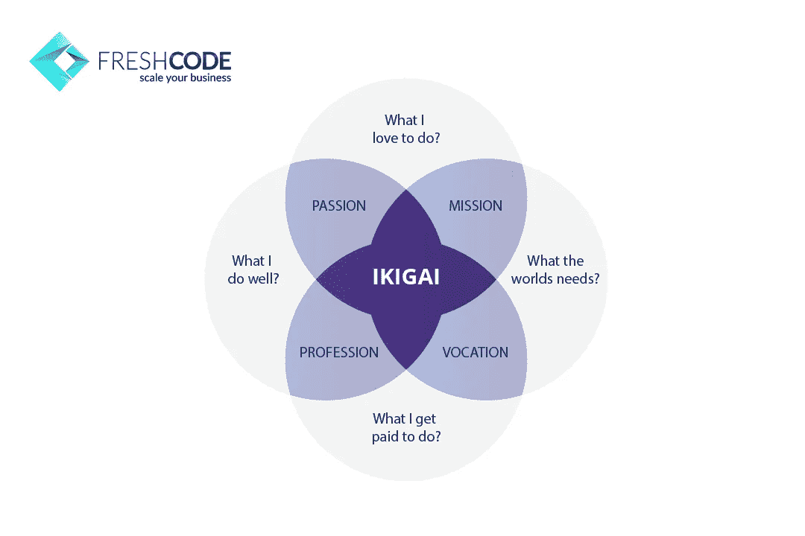
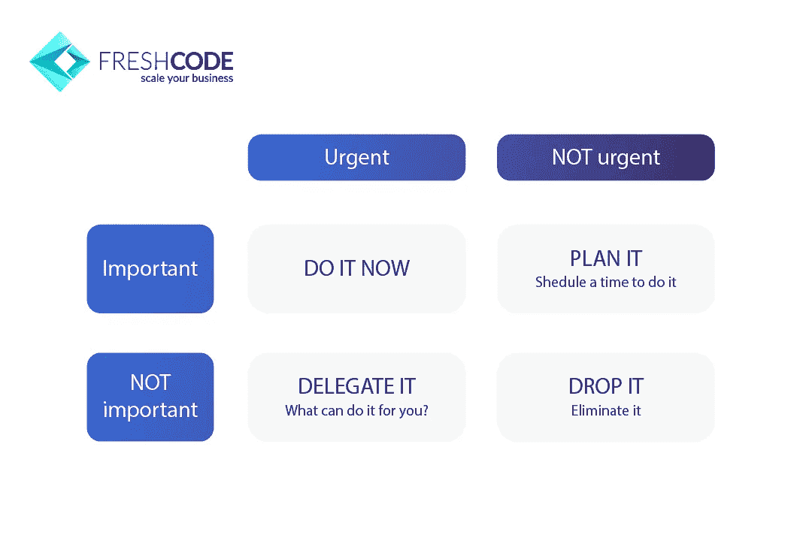
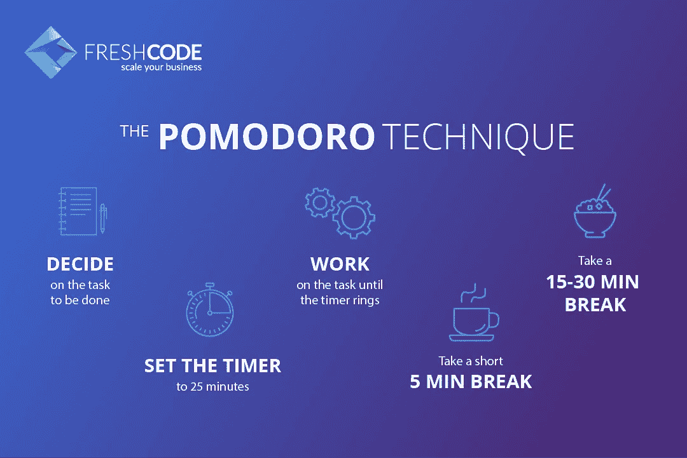

# 商业时间管理。来自 IT 公司所有者的有效攻击

> 原文：<https://medium.com/swlh/time-management-for-business-effective-hacks-from-it-company-owner-9bb805200460>

Original published at [freshcodeit.com](https://freshcodeit.com).

你认为一周是长还是短？你生命中最后 7 天的收获如何？你想让自己更有效率吗？如果是，你可以搜索“时间管理技巧”。感觉有点沮丧。首先，因为谷歌声称时间管理是一个矛盾的说法。事实上，你不能控制你的时间，秒和小时的持续时间，以及你自己的生活。你只能决定在每一分钟把你的精力、努力和注意力放在哪里。你可能后悔的第二个原因是这个主流话题的信息量。有成千上万的书籍、课程和建议，但我会给你看那些对我有用的。

快乐、生产力、存在感和成就感都源于你主动控制自己精神能量的能力。(扎特拉纳，**)**

*这句话告诉我们优先化的意义和控制注意力的能力。你现在专注于什么，将来就会得到什么。如何获得这些时间管理技巧？让我们看看。*

***时间管理的历史***

*我对这个话题的介绍是从学生时代开始的。我读过格列布·阿尔汉格尔斯基的一本书，叫《时间驱动》。作者解释了自我管理的基础，并分享了如何按时完成所有事情的技巧。对于刚开始发现这种方法的初学者来说，这是一个不错的选择。*

*下一本书是达尼伊尔·格拉宁的《奇怪的生活》。它讲述了生物学家亚历山大·柳比舍夫的故事，他发展了自己的时间管理系统。这是基于对个人时间和金钱一样宝贵的理解。也应该用同样的方式来控制。这位科学家不仅专注于优先顺序和有效的思考，而且还非常迂腐地遵循他的计时技术。他通过每天写特别的笔记来记录他生命中的每一分钟。这并不意味着你应该遵循他的步骤，因为这可能非常具有挑战性。但是这个案例显示了时间管理对于成功的职业成就、长久而丰富的人生是多么的重要。*

*许多名人使用自我组织技术，并思考时间的重要性。其中一位是希腊哲学家苏格拉底，他说:“*当我们等待生命时，生命就消逝了”。**

*时间管理的主要对手，也是最大的敌人，是拖延症。但是你不应该过多地责备自己把时间花在简单但无意义的事情上。拖延症是这个星球上所有人的通病。无论他们的专业成就和职位有多么重要和令人尊敬。*

*不仅人类会拖延他们的任务。动物也表现出这样的行为。这是一种“转移活动”现象，可能由两个因素引起:*

*   ***因挑战性的形势而受挫***
*   *由一些争议引起的**内心冲突***

*让我们来看一只在巢中产卵的海鸥。突然，它注意到一个危险。比如一个极地科学家。海鸥想逃，但是因为有鸟巢而逃不掉。所以，它感觉到了内心的冲突，决定清理羽毛。这是一种不理智的行为，无助于避免危险，但这只鸟就是这样做的。*

*现在，让我们想象一个记者正在写一篇重要的文章。突然，他听到了爆炸性新闻。一位编辑说他必须写一篇关于他们的笔记。那么记者做了什么？他打开脸书，一整天都在网上冲浪。问题是他根本无法决定这两个重要任务中哪一个应该先做。*

*你注意到这两起案件的相似之处了吗？拖延是大自然将我们从不愉快和困难的处境中拯救出来的一种古老方式。另一方面，人类需要应对它，如果他们想让他们的日常生活更加有效和有趣的话。*

*如何应对拖延症？*

*根据我的经验，最好的方法是使用日本的方法“ **Ikigai** ”。简而言之，这是一个问题的答案:“什么让你的生活有意义？”。这个概念对每个人都有特殊的意义，取决于 4 个标准:*

1.  ***激情**(你喜欢做的事情)*
2.  ***使命**(你如何帮助他人)*
3.  *职业(你擅长的)*
4.  *职业(什么带给你钱)*

**

*Original published at [freshcodeit.com](https://freshcodeit.com).*

*拖延症也被认为是被低估的任务和被高估的 T21 之间的冲突。Ikigai 有助于找到所需的平衡，简化对单一目标的专注。我想强调这一点，因为你的任务和问题越多，它们之间发生冲突的风险就越高。所以，你会花更多的时间在拖延症上。有人说多重任务对我们的影响比酒精更大。你只是迷失在许多项目中，开始做一些不必要的事情。*

***设定目标作为一种强有力的时间管理方法***

*和 Ikigai 一样，这项技术需要对你的个性、价值观和信仰有深刻的理解。定义你多年的目标不是一件简单的事情。我通常写一个月的计划，然后检查我做了什么。有时我会把目标放到下个月，或者干脆删除它，意识到它对我来说毫无价值。Ikigai 不仅有助于专注于个人目标，也有助于更好地了解你的优先事项，并从外部看待你自己。*

*至于优先级，我推荐一个简单的方案。这是戴维·艾森豪威尔的矩阵，他建议将日常任务分成 4 部分:*

1.  *重要且紧急*
2.  *不重要和不紧急*
3.  *重要且不紧急*
4.  *不重要也不紧急*

*通常人们会忘记第三点，因为紧急的事情会占用他们所有的时间。需要你关注的问题层出不穷。但是从长远来看，重要的和不紧急的目标对你的生活影响最大。对了，大部分不重要不紧急的任务可以简单跳过。*

**

*Original published at [freshcodeit.com](https://freshcodeit.com).*

***GTD 作为自我管理的最佳方式***

*[把事情做好](https://en.wikipedia.org/wiki/Getting_Things_Done)是一个系统，由美国商业顾问大卫·艾伦创造。企业家和高层管理者是那些真正感到时间不足的人。大卫·艾伦通过创造这些简单的规则来帮助他们。让我们来看看它们:*

1.  ***收件箱(空头术)***

*永远不要把所有的任务都记在心里。用你的智能手机写下所有新的计划和想法。这个规律也与著名的[蔡加尼克效应](https://en.wikipedia.org/wiki/Zeigarnik_effect)有关。心理学实验表明，与完成的过程相比，人们更容易记住未完成的过程。所以，如果你只是在下午 5 点停止工作，你可能整个晚上都在担心你必须做的事情。最好至少完成一些小任务，然后休息一下。*

***2。每周回顾***

*如果你只是把所有的东西都放进收件箱，有一天你会发现它很混乱，很乱。所以，每周你都应该抽出时间复习。我通常将所有任务分成单独的项目，检查已完成和计划中的项目。有些可以暂停，有些可以转换。审查保证了您对系统的信任，因为您确信您将看到所有的任务，而不是忘记它们。*

***3。定义接下来的步骤***

*每天的忙碌分散了你的注意力，你开始不加思考和分析地做出反应。为了避免冲动的决定和浪费时间，最好提前计划好你的行动。在周末，当你感到安全和平静的时候，坐下来思考下一步的任务。你可以花一个小时，两个或三个小时，根据你的需要来做长远规划。然后，写出每项任务的具体步骤。这是推进你目标的最简单的方法。这些步骤应该是明智的:*

*   *特殊的*
*   *可测量的*
*   *可完成的*
*   *现实的*
*   *有时间限制的*

*使用这种个人时间管理技巧，你会看到进步。因为不需要思考，不需要反思，不需要怀疑。做就是了。*

***4。依靠你的日历***

*至于日程，我完全相信我的个人日程表。它向我展示了所有计划好的会议和活动。所以，我看我什么时候能完成紧急而重要的任务。他们估计，并已计划下一步。这让我更加冷静和有效。至于时间管理应用，我喜欢[的 OmniFocus](https://www.omnigroup.com/omnifocus/) ，但也有很多替代产品。*

***时间管理原则***

*   *为这一天定义一个主要任务，让你离目标更近一步。你可能有其他事情要做，但这件事应该放在第一位。*
*   *注意让你分心的一切。我指的是随机的想法，新的想法，社交网络。当你注意到他们，你就能控制他们。*
*   *过滤信息，去掉不重要的事实。要小心那些通过提供意想不到的内容而导致上瘾的计时手表(YouTube，脸书，新闻)。*
*   *准备好说不，因为只有你能安排好你的时间。把大任务分成小部分。分几个步骤做。我称之为“吃大象”。*
*   *开始委派你的任务，尤其是当你有很多任务的时候。教导你的团队成员，这样你就可以依靠他们。让别人帮助你。*

*深度工作是提高生产率的关键*

*我最喜欢的一本关于生产力的书是《[深度工作](https://www.amazon.com/Deep-Work-Focused-Success-Distracted/dp/1455586692)》。它包括沉浸方法，有助于实现令人难以置信的结果。实际上，任何人都可以每天只工作 4 个小时，并完成全部任务。这里最重要的是避免任何干扰:不必要的网络搜索、社交媒体、私人和公司信使等等。你应该把注意力集中在任务上，把所有的注意力和全部的精神能量都投入到任务中去。*

*你也可以用一个“**好看的手势**的方法。例如，你可以在一个非凡、奢华的地方工作，或者做一些不寻常的事情。有些作家不能完成一部小说，不能买机票坐飞机，也不能在那里工作而预订昂贵的酒店房间。对我来说，我更喜欢不在办公室做生意，而是在城市的另一边一起工作。那里没人认识我，所以没人会用没完没了的问题、谈话和不重要的任务来分散我的注意力。*

*我还喜欢一种最著名的时间管理方法，叫做**番茄工作法**。这对那些不能长时间专注于某件事的人真的很有帮助。简而言之，你应该把你的时间分成几个区间。例如，你持续工作 20 到 25 分钟，没有分心。然后，你有 5-15 分钟的休息时间。*

**

*Original published at [freshcodeit.com](https://freshcodeit.com).*

*就像运动员训练他们的身体力量和增长肌肉一样，你可以提高你保持注意力在一件事情上的能力。经常练习是培养专注力最重要的因素。但是除了专注的工作，你还需要[走神思维](https://aeon.co/ideas/let-the-soul-dangle-how-mind-wandering-spurs-creativity)。它对你的创造力和找到非凡解决方案的能力负责。*

*其他时间管理技巧和注意事项:*

*   *记住，每天至少提高自己 1%，你可以在一年内获得不可思议的结果*
*   *尝试自我鉴定的方法，这对于分析你生活的不同方面很有帮助*
*   *开始写日记或自我感谢笔记，看看你做了什么，这一天有多有成效*

*我应该提到，如果没有你对自己建立的系统的完全信任，所有这些时间管理技巧都是毫无意义的。这是至关重要的。所以，你应该尝试不同的方法，选择最适合你的。*

*综上所述，以下是最重要的**要点**:*

1.  *如果你想让时间管理发挥作用，那就创造习惯和仪式。*
2.  *找到并遵循你的全球目标，日本的理念 IKIGAI。*
3.  *试着更好地了解自己，分析自己的生活，思考价值观。*
4.  *请记住，你的注意力决定了你的去向和成就。*
5.  *深入工作是在短时间内获得预期结果的最佳方法。*

*我希望我的文章对你有用，激励你至少迈出一小步来提高自己。订阅 [FreshCode 博客](https://freshcodeit.com/blog)获取更多由企业主、程序员、项目经理和其他 IT 专家撰写的有趣文章。如果你已经有了创业的想法，我们总是[在这里](https://freshcodeit.com/contact)让它实现。*

**原文* [*商业时间管理。IT 公司老板*](https://freshcodeit.com/freshcode-post/time-management-for-business-effective-hacks) *发布于*[*freshcodeit.com*](https://freshcodeit.com)*。**

**

## *这篇文章发表在 [The Startup](https://medium.com/swlh) 上，这是 Medium 最大的创业刊物，拥有+439，678 名读者。*

## *在这里订阅接收[我们的头条新闻](https://growthsupply.com/the-startup-newsletter/)。*

**