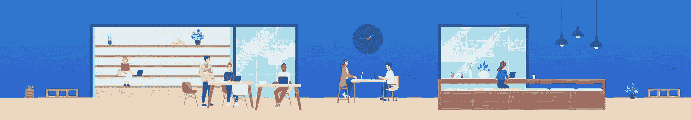

# 时间管理策略:如何更有效率

> 原文：<https://medium.com/swlh/time-management-strategies-how-to-be-more-efficient-e4b5b2a79907>

> "最不会利用时间的人最先抱怨时间的短暂。"
> 
> 让·德·拉·布吕耶尔，卡拉克泰尔斯

我们一天都有同样的 24 小时。然而，我们中的一些人似乎比其他人利用了更多的时间。

时间管理是计划和有意识地控制我们时间的能力…