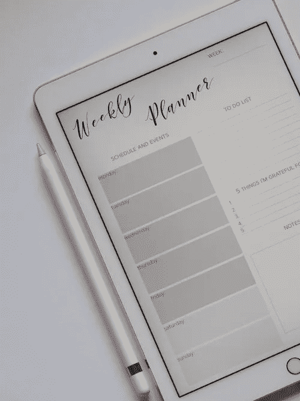

# 时间规划:4 种让工作更聪明、感觉更好的方法

> 原文：<https://medium.com/swlh/time-shaping-4-ways-to-work-smarter-feel-better-e2dda076dcdb>

Photo by Plush Design Studio, Unsplash

***日常事务、早晨事务、在家工作、数字游牧、简单生活、日程安排、生活方式设计。***

你的平衡术怎么样了？

对我的[辅导客户](https://alchemisteating.com/services)来说，一个常见的挣扎点是平衡多重责任，同时还要找到时间和精力进行自我保健和健康饮食。