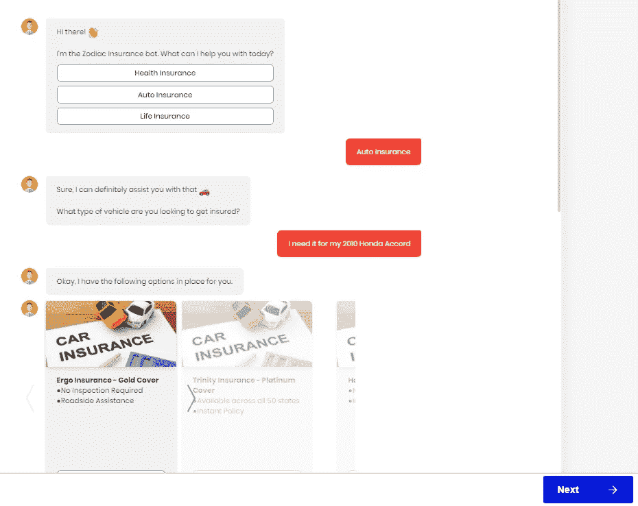

# 是时候改变保险业对待客户的方式了

> 原文：<https://medium.com/swlh/time-to-change-the-way-insurance-sector-treats-its-customers-for-good-6830810b1089>

## “请稍等。您的来电对我们很重要。”

保险行业每天都要处理成千上万的客户，每个客户都有大量关于保单、索赔处理、帐户更新、条款、条件等方面的查询。客户支持团队一次只能满足这么多的查询。结果，客户不得不等待更长的时间，从而导致潜在客户和客户放弃或转向竞争对手。

保险公司寻求技术进步来解决保险行业日益增长的担忧。聊天机器人(chatbot)是最新的技术，由于其带来的众多好处，它正席卷各个垂直行业的公司。聊天机器人可以在改善保险行业的整体客户体验方面发挥重要作用。让我们看看如何。

# 管理索赔处理

对于保险公司和保险持有人来说，索赔管理和处理都是税务程序。智能聊天机器人可以消除当前索赔管理场景中所需的过多人工干预。投保人只需在人工智能索赔机器人中报告索赔。然后，该机器人可以验证保单细节，并通过欺诈检测算法，生成一个置信度得分，保险公司可以根据该得分决定解决或拒绝索赔。

这使得索赔的处理变得更加容易和简单。人工智能聊天机器人可以审查标准文档中的索赔，从而最大限度地减少人工努力，并提供即时客户援助。

# 铅分析

聊天机器人 24 小时工作，解决一般的常见问题和其他问题。基于这些查询，聊天机器人可以分析潜在客户并提供报价。然后，销售团队可以利用机器人收集的这些数据来跟踪线索和新客户。

有了你网站/应用上的聊天机器人，你甚至可以在工作时间之外解决问题。如果一个潜在客户在深夜上网时发现了你的网站(这是他们经常做的)，他们仍然能够与机器人互动，并找到关于不同政策、条款和条件的答案。

# 个性化推荐

由于聊天机器人的对话性质，它们可以轻松地为客户提供找到合适的保险产品所需的所有教育支持。聊天机器人可以处理客户查询，浏览政策库，并根据个人需求提供准确的产品建议。

除了帮助个人决定最适合的产品，聊天机器人还帮助他们购买保险。

Your customers, as happy as this baby — after implementing chatbots.

保险行业的一些知名企业已经实施了聊天机器人，以提高客户满意度，并在竞争中保持强势。荷兰领先的保险公司之一， [Nationale-Nederlanden](https://www.nn.nl/) 在其网站上部署了一个名为 **Nienke** 的聊天机器人，用于解决客户查询，从而减轻了客户支持团队的负担。以下是聊天机器人的一些优势，这些优势使其成为保险行业的理想选择:

## 简化繁琐的流程

消费者害怕购买或续保时涉及的大量步骤。聊天机器人通过以对话的方式引导客户完成简单的步骤，减少了不必要的步骤和代理之间的频繁往返。轻松访问信息和消除过多的人工干预使客户入职变得更加简单。

## 减少客户困惑

人们通常害怕与保险公司打交道，因为与保险行业相关的术语既难懂又令人困惑。例如，对于不熟悉保险领域及其术语的消费者来说，试图浏览各种保单之间的差异可能是压倒性的。聊天机器人可以通过将复杂的术语简化为更简单的语言，并引导客户完成简单的步骤，来帮助减少混淆。

## 减少客户等待时间

面对保险业日益激烈的竞争，由于等待时间延长，保险公司发现很难吸引和留住客户。聊天机器人 24 小时都可以很容易地访问，并对客户的查询提供即时响应。这减少了客户等待时间，从而改善了客户体验。

## 可攀登的

您的客户支持团队一次只能处理这么多客户查询。但是聊天机器人是自动化工具，因此可以同时与成千上万的顾客交流。无论你的网站上有 5 个还是 500 个人在寻找答案，聊天机器人都能同时即时回答任意数量的问题。聊天机器人可以同时进行的对话数量没有限制。

我们在 [**WotNot**](https://app.wotnot.io/preview/choose-template?url=) 了解保险领域的复杂性，并提供量身定制的聊天机器人解决方案，以适应贵组织的使用情形。我们与您的团队密切合作，提供与您现有工作流程无缝契合的高级聊天机器人。

在决定冒险尝试之前，请通过我们的免费试用[在您的网站上体验免费的**聊天机器人**。](https://app.wotnot.io/preview/interact?url=&themeColor=%23F44336&alignment=right&templateKey=insurance)

Subscribe to Free Trial and experience the bot for FREE.

— — — — — — — — — — — — — — — — — — — — — — — — — — — — — — —

> 如果你喜欢这篇文章，请随意点击鼓掌按钮👏帮助其他人找到它。

## 这篇文章发表在 [The Startup](https://medium.com/swlh) 上，这是 Medium 最大的创业刊物，拥有+438，678 名读者。

## 订阅接收[我们的头条](https://growthsupply.com/the-startup-newsletter/)。

