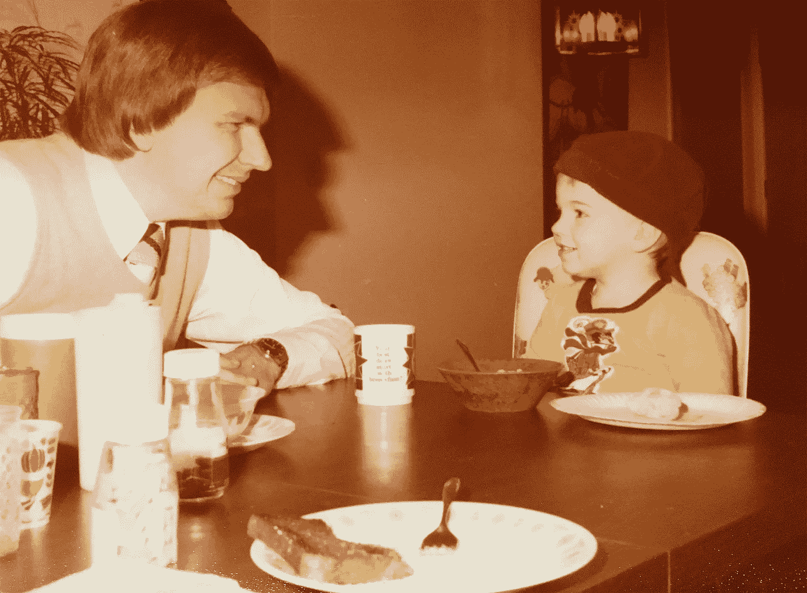
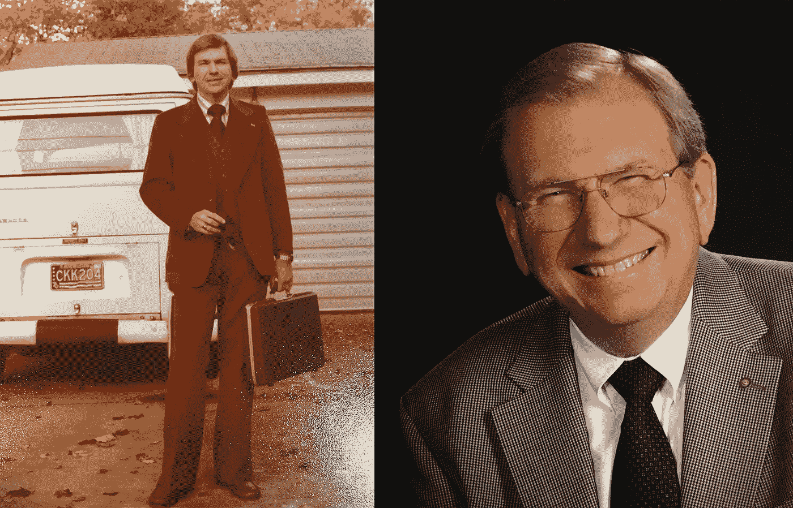

# 我父亲灌输给我的永恒的领导原则

> 原文：<https://medium.com/swlh/timeless-leadership-principles-that-my-dad-instilled-in-me-e8d38e003a36>

My Dad and I sharing a moment back in the day

我的家人最近庆祝了我父亲去世后的第三次生日。虽然这是扣人心弦的一天，但也引发了一些围绕他最喜欢的歌曲和电影的有趣交流。我清楚地记得他在公路旅行时跟着经典曲目唱歌，并引用我们看了一百遍的电影中的台词。

除了他对流行文化的热爱，他还是一个不可思议的商人和社区领袖。他在报业有着漫长的职业生涯，其中最重要的是担任了 20 年的出版人(报业的首席执行官)。除此之外，他还通过在社区委员会和市议会服务来回馈社会。

我们不像看电影那样经常谈论工作和领导力。但是，他模仿的行为比任何谈话都更好地揭示了一些重要的教训。

现在，随着我自己的生意越做越大，我继续从他的榜样中获益。

他没有亲眼看到我的业务在过去几年的发展，但他绝对是旅程的一部分。

尽管我不能像以前一样给他打电话了解他的观点，但我仍然可以回忆过去，听到他的声音。

当我思考他的领导价值观时，我想到的想法并不是开创性的，也不是新的。事实上，正如标题所示，我会把它们归类为永恒的。

这个系列对我来说显然超越了哲学。我看到一些人拥有这些品质，创造了非凡的职业生涯。我看到了它是如何为他自己、他工作的企业和他的社区带来成功的。这也在个人层面上为他提供了快乐和满足感。

有了这些，这就是我爸爸作为一个领导者灌输给我的东西。

# 我父亲的 7 条领导原则

**形成人脉**
我爸爸和他团队里的人有很强的人际关系。除了工作需要，他还花时间去了解他们。就个人而言，我认为他想创造一个他每天都乐于参与的环境。在团队层面，它有助于建立信任关系的文化。他的公司成了人们选择工作的地方，不仅是几年，而是几十年。

先听听我爸爸从不缺少意见。对任何领导者来说，提供清晰的决策观点都是至关重要的。但是你如何制定和做出这些决定可能会有很大的不同。我爸爸的公式是从成为一个优秀的倾听者开始的。这让他能够利用团队的才能和知识。反过来，他们也看到了自己的贡献对企业发展方向的影响。

有耐心
我父亲认为为人父母是培养一名高效管理者的最佳训练场地之一。当你有了孩子，你会经历耐心训练营。它给了你一个全新的定义，告诉你做那些你曾经认为理所当然的简单事情需要多长时间。比如离开房子。孩子们也从新的角度看待问题的范围。这并不意味着你不在乎挑战，但你获得了新的视角，可以帮助你保持清醒的头脑。当然，孩子不是培养耐心和洞察力的唯一途径，他们只是提升自己的一个好方法。

体现价值观
我父亲有一个非常强的道德指南针。他善解人意，善良，尊重他人。这种性格的一致性是他吸引人们的一大原因。无论是个人层面还是企业层面，一致性都会建立信任。为了取得长期的成功，企业需要领导层来设定明确的价值观，然后始终如一地展示这些价值观。

分享故事
我的父亲是一个很棒的故事讲述者，无论是他本人还是他的作品。他总是有一种强烈的直觉，能以有意义和令人难忘的方式分享想法。对于领导者来说，讲述一个令人信服的企业故事的能力是一项关键技能。无论你是需要雇人，建立合作关系，还是向客户销售产品，你的故事质量将决定你的成功。

**回馈**
我爸没有把他的领导贡献限制在办公室的范围内。他创立或参与了各种董事会，从城市经济增长，到当地大学，联合之路，艺术博物馆，他的教堂，城市的当地音乐节，等等。这项工作给他带来了很多个人快乐和满足感，并提升了他的企业在社区中的地位。他“退休”后——只是名义上——他被任命为市议会议员，后来又当选连任两届。事实证明，打高尔夫并不足以让他有事可做。

多笑(尤其是对自己)
我爸爸喜欢笑，他喜欢让别人笑。对我们来说，分享笑话、电影和电视节目是我们纽带的重要组成部分。这种对笑声的热爱也服务于他的工作。分享笑声，表现出自嘲的脆弱，是建立真正联系的一种不可思议的方式。

The years passed, but the style was always on point

# 继续成长以填补那些鞋子

我爸爸留下了一些大鞋子。确切地说，他穿 13 号。我的最高收入是 11 英镑，所以我在那里没什么别的事可做。但形象地说，他的足迹也很大。

幸运的是，当谈到领导技能时，我们总是能保持增长。

我很幸运有我父亲作为榜样。他帮助推动了我作为一名领导者的成长，我认为随着我职业生涯的进展，他的影响只会变得更有价值。

但是总有更多东西要向别人学习。分享我们的经验，我们总能做得更好。

你生活中的领导或导师灌输给你的教训是什么？

如果您需要帮助定义您企业的核心价值，我们在 Map & Fire 网站上有免费的工作表。

*特别感谢我的妻子* [*丽莎·帕尔*](https://medium.com/u/769130e4bc67?source=post_page-----e8d38e003a36--------------------------------) *鼓励我写这篇文章。*

*原载于 2019 年 5 月 7 日 https://mapandfire.com***。**