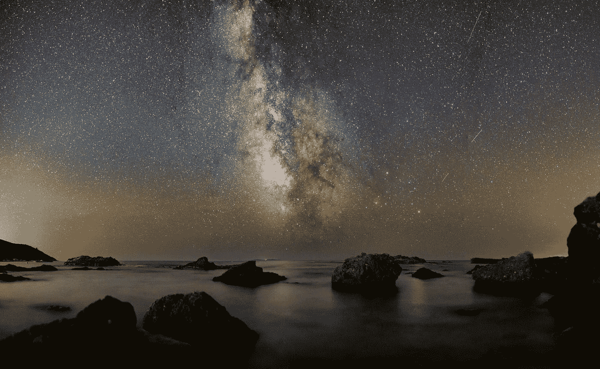

# 时间尺度:人类，恒星，宇宙

> 原文：<https://medium.com/swlh/timescales-human-stellar-cosmic-ca68832489f2>

超越我们的日常经历来思考时间尺度及其意义是很有趣的。这篇文章将关注更长的时间框架，但是对于更短的时间框架，我将在另一篇文章中讨论。

Photo by [Luca Baggio](https://unsplash.com/@luca42?utm_source=medium&utm_medium=referral) on [Unsplash](https://unsplash.com?utm_source=medium&utm_medium=referral)

# 1.人的一生(10 年)

先以我们的生活为基线，相对我们最长但漂亮的…