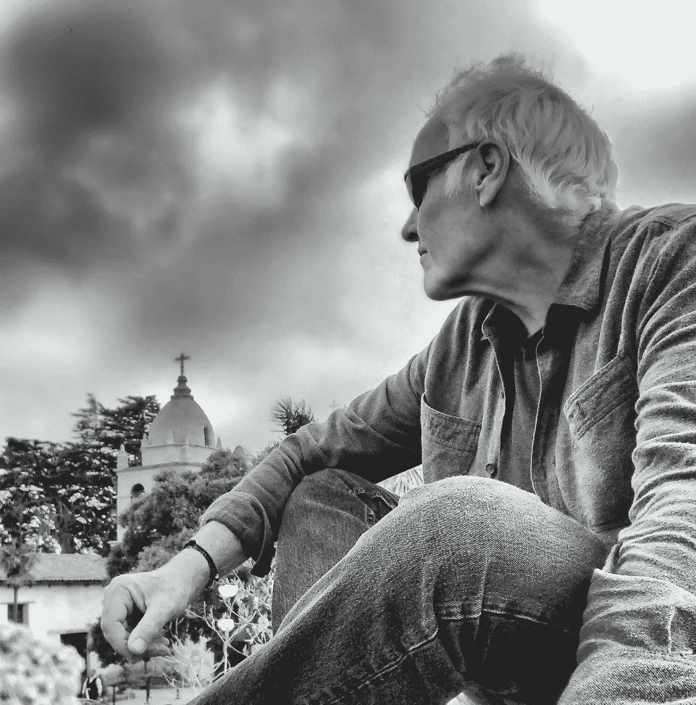

# 创造性地处理消极情绪的技巧

> 原文：<https://medium.com/swlh/tips-for-dealing-with-negativity-as-a-creative-19d7ae5a7832>

## 创造力

## 认真有创造力的人给出他们来之不易的建议

The Author Taking Stock

当你是任何类型的创造者时，你每天都会面临一些障碍。在创造性旅程的开始，这些障碍会阻碍你坚持你的创造力。