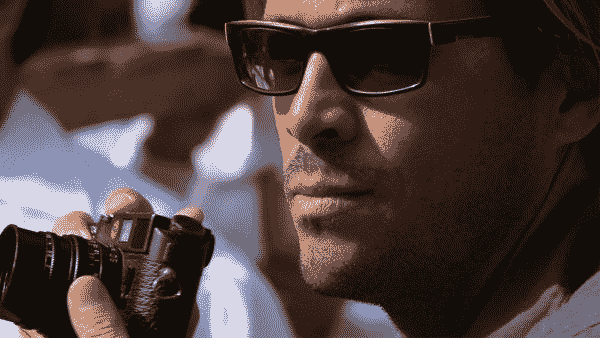

# 用相机讲故事的小技巧

> 原文：<https://medium.com/swlh/tips-for-telling-stories-with-your-camera-d7783811a9d6>

## [摄影](https://medium.com/storiusmag/photography/home)

## 你想如何创作你的故事？

你是个讲故事的人。你是个艺术家。世界是你的画布，你的相机是你的*工具*。这是一个如此疯狂、壮观的世界，充满了故事。

有这么多不朽的主题要探索，你从哪里开始呢？