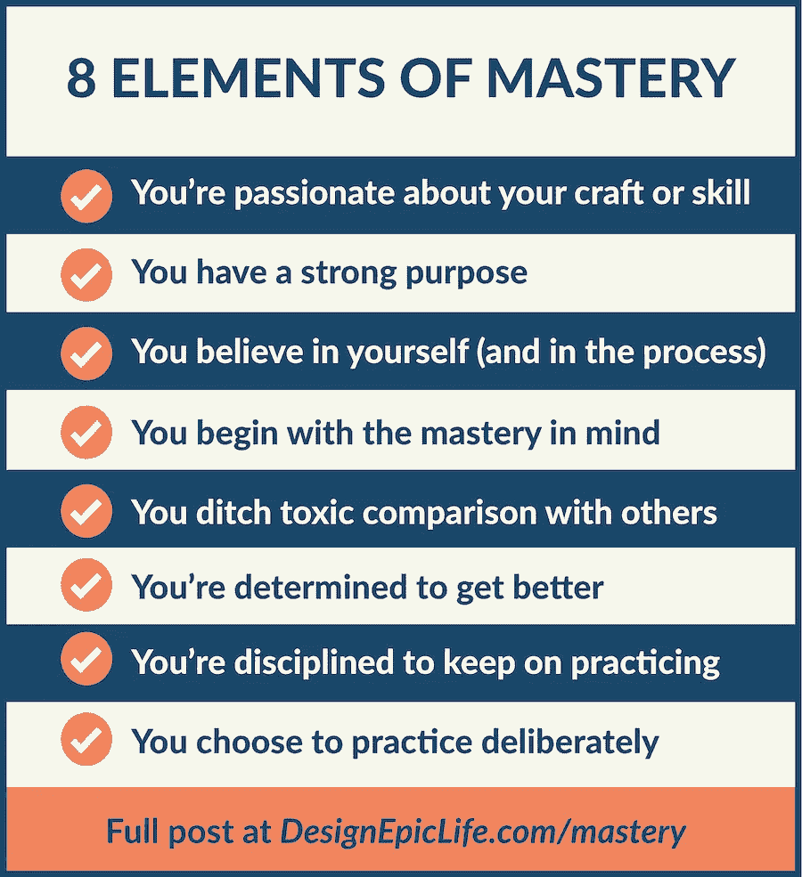
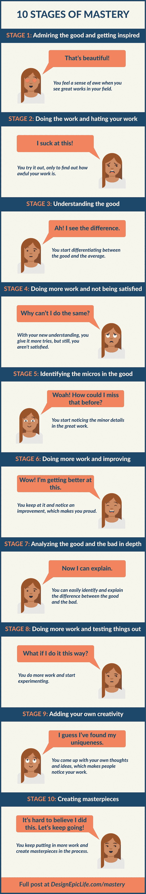
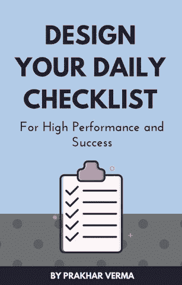

# 要在你拥挤的领域中达到精通，你必须经历这 10 个阶段

> 原文：<https://medium.com/swlh/to-achieve-mastery-in-your-crowded-field-you-must-go-through-these-10-stages-73481220e022>

## 从其他人中脱颖而出

> 如今每个人都知道如何成功。网络世界充满了告诉你实现任何事情的确切步骤的文章。

> 你知道该怎么做…创造愿景，设定目标，朝着目标努力，恭喜你，你赢了。

上面的蓝图没有问题。人就是这样成功的。但是那些不成功的人呢？他们遵循同样的指导方针，然而，结果是不同的。

现在我可以继续谈论正确的心态，燃烧的欲望，坚持，等等。但是今天，让我告诉你你需要听到的关于成功的残酷事实。

成功往往需要精通。做好人已经不够了。你取得的成功与你对技能和知识的掌握程度成正比。

为什么？因为它引领你为世界提供独特而稀有的价值。

现在有趣的部分来了…

那些没有意识到这个简单的事实的人，不会取得巨大的成功。

那些认识到真相的人，也很少成功，因为来自冒名顶替综合症的麻痹。

你看，当你在某方面没有天赋时，你的现状和你的理想之间就会有差距。所以你[怀疑自己](https://designepiclife.com/kill-self-doubt/)。毕竟，你有一个坚实的，合乎逻辑的理由这样做。

[**你不特别**](https://designepiclife.com/you-are-not-special/) **。你没有天赋。你不是专家。你的技术不够好。**

然后还有比你优秀一千倍或者更有才华的人。

所以问题依然存在——这值得吗？你会变得足够好吗？

答案就在你自己身上。

# 掌握一门手艺或技能需要什么

首先，**当你真正对** [**某事**](https://designepiclife.com/find-your-passion/)**充满热情的时候，你就会知道。所以不要忽视自己内心的声音。**

**接下来，你需要一个强烈的目标去变得更好。当你有了目标，你就找到了长期坚持的方法。**

**然后，**你需要相信，无论你朝着什么方向努力，你都会变得更好。本质上这就是成长思维。与之相反的是会阻碍任何人的固定思维模式。****

**要达到精通，仅仅相信你能变得更好是不够的。你需要从头脑中的掌握开始。你不必“假装直到你成功”。相反，你需要意识到你在哪里，你想成为什么样的人。然后，按照你想成为的人去行动。**

> **例如，你可能想从头开始学弹钢琴。与其专注于你以前是如何失败的，不如专注于成为钢琴大师的最终结果以及让你成功的练习。你意识到你才刚刚开始，但是你相信自己，并且真的相信当你投入到需要的工作中时，你会达到精通。所以你要像这个领域的顶尖人物一样——投入数小时的练习。**

**在那之后，**你必须停止拿自己和别人比较**。每个人都在跑自己的比赛，你唯一需要比较的人就是昨天的你。**

**健康的竞争是有益的，而不健康的比较是有害的。前者是关于在一个鼓舞人心的环境中共同成长，后者是纯粹的自我主义。**

**为了找出哪一个控制了你的思维，问问你自己——当你注意到你所在领域的世界上最好的时候，你脑海中浮现的是什么——沮丧还是灵感？**

**如果你感到鼓舞，这意味着你尊重你的手艺或技能，并承认达到精通所需的努力。当我们的自我占据主导地位时，我们常常会感到沮丧。为了克服沮丧，把你的注意力从自己身上转移到你的手艺或技能上，以获得无限的灵感。**

**你的下一个问题是——**你决心要变得更好吗？因为掌握只属于那些承诺的人。你不必掌握生活中的一切。所以明智地做出这个决定，基于你的激情、目标和直觉。****

**下一件事**你需要的是遵守承诺的纪律，即使你不喜欢这样做**。这就是生活考验你的目标和决心的地方。**

**正如史蒂文·普雷斯菲尔德所说，当你练习手艺或技能时，你每天都会面临来自你蜥蜴脑的阻力。**

> **这位献身于自己使命的艺术家已经自愿下地狱，不管他是否知道。在此期间，他将被孤立、拒绝、自我怀疑、绝望、嘲笑、蔑视和羞辱。—史蒂文·普雷斯菲尔德**

**最后，你需要充分利用你投入实践的时间和精力。这就是刻意练习的用武之地。不要盲目地进行越来越多的练习，而是根据来自以下方面的反馈来调整你的训练:**

**a)已经熟练掌握你想要提高的技能的人。**

**b)你的受众。**

**c)有意识的跟踪和调整。**

**好了，现在你知道了掌握的 8 个要素:**

****

1.  **你对自己的手艺或技能充满热情**
2.  **你有很强的目的性**
3.  **你相信自己(在这个过程中)**
4.  **你从头脑中的精通开始(做大师做的事情)**
5.  **你抛弃了与他人的有毒比较**
6.  **你决心要变得更好**
7.  **你被训练要坚持练习**
8.  **你选择刻意练习**

**很好！**

**考虑到这一点，你可能想用我推荐的 [**学习工具和网站**](https://designepiclife.com/tools/#learning) **来加速学习过程。****

**现在准备好通过这 10 个步骤走向精通:**

# **成为你所在领域的大师:10 个阶段**

****

## **第一阶段:欣赏美好的事物并获得灵感**

**当你看到你所在领域的伟大作品时，你会有一种敬畏感。**

## **阶段 2:做工作，讨厌你的工作**

**你尝试了一下，却发现你的工作有多糟糕。**

## **阶段 3:理解好的一面**

**你开始区分好的和一般的。**

## **第四阶段:做更多的工作而不满足**

**有了新的理解，你尝试了更多，但仍然不满意。**

## **阶段 5:识别商品中的微观结构**

**你开始注意到伟大作品中的小细节。**

## **第六阶段:做更多的工作和改进**

**你坚持下去并注意到了进步，这让你感到自豪。**

## **阶段 7:深入分析好的和坏的**

**你可以很容易地识别和解释好与坏的区别。**

## **阶段 8:做更多的工作并测试**

**你做更多的工作，开始尝试。**

## **第九阶段:加入你自己的创造力**

**你提出自己的想法和创意，让人们注意到你的作品。**

## **第十阶段:创造杰作**

**你不断投入更多的工作，并在此过程中创造出杰作。**

**之后就是不断的重复，不断的改进，提高杰作的创作率。**

**你能在其中一个台阶上看到自己吗？**

**事实是通往精通的道路并不容易。充满了失望和失败。但是如果你想要好的结果，你必须[拥抱过程](https://designepiclife.com/key-to-success-in-life/)。**

**这个过程阻碍了业余爱好者和大师之间的区分。你会是哪一个？**

**当事情变得艰难时，记住米开朗基罗的话…**

> **如果人们知道我是多么努力才掌握的，那就一点也不美妙了。—米开朗基罗**

# **精通是日常行动的结果…**

## **为高绩效和成功设计你的每日清单。[点击此处下载](http://bit.ly/daily-success-list)您的免费副本。**

****

***最初发表于*[*DesignEpicLife.com*](https://designepiclife.com/creating-masterpieces/)**

****

## **这篇文章发表在 [The Startup](https://medium.com/swlh) 上，这是 Medium 最大的创业刊物，拥有+412，714 人关注。**

## **在这里订阅接收[我们的头条新闻](http://growthsupply.com/the-startup-newsletter/)。**

****