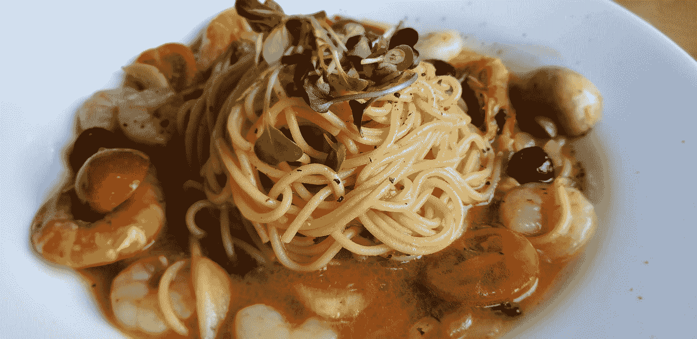

# 公平地说，JavaScript…

> 原文：<https://medium.com/swlh/to-be-fair-to-javascript-440c154b501c>

Photo by [Park Misong](https://unsplash.com/@pasongsong?utm_source=medium&utm_medium=referral) on [Unsplash](https://unsplash.com?utm_source=medium&utm_medium=referral)

最近有很多文章列举了 JavaScript 的许多缺点。

即使是现在，在经历了近四分之一世纪的发展之后，这种编程语言仍然显示出匆忙中创造出来的所有迹象(尽管创造 1.0 版本确实花了超过十天的时间，正如我在几周前的一篇文章中解释的那样)。