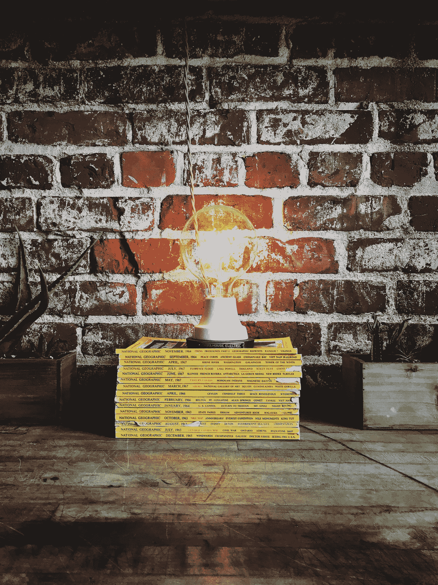

# 为了更好地组织你的生活，你需要组织你的心态

> 原文：<https://medium.com/swlh/to-better-organize-your-life-you-need-to-organize-your-mindset-e755c848af4>

## 关于你的组织能力，你给自己讲过什么故事？

Photo by [Jonathan Simcoe](https://unsplash.com/photos/qYxIVsHpDDo?utm_source=unsplash&utm_medium=referral&utm_content=creditCopyText) on [Unsplash](https://unsplash.com/search/photos/bulb-magazine?utm_source=unsplash&utm_medium=referral&utm_content=creditCopyText)

我儿子找不到他的高尔夫球杆了。

我所在的世界终于(几乎)迎来了春天。他上次打高尔夫球是在六个多月前。俱乐部已经消失在某个地方，在车库或地下室…