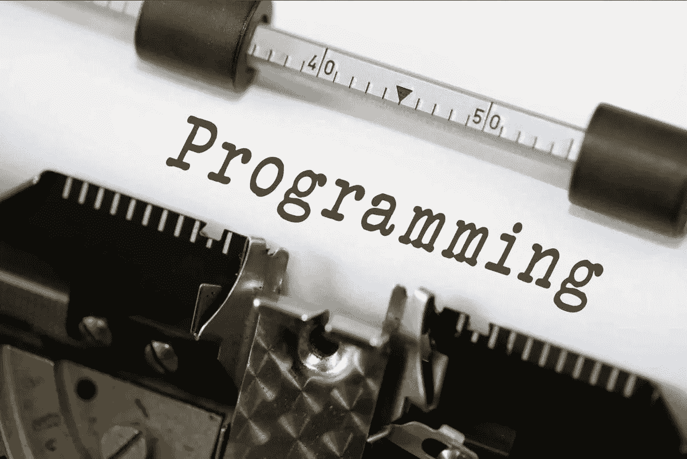

# 评论还是不评论？

> 原文：<https://medium.com/swlh/to-comment-or-not-to-comment-72d84e6f0706>

## 不，你不应该停止写代码注释。

不可否认，互联网是一项巨大的技术，将信息共享和思想交流推进到了前所未有的水平。然而，这有时会引起一些挫折，比如当我们读到一个人的话，他的想法和结论与我们的完全相反。它可能会产生一种严重的紧迫感，使你以这样或那样的方式做出反应，因为你意识到一种冒犯君主的罪行；某个人，在互联网的某个地方是**错了**！

我在阅读一篇名为:“*停止编写代码注释*”的文章时经历了这种情况，文章作者提出了一个论点，主张停止编写，甚至忽略计算机程序源代码中的*注释*。当然，这个话题并不新鲜，我已经和很多同事广泛讨论过这个问题。他们中的一些人也很大程度上赞成至少使用它们，因为他们认为评论，往好里说是浪费时间，往坏里说是混乱的来源。但是要鼓励全面压制评论的道歉，有一条线是我没想到一条可以跨越的。

即使我的心脏漏跳了一拍，如果我有强烈的冲动去否认这本应该是一派胡言的小册子，我仍然不厌其烦地研究这位诽谤者的论点。难道《孙子兵法》没有教你知己知彼吗？那么，每个人都必须承认，声称自己掌握着唯一的真理是有点冒昧的。如果这个作者有一种感觉，觉得一个节目里的评论完全没用，这种感觉一定是建立在某种客观标准上的。因此，在处理这篇文章之前，我深吸了一口气，充分了解了事情的来龙去脉。

然后，我惊讶地发现，支持他演讲的基本要素是有道理的，但正是在他提出的建议的层面上，它变得摇摆不定。作者确实鼓励**自文档化代码**的论点，这意味着每个程序员都必须努力编写尽可能清晰和有表现力的代码*以尽可能避免必须定义它在做什么。每个变量、类或函数的名字必须明确它们的用途。功能必须很小，并且只服务于一个目标，正如它的名字所明确指出的那样。一旦赋予它活力的逻辑变得过于复杂，一个功能就必须被分解成许多微小而简单的部分，每个部分都封装在自己的例程中。所有这些良好实践的规则都旨在使代码尽可能容易阅读，以确保其可测试性，或者保证某人以后可以轻松地进行任何更改。*

我只能在这里强调这一观点的相关性和重要性，因为我自己坚信好的代码不应该只是做它应该做的事情；它还必须具有极强的可读性、良好的结构和灵活性，以便在所有阅读水平上尽可能地降低其复杂性。我的意思是，当你看一段源代码时，*它必须被设计成能大大减轻读者的精神负担*。考虑到在软件的生命周期中，它的代码被读取的次数会比它被编写的次数多，它在它存在的所有阶段都节省了大量时间，同时极大地限制了将各种**bug**留在角落里的可能性。

事实上，这个原则比我们关于注释的辩论更进一步，我将允许我自己在这里做一点附带的评论。软件工程和代码编写的主要目标完全是管理**复杂性**。如果在编写几百行代码的程序时很容易忘记这一点，那么对于更大或更复杂的软件来说就完全不同了。你们中的一些人可能已经见证了程序的有机增长，逐渐地，程序变成了一个迷宫般的黑盒子，没有人能够完全理解它。与这种现象作斗争的黄金法则主要在于程序组成部分的系统化和层次模块化。这就是为什么一个系统的开发要经历不同模块的设计，这些模块又被分解成子模块、类，然后是功能。这就是为什么在编码之前，您必须花时间在更高的抽象层次上细化这些元素的操作，或者您必须花时间创建接口来将它们相互连接。在任何地方，都有必要确保各个部分彼此高度一致(它们共同瞄准同一个目标)，但它们的耦合(即它们的相互作用)仍然很弱。只有这样，人类才有可能管理代码，这些代码的影响可以扩展到几个数量级的复杂性，从处理简单的比特到几百兆的信息。

在所有可能将*代码复杂性*限制在人类可接受水平的工具中，*自文档化代码*的概念肯定是程序员武器库中的先锋；我不想在这里争论这一点。我的问题来自下面的步骤，即**妖魔化**评论，不仅否认它们的有用性，还断言它们弊大于利。

无数众所周知的对评论的批评被一个永恒的争论所推动，这个争论是为了定义软件工程艺术的精髓应该是什么。例如，我们可以提到这样一个事实，注释会使代码更难阅读，因为普通语言远不如任何编程语言精确。我们可以补充一点，代码的改变没有人费心去修改伴随它的注释，这使得阅读更加混乱和困难。然后，它们就像是浪费时间，因为它们需要写或读两倍的信息，而其中一部分可能完全过时或错误。此外，终极知识，真正重要且从不说谎的知识，是代码本身；我们为什么要为静脉和潜在有害的额外工作量而烦恼呢？

我刚刚提到的所有陷阱确实是真实的，无需否认。但是这些问题只有在注释被没有经验的程序员不恰当地使用时才会出现。也不是因为一些笨手笨脚的人已经被铲子或鹤嘴锄弄伤了，这些工具就一定被认为是绝对邪恶的。想象一下这种情况:

*用工具挖洞？但你疯了，这是烦恼和无休止的麻烦的来源。你必须小心处理他们，照顾他们，更不用说受伤的风险。我个人会告诉你，没有我不能用手指和茶匙挖的洞。你不相信我？看看这个一立方米的洞，完全是用三天的辛苦劳动挖出来的。所以收起你的工具或者其他魔鬼的挖掘机，一个* ***真正的工人*** *只用他的肌肉和一把茶匙。*

如果你觉得我的故事有点讽刺，这次我要讲另一个真实的故事。有几个人已经告诉我，完全相信，没有什么情况是不能用 ***printf*** 完全调试的。那一个**真** **纯程序员**不需要任何 IDE，只需要一个类似 ***vi*** 的文本编辑器，当然还有 ***printf*** 。有人甚至声称使用鼠标是浪费时间，使用键盘快捷键可以更快地完成所有事情。我一直对这种说法感到困惑。它们发出时不可动摇的信念让我甚至开始怀疑自己，让我相信我是不称职的，不知道如何在不使用断点、可变检查工具甚至检查内存内容的情况下调试处理复杂数据结构的多任务进程。但事实是非常不同的，这些人可能从来没有在其他问题上正面交锋过，除了那些我认为自己很幼稚的问题。我不是说你永远不要用 ***printf*** ，这是一个经常相关的选项。我的意思是，还有许多更困难的情况，忽视它们是非常幼稚的。

《禁止评论》一文中举例说明的情况因此属于同一类型，**简单化**。它们都实现了一些琐碎的例子，强调在一个名为" *title* "的变量旁边写一个注释"*The title of CD*"是没有用的，或者"*This function send email*for a function "*send email()*"是没有用的。我并不是说我从来没有遇到过这样的平庸，但是我非常精通编写算法来解决复杂的问题，所以我仍然非常困惑。我习惯于在评论中提到与物理过程相关的变量的可接受范围或物理单位。这样就可以一目了然地理解变量“*speed”*是用在 *m/s* 中而不是用在 *km/h* 中，而不必阅读一百行代码寻找任何线索。我现在应该避免这种琐碎的事情，只依赖自文档化代码的概念吗？我现在应该把我的变量的名字“ *speed* ”改成像“*speed _ positive _ less than 150 _ meterbysecond*”这样不那么平淡无奇的名字吗？

同样，除了给每个函数一个明确的名称之外，我总是试图写一段话来总结每个函数执行的主要内容。原因很简单，很多都相当抽象，无法用三言两语概括。例如，假设您编写了一个使用牛顿迭代法搜索多项式根的过程。就我个人而言，我认为概括一下这个函数的作用是个好主意，同时也提供了一些额外信息的指针。我现在应该将我的" *FindPolynomialRoot ()"* 函数重命名为更明确的名称吗

*" find polynomialroot _ usenewtonproximation _ moreon Wikipedia _ Newtons _ method()"*

为了避免这些卑鄙的评论？

即使我强调这一点(并再次强调)，现实却大不相同。一个好的程序员必须总是在所有支持他管理程序复杂性的工具的基础上找到一个可接受的折衷方案。自我记录的代码是非常重要的，但是它通常是远远不够的。当心那些声称已经找到圣杯并鼓吹绝对主义政策的人，因为真相往往在细微之处，而不是在极端。如果应用得当，注释的使用能够并且应该帮助你更好地组织和记录你的代码。拒绝它们，就像作者在他的文章中声称的那样，因为一个程序员“*不是一个文档员”*，类似于声明除了代码之外没有任何其他类型的文档是必要的。退出软件架构、UML 图、测试计划、详细的模型、伪代码或者算法和数学方法的描述，所有你需要知道的都在代码中。当我们这样做的时候，也许对于一个真正纯粹的程序员来说，所有需要知道的都在二进制形式的代码中。

更严重的是，*代码只包含编译器需要知道的东西，但肯定不是你作为一个人需要知道的一切*。注释应被视为并用作规范和其他设计文档之间的中间文档。因此，它们不应该重叠，而应该揭示更高的抽象层次，也就是说，不是任何自文档化的代码都可以达到的层次。注释应该总是描述**程序员的意图**，绝对不要重述代码做了什么。它们不能是多余的，当然也不能过时。因为是的，注释必须和代码一起写，改变一个就像改变另一个。为了把事情做好，告诉你自己，通过只阅读关于一个函数的注释，你必须不仅能够了解这个函数做什么，而且能够进一步掌握它如何实现它的大逻辑线。从这个意义上来说，注释必须总是描述一个应该可以阅读的故事，而忽略其中混杂的代码行。更高层次的注释也有助于理解所有函数或类之间的相互关系，通过总结一般的操作或给代码的某些部分加上标点符号，就像目录和章节标题构成一本书一样。如果你从未觉得有必要对你的代码进行注释，那可能是因为你从未写过书。这没有任何贬义，但在假装理解一切并为根除它们而斗争之前了解它是有益的。

在结束这篇小笔记时，我想引用史蒂夫·麦康奈尔的书“*代码完成*”。这种独一无二的阅读对管理计算机程序中的复杂性这一经常被忽视的话题进行了长期而广泛的审视。如果你只需要读一段，那么它肯定是第 32.3 章的注释。