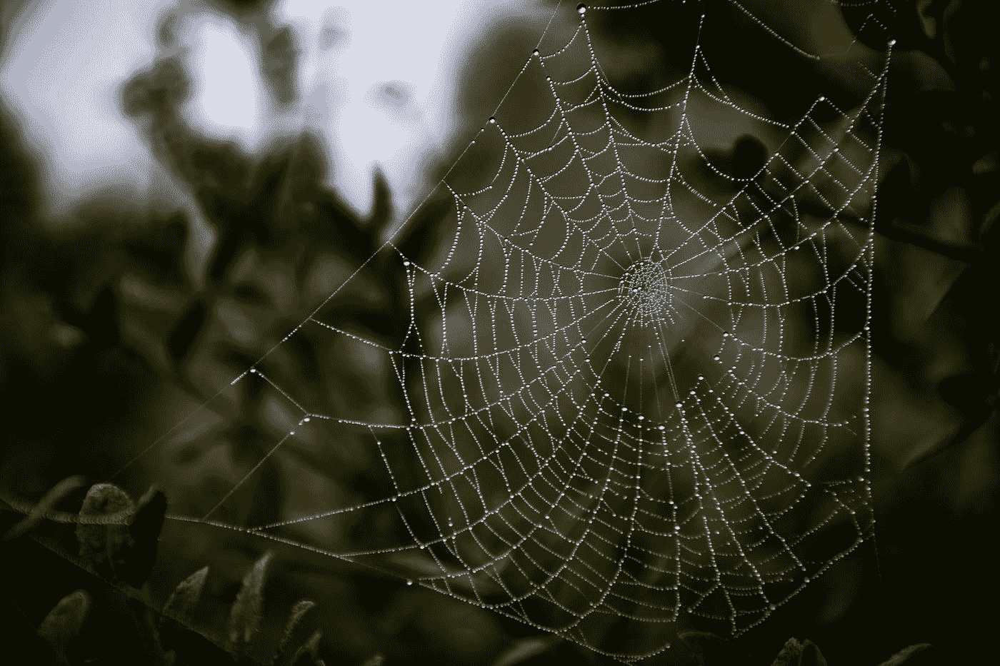

# 今天我徒手捡起了一只蜘蛛

> 原文：<https://medium.com/swlh/today-i-picked-up-a-spider-with-my-bare-hand-7240e295e330>

## 我是如何意外地颠覆了恐惧症

Photo by [Constantinos Kollias](https://unsplash.com/@ckollias?utm_source=medium&utm_medium=referral) on [Unsplash](https://unsplash.com?utm_source=medium&utm_medium=referral)

我从来没有特别害怕动物。如果说有什么不同的话，那就是我对自然界的生物非常好奇。我小时候经常挖蚯蚓和抓青蛙，我十几岁的时候养了一只蜥蜴，我经常抱它(有时我不得不在它进食的时候捡回来……