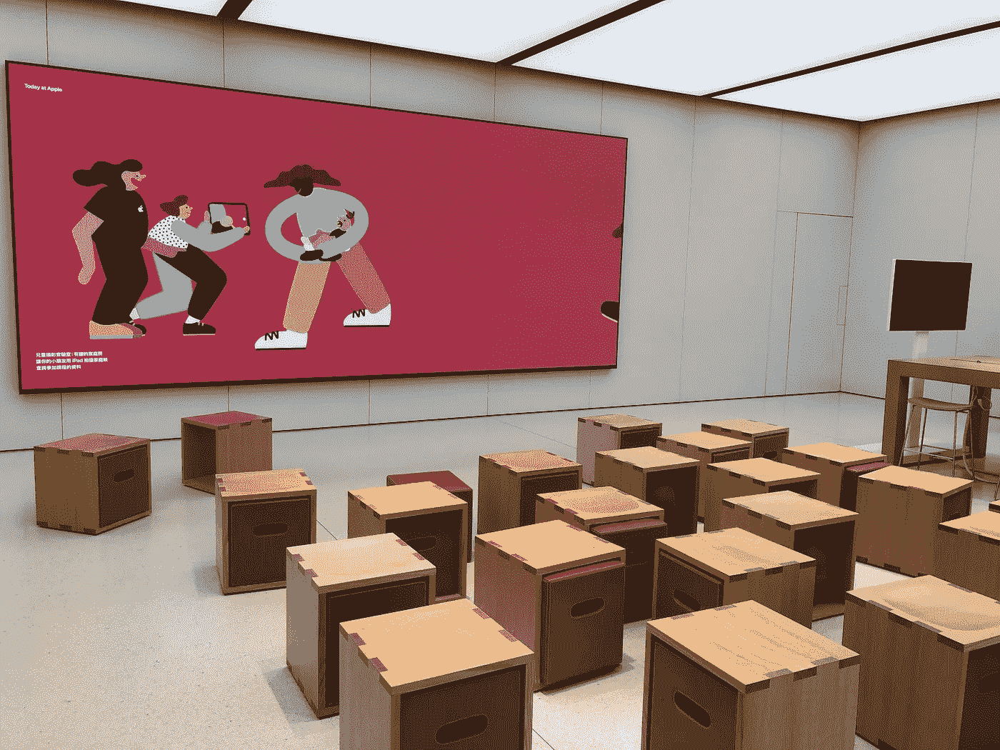

# 我认为今天的苹果是 7/10。

> 原文：<https://medium.com/swlh/todayatapple-literature-productivity-9372f5a0c372>

Apple Sha Tin, Hong Kong.

## 文学和生产力是我找不到的主题，我讨厌那些“免费”的会议。

今天在苹果公司有一个零售推广项目，教导和激励人们如何更好地利用他们的苹果产品。让我先澄清一下，我是苹果的粉丝，但我对今天在苹果的日子并不开心。专业的主持人确实传递了…