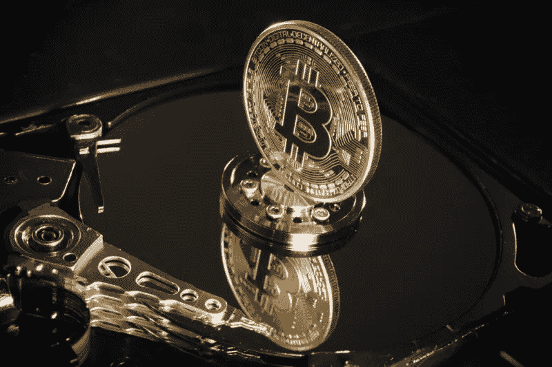

# 令牌模型:这只是一个马尔可夫均衡的问题！

> 原文：<https://medium.com/swlh/token-models-it-is-all-just-a-matter-of-markov-equilibrium-96a664e56c4b>

硬币是区块链平台上交易和业务运营所需的交换媒介，这是由于协议设计的原因，也是由于相对于替代货币，硬币提供了更高的便利收益。事实上，与一般看法相反，通过 ico 发行的大多数“公用事业代币”并不是用于兑换产品和/或……