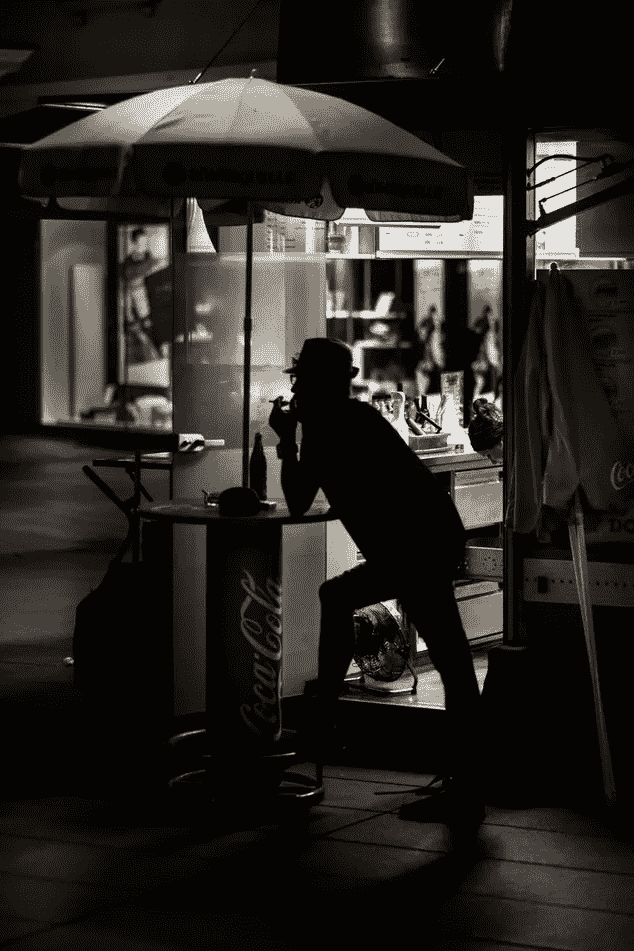

# 为昨天的灵魂做明天的营销

> 原文：<https://medium.com/swlh/tomorrows-marketing-for-yesterday-s-souls-ae612f687d76>

Photo by [Rene Böhmer](https://unsplash.com/photos/HKNLYB7F3WQ?utm_source=unsplash&utm_medium=referral&utm_content=creditCopyText) on [Unsplash](https://unsplash.com/search/photos/coca-cola?utm_source=unsplash&utm_medium=referral&utm_content=creditCopyText)

随着我们越来越多地沉浸在数字层，如果明天的营销活动能够影响我们真实的、非数字的自我，它们将会脱颖而出。

我第一次想到它是在我还是学生的时候。我正穿过开普敦大学的校园，拼命寻找一台自动售货机来满足我突然对可乐的渴望。作为一个有自知之明的人，我意识到这些渴望在过去的 3 周内又复发了。

因此，以前对可乐没有任何好感的我回想起发生了什么变化。三周前，我第一次参加了 10 公里赛跑。我突然意识到，在终点线上，可口可乐公司设立了一个摊位，向跑完全程的人分发可乐，这是一个谦逊的营销壮举。

如果我停下来想一想，可口可乐将营销资源投资于此似乎有些奇怪:这是一场有点武断的、带有社区意识的马拉松，终点是开普葡萄酒之乡的一个孤立的葡萄园。他们本可以把钱花在广告牌、电视广告、社交媒体或其他一些更明显的平台上。我们不要忘记，一种含糖碳酸饮料亵渎神明地闯入健康人的圣地，需要勇气。

但是，话又说回来，在一个营销巨头精心策划的思维中，没有什么是巧合:在比赛后的 3 个星期里，我所经历的是内啡肽热潮的反响——我已经学会将这种热潮与可口可乐联系在一起。

联想在广告业并不新鲜。事实上，数字营销是基于联想的(这也是个人数据变得如此有价值的原因之一)。问题是:在一个被它们饱和的世界里，什么样的联想会脱颖而出？

哪些联想会持久？哪些会成就不朽与辉煌？哪些会脱颖而出，赢得奖项，并被镌刻在万物营销名人堂？

如果可口可乐的天才值得一提的话，伟大的联想将是那些与真实体验相关的。

*经历*。想一想这个词。你最后一次真正经历某事是什么时候？你——不是你的社交媒体“你”——上一次经历某事是什么时候？我们还知道区别吗？我认为，只要令人窒息的数字层继续吞噬我们生活的更多方面，我们基本上不会。

可口可乐当时利用的是这样一个事实，即体验比其数字表现更强大，现在仍在继续利用这一点(他们仍然在马拉松比赛中设立免费饮料摊位)。一天结束时，葡萄酒之乡风景如画的葡萄园，完成比赛后爆发的成就感，当然还有内啡肽飙升的巨大身体感觉，这些都是独一无二的高体验的 DNA。从那种高度下来后，我想重新体验——所以很自然地，我想喝可乐。

*体验*是红牛的原因——通过一场将品牌与模糊和极限体育赛事联系起来的长期运动——从怪异的痛苦中脱颖而出，在 2018 年占据了能量饮料市场约 43%的份额。今天，当我们看到一辆红牛太空跳跃和一级方程式赛车时，我们不会多想。

有些品牌甚至成功地渗透了决定性的体验媒介:语言。事实证明，相当数量的英国人已经经历了一些足够普遍的事情，比如“厚脸皮的 Nandos”，是英国文化方言的一个常规组成部分。同样，《网飞与寒冷》也证明了*成功地抓住了我们都知道的人类体验的一部分，嗯，销售。*

然后是奥克利——也许是独一无二的。2010 年，在被称为“智利矿难”的事件中，33 名智利矿工被困井下近 70 天。一场大规模的合作救援行动即将展开。所有主要的媒体都拿着相机在撤离现场等着。巨大的全球观众聚集在电子期待。

与此同时，在幕后，专家们知道，在几乎没有任何光照的地下生活后，矿工们在重新浮出水面时需要戴上太阳镜。

全世界都看到(并一起经历了)矿工们一个接一个浮出水面，与家人团聚的欣喜若狂、高度兴奋、激动万分的场景。当然，他们在上颧骨上挥舞着一个标志性的“O”。仅仅是他们送给矿工的 33 副太阳镜的价格，奥克利就产生了大约 4100 万美元的广告收入——如果你考虑到将这个品牌与那种独特的全球*体验联系起来的不可量化的价值，可以说更多。*

因此，描绘明天营销天才壮举的画布将不是屏幕或广告牌，而是我们的意识。未来的营销巨头不仅会利用脸书和数据驱动的市场情报，还会利用神经通路和内啡肽。他们会穿透社交媒体的模糊，发现我们被剥夺权利的灵魂躲在迷雾后面，渴望得到肯定。

在一个沉迷于现代性的环境中，未经过滤的原始经验永远难以获得；在这个世界里，真实被边缘化、被忽视、被置换——真实的体验的确更短暂。然而，这其中既有诅咒也有机会:真实经验和过滤经验之间的对比将更加明显，并将为巨头们提供走出阴影、击败竞争对手的机会。

所以，对于那些想要脱颖而出的广告商来说:找到一种方式，聪明地与真实的我们联系起来，而不是市场情报*声称的我们。当我们奔跑时，当我们希望时，当我们成功时，请对我们说话。在生活中最有影响力的经历中给我们讲讲——我在想为产房的新妈妈们提供免费的好奇护理包。从大处着眼，打破常规。*

请记住，有些东西——尽管很难定义——超越了人工智能，使我们成为人类。我敢说，有勇气诉诸我们无限和不朽的灵魂，你的品牌也将获得不朽。