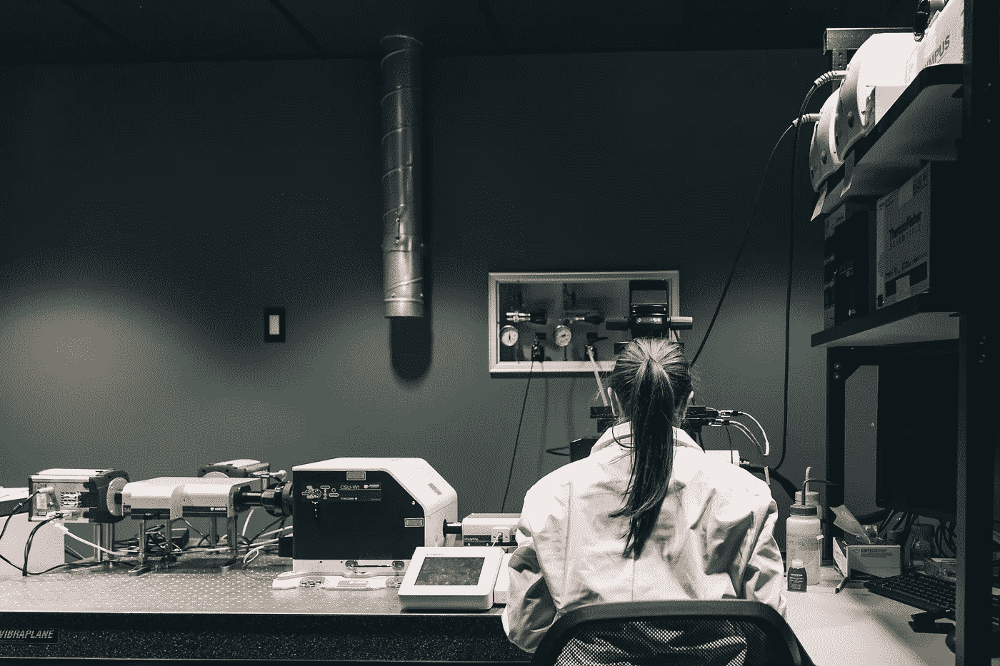
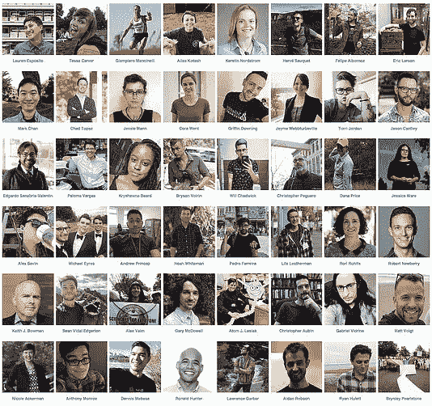
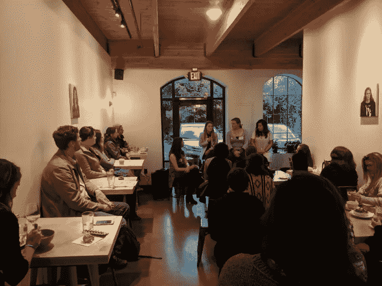

# 对科学来说太跨了:面对职业隔离寻找自豪感和社区

> 原文：<https://medium.com/swlh/too-trans-for-science-finding-pride-and-community-in-the-face-of-occupational-segregation-b75445e18f8f>

一个跨性别女性不顾超高的曝光率和预期的拒绝，在科学中寻找社区。

**通过拒绝走向暑期本科生物学的骄傲**

当我的生物学教授开始自我介绍时，教室里鸦雀无声。

我在塑料椅子上挪了挪，俄勒冈夏天的热气温暖了教室，教室里挤满了勤奋好学的本科生。生物学暑期班标志着我从两年的中断中归来。那些年，我专注于我的性别转换和建立两个企业，一个是数字扫盲，一个是土壤科学。我的创业经历将土壤生物学和信息技术等技术主题带给普通消费者，这重新点燃了我对科学的热情。坐在满是学生的教室里，专注于学习生物学，这是我完成本科学位并继续接受科学家培训的第一步。

然而，我的思绪游离于我的行为和自我意识的表达上。我经历的变味是转型早期养成的习惯，在那里，我对女性特质的表达遇到了羞辱的仪式——我们的社会对跨性别女性并不友好。

The transgender community faces [systemic](https://www.hrc.org/resources/understanding-the-transgender-community) [discrimination](https://www.thetaskforce.org/injustice-every-turn-report-national-transgender-discrimination-survey/) and [challenges](https://www.justice.org/what-we-do/enhance-practice-law/publications/trial-magazine/many-faces-transgender-discrimination). **Image by:** [geralt](https://pixabay.com/users/geralt-9301/) from PixaBay

过渡感觉就像晕船，我处于永无止境的社会交往中。然而现在，大海平静了，由于荷尔蒙的作用，我正在返回港口，我的骄傲开始增长。然而，作为一名变性女性，我的能见度仍然意味着同学们更多的辨别或困惑的目光，这是我在那个炎热的夏天感受到的。

密歇根州的两位心理学家——Nico El Bucchanan 博士和 Isis Settles 博士——在他们发表在《职业行为杂志》上的文章“[管理工作场所的可见性和超可见性](https://www.sciencedirect.com/science/article/pii/S0001879118301313)”中描述了超可见性:

> 过度视觉化仅仅是极其明显的状态……负面的刻板印象加上被标记为与众不同，导致……被认为是离经叛道的……他们只被视为边缘群体成员(例如，在委员会中作为代表多样性的有色人种)。

转变迫使我变得脆弱。我没有同意分享我的弱点。从国家政策到制度到家庭结构再到个人观念，性别体系在社会的多个层面上以无尽的方式制定和复制自己。在面对被拒绝的感觉之前，我觉得有必要解释一下自己。

用一个超可见性的例子来证明。本科期间在一家进步组织实习时，公司高管指示我阅读最近的会议笔记。在之前的会议中，她说“我们有一个新的工作人员变性了！”以及他们收到的用于增加多样性的拨款。然而，“已经变性”显然是一种讨论跨性别身份的奇怪方式——一种缺乏理解的表现。超高的可见性既允许组织雇佣边缘化的人，又不需要付出努力去理解这些人的生活经历。

坐在我的班级里——在一个自由的州，有一个非常友好的跨性别学校——我觉得在我的学习社区里，我既被孤立，又非常显眼。这种分离可能是由习得性无助感造成的:我预料会被同学拒绝。当我坐在那里摆弄着钢笔时，我在想我将如何完成这门课程。前两天很惨，我差点退学。Brian Rood 和他的同事在他们发表在《跨性别健康:

> 考虑到近端紧张性刺激……和……恐惧、过度警惕、悲伤和愤怒……的频率，进一步评估压力随时间的累积影响显然是必要和紧迫的。鉴于当前的文化氛围，TGNC 人仍然是暴力和歧视的目标，这一点尤其重要。

当一名助教和一名博士研究生走到教室最后面我的桌子旁边并向我介绍自己时，那间教室的文化氛围变得活跃起来。当我抬头看他时，他的衬衫上写着“跨性别是美丽的”，当他巧妙地透露他的跨性别身份时，我立刻感到了一种安全感。如果遭到拒绝(实际上从未发生)，在我同意的情况下，我可能会变得脆弱，并与我的新助教朋友分享课堂上任何奇怪或令人不快的经历。

我有归属感。

**有多少酷儿科学家？**

当人们开始了解他们的专业和职业兴趣时，他们经常会遇到基于性别的职业隔离的强大力量，影响他们的决定。从二元角度来看，男性和女性往往不成比例地受雇于不同行业的不同职业和工作角色。

[Inequity in Emergency Management](https://www.govtech.com/em/disaster/Female-Firefighter-Still-Fight-for-Equality-Were-assumed-Incompetent.html): Only about 4% of firefighters in the United States are women. **Photo by:** [TheHilaryClark](https://pixabay.com/users/TheHilaryClark-1068778/) from PixaBay.

基于性/性别的不同职业的隔离可能是偏好的结果(这是性别规范社会化的结果)；然而，妇女政策研究所在他们的文章“[分开和不平等？劳动力市场中的性别隔离和性别工资差距](https://iwpr.org/publications/separate-and-not-equal-gender-segregation-in-the-labor-market-and-the-gender-wage-gap/)"表明:

> 这些模式在很大程度上反映了进入职业的障碍，从缺乏替代工作选择的信息到积极的劝阻和骚扰。这种壁垒人为地限制了最合格和最有积极性的人进入最适合他们的职业，加剧了技能短缺，并降低了经济增长([希尔、科比特和罗斯 2010](https://eric.ed.gov/?id=ED509653) )。

此外，人为设置的障碍造成了男女之间的性别工资差距；研究人员已经证实了美国绝大多数职业的工资差距。妇女政策研究所继续:

> 2009 年，全职女性员工的周收入中值是全职男性员工的 80.2%。在劳工统计局(BLS)提供男女工人收入数据的 108 种职业中，有 104 种职业的全职就业妇女平均收入低于男性同行( [IWPR，2010 年 a](http://www.bls.gov/cps/cpsaat39.pdf) )。

或许不足为奇的是，女性主导的职业薪酬也低于男性主导的职业。例如，在男性占主导地位的领域(比如工程或计算机科学)，工作对学士学位的要求高于女性占主导地位的领域(比如护理或教学)。女性化劳动力的贬值导致以人为本的软技能被视为不如男性化劳动力有经济价值。

职业隔离不会随着性别而结束。美国的种族和族裔制度造成了类似的薪酬差距和职业构成差异。经济政策研究所(Economic Policy Institute)发布了一份关于种族职业隔离的报告(T7 ),描述了身为黑人和女性的负面影响(T8),“黑人女性必须在 2017 年前工作 7 个月，才能在 2016 年获得与白人男性相同的薪酬”

Disparity can be measured by comparing the U.S. Population against actual representation in an occupation. **Image by:** [National Science Foundation](https://www.nsf.gov/) | [National Center for Science and Engineering Statistics (NCSES)](https://www.nsf.gov/statistics/)

因此，奇怪的是，同性恋者也面临着困扰研究者的职业隔离。某些职业——如各种修理工、机械师、空姐、按摩师和中学后教师——尽管看起来没有什么共同点，但仍然保持着高水平的 LGBTQ 工作者。安朵斯·蒂尔西克和他的同事在他们发表在《管理科学季刊》上的文章“[可隐藏的耻辱和职业隔离:走向男女同性恋职业的理论”](https://journals.sagepub.com/doi/full/10.1177/0001839215576401)中解开了这个谜题，他们在文章中确定，男女同性恋都专注于具有独立性或需要社会洞察力的职业。

乍一看，这种自我选择从事需要独立性和社会认知的职业似乎无害。然而，驱使男女同性恋、双性恋和变性者从事这些工作的潜在机制是，他们希望控制何时以及如何隐藏自己的身份以避免污名。为了管理污名，个人可以选择一个相对独立的职业，不与他人合作，从而防止潜在的骚扰和歧视。管理耻辱感还可能涉及自动自我监控，这在生命早期就开始了，以适应和应对他人的反应。这种自我监控技能在某些职业中可能是有用的，比如心理学家和教师。因此，性和性别的隔离会影响一个人加入的职业。

Moving towards [equity](https://www.newscientist.com/article/2193119-dont-believe-women-in-science-face-huge-inequality-heres-the-proof/) in science. **Photo by:** [Shopify Partners](https://burst.shopify.com/@shopifypartners) through Burst.Shopify.com

成为一名同性恋科学家可能会给我很大程度的独立性，并可以利用我在社会感知方面的技能，特别是因为我的目标是从事社会流行病学，以揭示社会世界如何影响我们的健康。然而，这项研究表明，我想在某些职业中工作或不工作的愿望部分是因为经历了耻辱，这种耻辱可以追溯到年轻的时候。虽然我坚持认为我的决定大部分在我的控制之下，但我必须承认，一生的社会压力，以符合性别和性的期望，一定影响了我的职业决策。

但是，如上所述，也可能存在限制进入任何就业领域的人为障碍。造就科学家的学术环境(即大学教室和研究实验室)和专业本身给有抱负的科学家带来了许多障碍。具体来说，过度视觉化、隐形、耻辱和骚扰等问题阻碍了同性恋者在科学管道中的发展。

例如，Eric V. Patridge 和他的同事在《科学与工程中的女性和少数民族杂志》上发表了一篇名为“[影响 LGBQ STEM 教师学术氛围的因素](http://www.dl.begellhouse.com/journals/00551c876cc2f027,761a7b37493b2d86,6fe4cda94f55abdf.html)”的文章，该文章发现，大学 STEM 系约 70%的“出柜”教师在自己的部门感到不舒服，他们遭受同事排斥的可能性是其他人的 7.2 倍。然而，管道泄漏开始得更早，LGBTQ+确定的学生[在大学经历更高比例的性骚扰](https://www.aau.edu/key-issues/aau-climate-survey-sexual-assault-and-sexual-misconduct-2015)，尽管更有可能在实验室工作，LGBQ 学生[留在 STEM 的可能性比异性恋学生低 8%](https://advances.sciencemag.org/content/4/3/eaao6373)。

我与另一位跨性别科学家的偶遇引发了我对这个问题的兴趣:我们有多少人？经过进一步搜索，我发现了一个针对在 STEM 工作的 LGBTQ+人群的可见性活动: [500 个酷儿科学家](https://www.500queerscientists.com/)。

#500QueerScientists **Image By:** [500QueerScientists.com](https://www.500queerscientists.com/toolkit)

500 酷儿科学家分享酷儿科学家的故事，以确保下一代有 LGBTQ+的榜样，帮助我们这些目前在科学领域的人意识到我们并不孤独，并创造联系的机会。被人看见——主要是对彼此——可以给我们勇气，打破职业隔离的机制，继续作为科学家的艰苦工作。

最终，我获得了理科学位，并搬到了俄勒冈州的波特兰市。我作为一名医学书记员的工作很短暂，我很快就进入了研究领域，在一家临床心理学实验室担任研究助理。我找到了一份科学工作，我知道社区建设的力量。

我想:在波特兰哪里可以找到我的科学家团体？

**组织科学领域的酷儿女性，PDX**

我没有被排除在科学领域之外，而是奔向我能找到的任何社区。通过研究，我听说了非盈利组织“科学界女性”,该组织建立了一个科学界女性社区。他们的努力包括网络活动、研讨会、妇女谈判训练营、与团体的外联、职业发展、政策工作以及为目前从事科学工作或渴望成为科学家的所有妇女进行宣传。

[Women in Science Portland](https://womeninsciencepdx.org/faqs/) is a non-profit organization focusing on building a community of supportive networks for the development, retention and promotion of women in science and technology-related fields. **Image by:** [WomenInSciencePdx.org](http://WomenInSciencePdx.org)

我参加的第一个研讨会的主题是科学领域的职业改变者。在这次活动中，我遇到了一些志愿者，他们鼓励我作为一名志愿者加入女性科学。在向 LGBTQ 社区表达了我的兴趣后，我遇到了一个组织者，他已经开始计划一个关注科学界同性恋女性的活动。我们一起组织了一个科学界同性恋女性的小组。

The Queer Women in Science Panel on October 2018\. **Image by:** [WomenInSciencePdx.org](http://WomenInSciencePdx.org)

我们第一次活动的成功给了我信心，让我继续在科学界建立酷儿女性。在女性科学领袖的帮助下，我们成立了一个新的小组委员会，直接负责同性恋群体的职业发展。我联系了那些对计划未来活动感兴趣的人，从那以后，我们又举办了两次社交活动，让同性恋科学家们可以相互放松。

**对社区的信任**

我将继续我的旅程，去了解这个世界，并接受训练成为一名科学家。没有社区和向我伸出援手的人们，我就不会在这里。我将永远记得我第一堂课的助教,《500 位同性恋科学家》的撰稿人，以及我通过组织科学界的同性恋女性而结识的朋友。我们建立的联系——以及支持我们的盟友——有助于我们在科学努力中保持并取得成功。我们成功的机会渺茫，未来牢牢掌握在我们手中。我们之间有希望。骄傲和关系会保护我们。