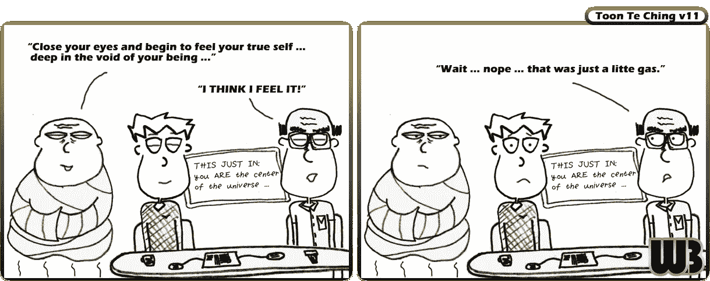

# 《卡通德经》:第 11 节

> 原文：<https://medium.com/swlh/toon-te-ching-verse-11-5f054dc39bad>

欢迎来到本周的《香椿德经》。每周我们都会从《道德经》的 81 节经文中选取一节，将它与一个卡通人物配对，并将教学与我们的工作生活联系起来。

> **第 11 节**
> 
> 三十根辐条汇聚在一个轮毂上；
> 中心的孔就是
> 推车使用的铰链。
> 
> 将粘土制成容器；
> 是内在的空间造就了它…