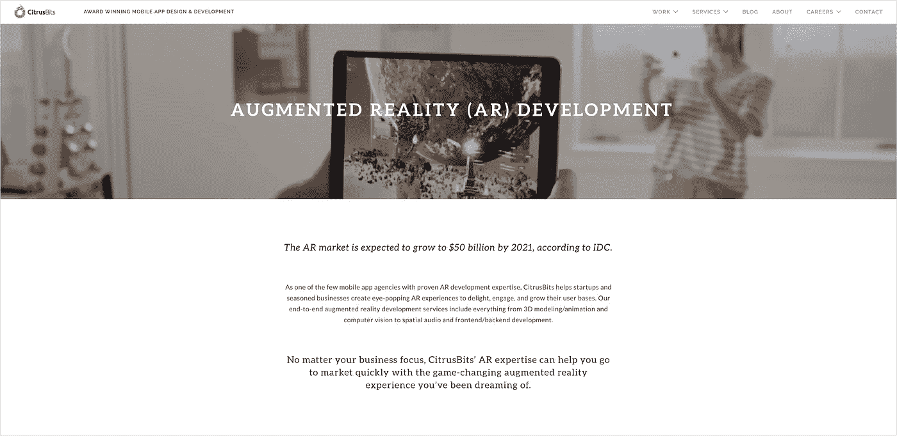
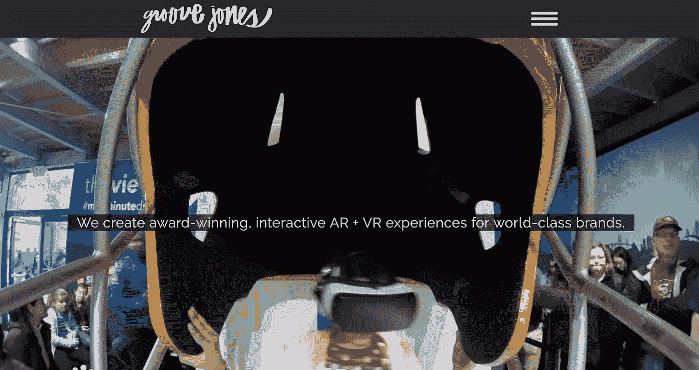
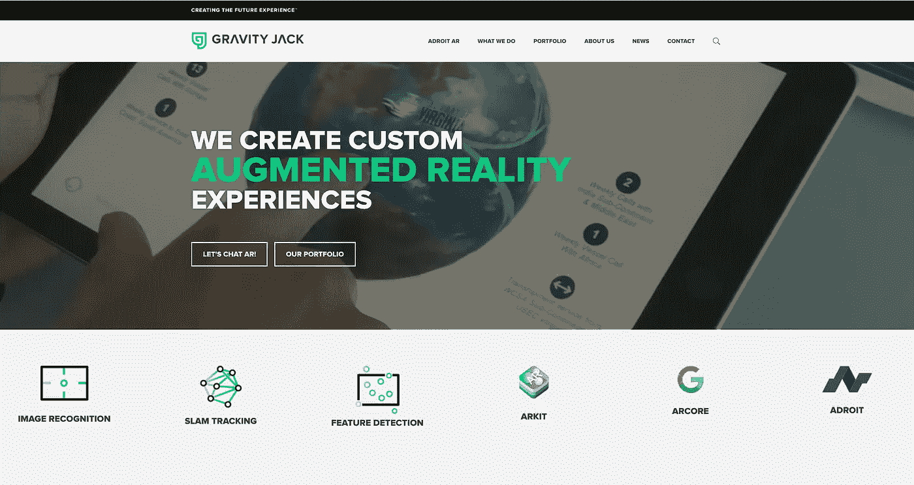
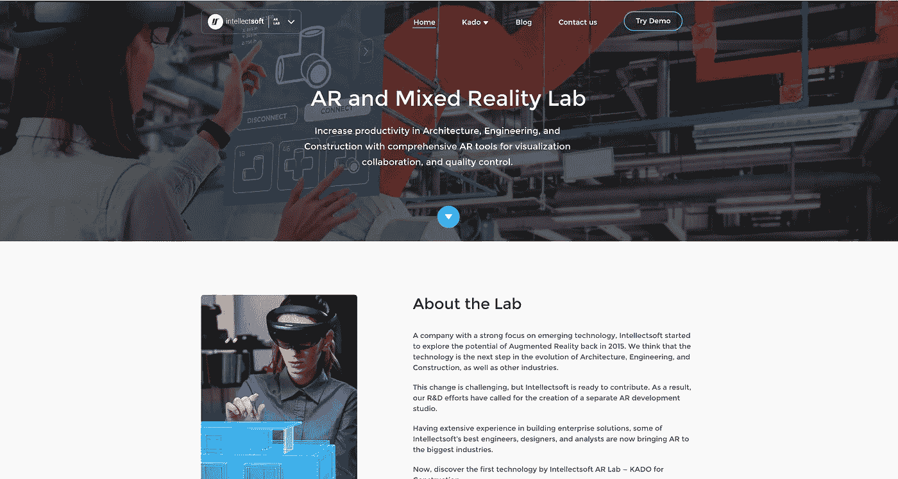
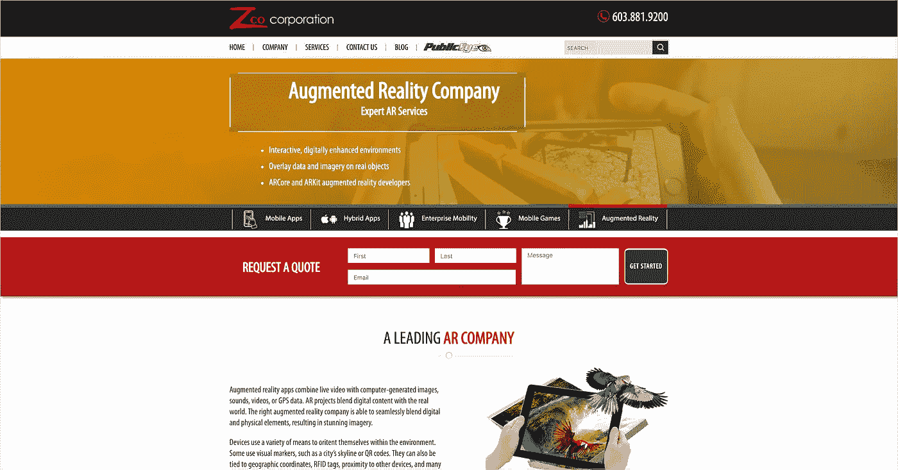
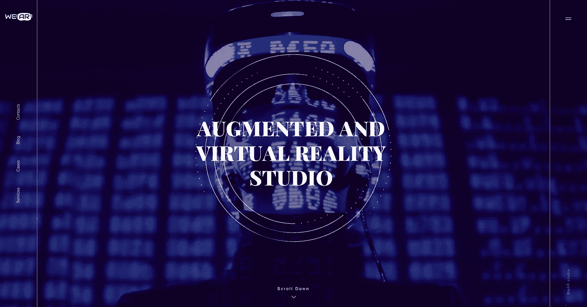
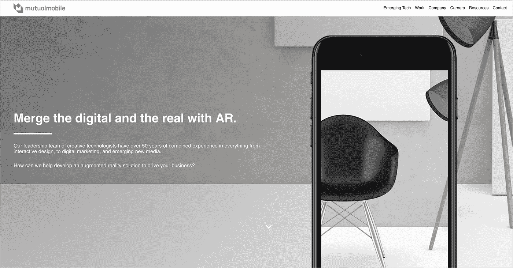
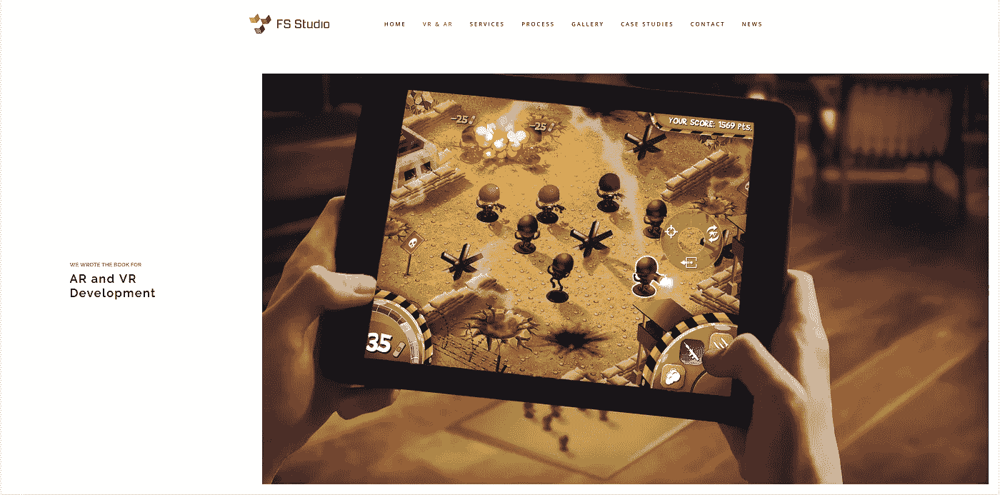
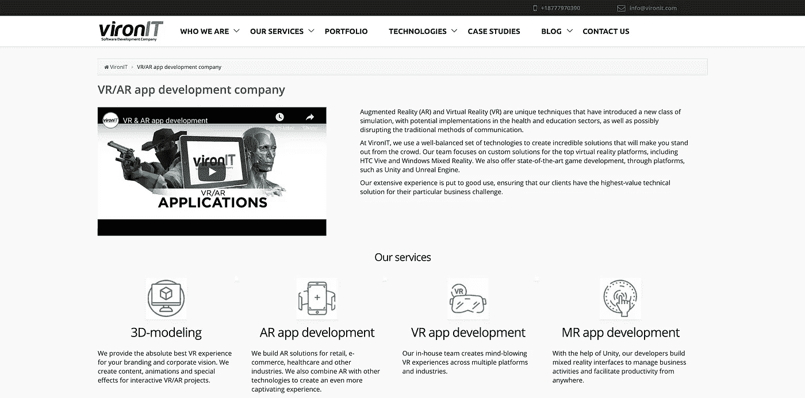
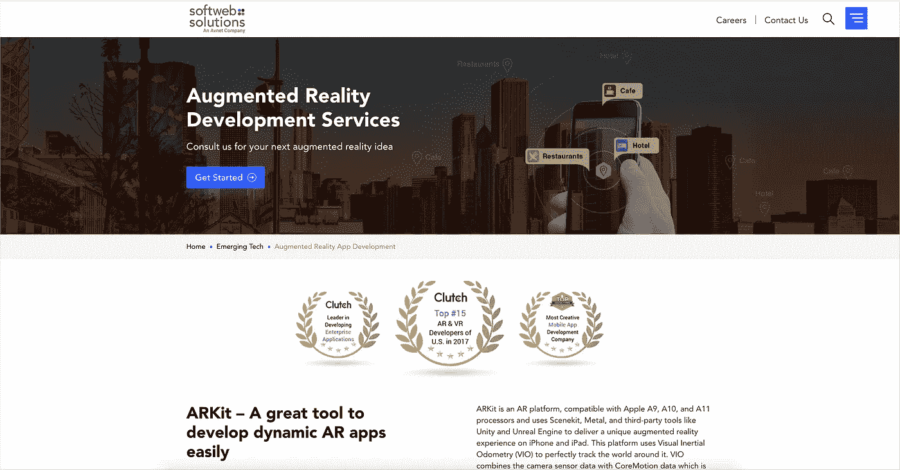

# 美国十大增强现实(AR)应用开发公司

> 原文：<https://medium.com/swlh/top-10-augmented-reality-ar-app-development-companies-in-the-us-60d3b3dce43c>

多亏了增强现实技术，你现在不用花一分钱就可以把最新的宝马轿跑加入你的车库；在你当地的公园或购物中心捕捉口袋妖怪；在家里摆放家具，或者试着化妆、染发或戴太阳镜——只需用手指轻轻一点。

如果你能梦到它，你就可以用增强现实在现实世界中体验它。

进入 2019 年，我们看到了对移动 ar(通过智能手机体验)的特别重视。)这是因为现代智能手机配备了提供有意义的 AR 体验所需的所有陀螺仪传感器、摄像头、处理器和高分辨率显示器。

挑战？构建一个基于 AR 的应用程序需要专业的资源，而大多数软件公司都不具备这些资源。

为此，我收集了美国十大增强现实应用开发公司的名单——这些公司拥有增强现实能力和经验，可以帮助你构建下一个增强现实移动应用。

## [1。西瓜比特](https://citrusbits.com/)

地点:加州洛杉矶/旧金山

员工:10 ~ 49 人

> “获奖的移动应用程序设计和开发”

CitrusBits 是少数几家拥有成熟的 AR 开发专业知识的移动应用代理公司之一。他们位于洛杉矶和旧金山，为知名客户如汉堡王、Quiksilver 和三星开发了重要的移动应用程序。

作为一家移动应用开发公司，CitrusBits 提供端到端服务，将 AR 应用设计和开发作为核心竞争力。凭借创建具有本机和无缝 AR 体验的令人惊叹的移动应用的能力，CitrusBits 可以帮助企业创建动态和迷人的移动应用，这些应用使用 AR 功能脱颖而出。

CitrusBits 的 AR 开发发生在许多平台上。虽然该机构的 AR 团队专门研究 ARCore、ARKit 和 Unity 等平台的移动 AR，但其他支持的平台包括 Unreal、Xamarin、Vuforia 和 web。

 [## 增强现实(AR)应用程序开发|柑橘比特

### 家庭增强现实(AR)开发作为少数几个拥有成熟的 AR 开发专业知识的移动应用代理公司之一…

citrusbits.com](https://citrusbits.com/augmented-reality-app-development/) 

## [2。凹槽琼斯](https://www.groovejones.com/)

地点:德克萨斯州达拉斯

员工:10 ~ 49 人

> “我们为世界级品牌创造屡获殊荣的交互式 AR + VR 体验。”

Groove Jones 以其沉浸式虚拟现实内容而闻名。Groove Jones 位于达拉斯市中心的总部，最初用作工厂建筑，痴迷于尖端技术的运营。

Groove Jones 在 AR、VR、ML 和 AI 方面都做过获奖的工作。他们专门从事包括 AR 在内的 XR 的创建，该团队有自己的实验室，可以在那里测试新的 VR 或 AR 产品和平台。

AR 开发方面，他们用的是自己的工具包 AR Object Toolkit 2.0。通过使用这个工具包，原始数据可以转换成现实的增强现实体验。这个工具包也支持 ARKit 和 ARCore。Groove Jones 还与脸书的 AR 工作室和 Snapchat 的 Lens 工作室合作。

 [## 为品牌及其代理机构提供屡获殊荣的 AR、VR 和混合现实体验

### Groove Jones 是一家创造性的技术公司，为世界级的客户提供下一代 AR、VR 和 MR 体验

www.groovejones.com](https://www.groovejones.com/) 

## [3。重力千斤顶](https://gravityjack.com/)

地点:华盛顿州斯波坎市

员工:10 ~ 49 人

> “我们正在创造未来体验”

增强现实是这些人的未来。Gravity Jack 于 2009 年在华盛顿成立，该公司从那时起一直在做软件和增强现实项目。

Gravity Jack 提供具有 AR 和 VR 功能的移动应用程序和 web 开发，以及 360°视频制作。

Gravity Jack 使用他们专有的 Adroit 平台来构建 AR 产品。有了 Adroit 和他们的 PoindextAR 技术，现实世界——从螺丝钉到摩天大楼——可以通过增强现实带入生活。此外，它们还具有图像识别、slam 跟踪、特征检测、ARKit 和 ARCore 方面的能力。

 [## 重力杰克|增强和虚拟现实公司

### 如果没有重力千斤顶，我们的客户所说的坦克世界是完全不可能的。这是…

gravityjack.com](https://gravityjack.com/) 

## [4**。智力软件**](https://www.intellectsoft.net/)

地点:加利福尼亚州帕洛阿尔托/纽约州纽约市

员工:350 人

> “有影响力的特定于行业的软件解决方案”

Intellectsoft 于 2007 年开始开发，现在被认为是具有移动 AR 功能的较好的开发伙伴之一。Intellectsoft 试图通过采用增强现实等新兴技术的数字产品来帮助组织克服特定的行业挑战。通过这样做，他们相信他们可以使我们的生活更容易，更简单，更聪明。

除了 AR，Intellectsoft 还与区块链、云计算、物联网和人工智能合作。他们的数字能力还包括移动应用程序开发、IT 咨询、UI 和 UX 设计以及软件测试。

Intellectsoft 的 AR 服务包括移动 AR(通过智能手机应用程序)、HoloLens 和运动控制器，以及 Unity 和 Web assembly。该公司的 AR 实验室正在为微软 Hololens 开发一个独特的 AR 框架，名为 Kado，专门用于建筑行业。

 [## 建筑增强现实解决方案| Intellectsoft 增强现实实验室

### 对于今天的 AEC 来说，很少有技术比建筑中的增强现实技术更有前途。一个非常专注的公司…

ar.intellectsoft.net](https://ar.intellectsoft.net/) 

## [5。Zco 公司](https://www.zco.com/)

地点:马萨诸塞州波士顿

员工:250 ~ 500 人

> “我们的理念是，更多的技术将会到来，我们会在那里！”

Zco 公司成立于 1989 年，位于波士顿，三十多年来一直致力于软件解决方案的开发。他们为自己的客户开发了从桌面到移动设备的软件产品，此后还增加了增强现实功能。

虽然移动应用开发是他们的专长，但 Zco 也做企业软件和 3D 动画。说到移动应用开发，他们已经建立了混合应用、移动游戏、企业应用和 AR 应用。

至于 AR，涵盖了消费者、企业、游戏。他们的团队可以将现场视频与计算机生成的图像、声音、视频或 GPS 数据相结合，以提供可信的增强现实体验。他们开发的平台包括 Unity 和 Vuforia，以及苹果的 ARKit 和谷歌的 ARCore。

 [## 增强现实公司|专家 AR 服务

### 通过与专业的增强现实公司合作，将数字内容与现实世界融合在一起。联系我们获取报价…

www.zco.com](https://www.zco.com/augmented-reality-services.aspx?utm_source=Top%2010%20Augmented%20Reality%20App&utm_medium=CTA&utm_campaign=Alex%20Sam) 

## [6。穿工作室](https://wear-studio.com/?ref=logo)

地点:加州洛杉矶

员工:50~249 人

> “如果你能梦想到，我们就能做到。”

正如你可能从这家公司的名字中推断的那样，WeAr Studio 是一个增强和虚拟现实工作室。WeAr 团队努力使用虚拟和增强现实体验来帮助客户实现他们的业务目标。

他们拥有使用 AR 的移动设备、可穿戴眼镜和耳机的全面服务能力。他们开发的平台包括 Vuforia、WikiTude 和 EasyAR，以及用于构建移动 AR 体验的 ARKit 和 ARCore。

 [## AR/VR/MR 中使用的技术:ARKit、ARCore、Vuforia

### 当今 VR/AR/MR 开发中使用的最新技术:Vuforia、ARKit、ARCore、Oculus HMDs、HoloLens 等。

wear-studio.com](https://wear-studio.com/what-are-the-technologies-used-in-ar-vr-mr/) 

## [7。相互移动](https://mutualmobile.com)

地点:德克萨斯州奥斯汀

员工:50 ~ 249 人

> “我们改变业务，推动世界前进。”

Mutual Mobile 是一家不断发展的数字机构，以创新为荣。通过无缝集成设计和技术，他们试图创造最好的移动体验。

这家屡获殊荣的机构利用新兴技术改变我们的日常生活。除了移动应用，该公司的能力还包括增强现实、虚拟现实、物联网和对话设计。

支持的 AR 平台包括 ARKit、ARCore、Vuforia、HoloLens 和 Unity。

 [## 增强现实-相互移动

### 设计增强现实体验需要对支持它们所需的平台有战略性的理解…

mutualmobile.com](https://mutualmobile.com/augmented-reality) 

## [8。FS 工作室](https://fsstudio.com/)

地点:加州旧金山

员工:10 ~ 49 人

> “通过高级软件开发创造奇迹”

在 FS Studio，VR 和 AR 无疑是优势领域。那里的团队已经成功地与众多客户合作，通过创新的 AR/VR 体验将他们的雄心变为现实。

他们提供的 AR/VR 技术能力超越了 iOS 和 Android，他们将计算机视觉、互联设备、物联网和人工智能视为自己的能力。

FS Studio 团队参与过大大小小的项目和平台。ARKit 和 ARCore 是他们合作的两个主要平台，但他们也与 OpenCV、Unreal 和 Unity 等平台合作。

 [## 虚拟现实和增强现实开发- FS Studio

### 我们将把你的概念从故事板，通过垂直切片，到全面开发，最后推出。我们可以给…

fsstudio.com](http://fsstudio.com/virtual-reality-and-augmented-reality-development/) 

## [9。维罗尼特](https://vironit.com/)

地点:加州旧金山

员工:10 ~ 49 人

> “定制软件开发公司”

VironIT 是一家全球性软件开发公司，在伦敦和白俄罗斯也设有国际办事处。该公司成立于 2004 年，在生产优秀软件产品方面有着相对较长的历史。

VironIT 的技术能力非常强大。他们提供的服务包括企业软件开发、移动应用程序开发、web 应用程序开发和游戏开发。他们还提供 VR/AR 开发，包括 3D 建模和 AR/VR/MR 应用程序开发。

他们开发应用的 AR 平台包括 ARKit 和 iOS，以及 Unity。

 [## VR/AR app 开发公司

### 增强现实(AR)和虚拟现实(VR)是独特的技术，引入了一种新的模拟…

vironit.com](https://vironit.com/vr-ar-app-development/) 

## [10。软网络解决方案](https://www.softwebsolutions.com/)

地点:德克萨斯州达拉斯/伊利诺伊州芝加哥

员工:250 ~ 500 人

> “改变你的明天。”

Softweb Solutions 是一家技术咨询和数字服务机构，十多年来一直致力于新兴技术。

他们广泛的新兴技术能力包括物联网、数据平台、移动应用、人工智能以及增强现实和虚拟现实。他们广泛的专业知识使他们在市场上具有竞争力。

关于 AR 开发，他们用 ARKit 做 iOS 应用，还有 Vuforia，Wikitude，ARCore。

 [## 雇佣 AR 应用开发者，增强现实应用开发公司

### ARKit -轻松开发动态 AR 应用的伟大工具 ARKit 是一个 AR 平台，兼容苹果 A9、A10 和 A11…

www.softwebsolutions.com](https://www.softwebsolutions.com/augmented-reality-app-development.html) 

## 这篇文章发表在[《创业](https://medium.com/swlh)》上，这是 Medium 最大的创业刊物，有+406，714 人关注。

## 在这里订阅接收[我们的头条新闻](http://growthsupply.com/the-startup-newsletter/)。

