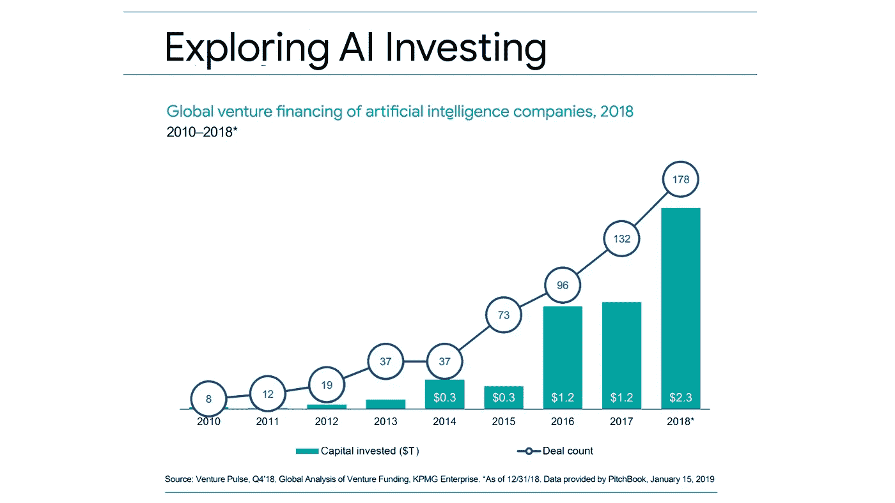

# 2019 年值得关注的 10 大(预期)独角兽人工智能创业公司

> 原文：<https://medium.com/swlh/top-10-expected-unicorn-ai-startups-to-watch-in-2019-dec38bc5f2ef>

## 我们研究了 Crunchbase 中列出的 10，668 家创业公司和公司，它们的主要应用程序、产品和服务都依赖于人工智能

Source: Venture Pulse, Q4'18 Global Analysis of Venture Funding

从重新定义管理通过评估候选人的先天和新兴优势，通过消除有意识和无意识的偏见…