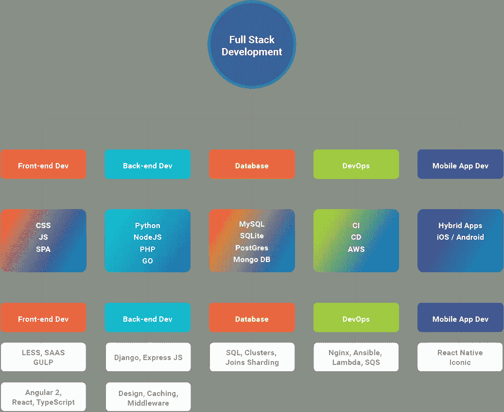
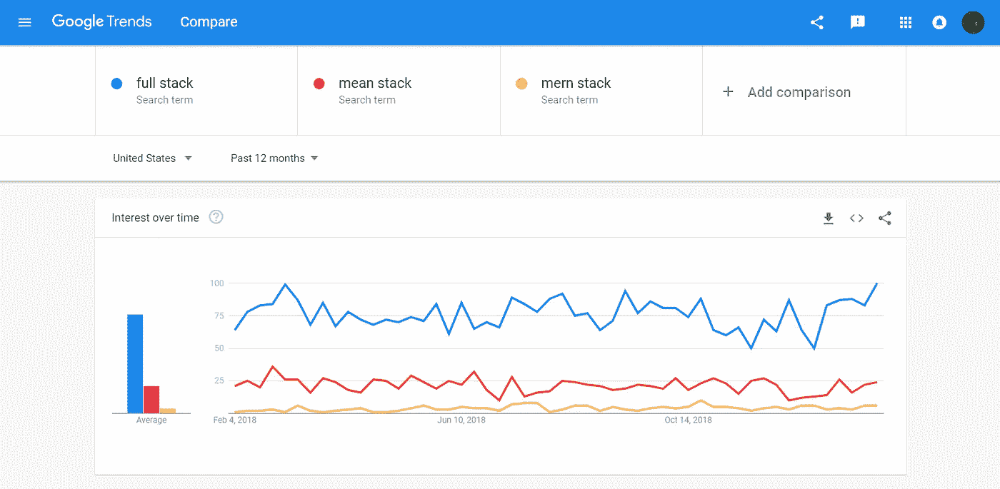

# 2020 年十大全栈开发公司

> 原文：<https://medium.com/swlh/top-10-full-stack-development-companies-in-2019-2f33436f8992>

**Source: Designed By Author**

大家好，现在全栈开发是最流行的 web 和移动应用程序开发技术之一。如果我不得不详细说明谁以及为什么要雇用全栈开发人员或开发团队；“完整”完成一个项目所需的一系列技术的集合；而“栈”指的是子模块的集合。这些软件子模块或组件组合起来实现所需的功能，而不需要其他模块。下面给出的图片将消除你对技术堆栈的疑虑。

**Source: Designed By Author**

在 [**全栈开发服务**](https://www.bacancytechnology.com/full-stack-development) 中，拥有完整知识的程序员可以处理数据库、服务器、系统工程、客户端的所有工作。根据项目的不同，客户需要的可能是移动堆栈、web 堆栈或本机应用程序堆栈。2019 年创造了有史以来对全栈开发者的最高需求。为什么会这样？总结，如今你在职业中掌握的技能越多，你在行业中的价值就越大。拥有一个非常了解 web 和应用程序开发的人是多么大的好处啊。

***但现实中这些人是谁！无法用三言两语回答的问题。如果你想找一个精通各行各业的人，你将不得不从拥有大量投资组合和客户的知名公司中寻找特定的开发人员。***

这是 2020 年全栈开发的技术路线图，在为你的项目雇佣公司或自由团队之前，你需要考虑一下。
**来源于博主:**[https://techtrendingnew . blogspot . com/2019/02/full-stack-development-roadmap-for-2019 . html](https://techtrendingnew.blogspot.com/2019/02/full-stack-development-roadmap-for-2019.html)

> **最后，这里列出了 10 家最好的全栈开发公司，供你在 2020 年进行下一个 web 或移动应用开发项目时考虑。**

1.  [**Bacancy 技术**](https://www.bacancytechnology.com)随叫随到支持:+1 347 441 4161，+1 416 907 6738
    邮箱:[solutions@bacancytechnology.com](mailto:solutions@bacancytechnology.com)
2.  [**元设计解决方案**](https://metadesignsolutions.com/full-stack-development-company)随叫随到支持:+1 917 728 1770
    邮箱:[sales@metadesignsolutions.com](mailto:sales@metadesignsolutions.com)
3.  [**peer bits**](https://www.peerbits.com)随叫随到支持: +1 877 707 0459 ， +919574078295
    邮箱:【info@peerbits.com】T21
4.  [**多点**](https://www.multidots.com/)
    随叫随到支持:+1–646–568–5447，+91–79–2970–8121
    邮箱:[inquiry@multidots.com](mailto:inquiry@multidots.com)
5.  [**八进制 IT 解决方案**](https://www.octalsoftware.com)随叫随到支持:+1–817–717–1793，+44–7706116080
    邮箱:[enquiry@octalsoftware.com](mailto:enquiry@octalsoftware.com)，[enquiry@octalsoftware.co.uk](mailto:enquiry@octalsoftware.co.uk)
6.  [**像素点技术**](https://pixelpointtechnology.com)
    随叫随到支持:+91–9887353003
    邮箱:[info@pixelpointtechnology.com](mailto:info@pixelpointtechnology.com)
7.  [**即时信息解决方案**](https://www.konstantinfo.com)随叫随到支持:+1–310–933–5465、+44–203–239–7253、+91–141–2291398
    电子邮件:[sales@konstantinfo.com](mailto:sales@konstantinfo.com)
8.  [**in wizards**](http://www.inwizards.com)随叫随到支持:+44–2032906266、+61–0280033039、+91–9229225552、+1–9796334727
    邮箱:[info@inwizards.com](mailto:info@inwizards.com)
9.  [**Concettolabs**](https://www.concettolabs.com)
    随叫随到支持:+1(903)200–8801，+91(958)677–7575
    电子邮件:[info@concettolabs.com](mailto:info@concettolabs.com)
10.  [**像素蜡笔**](https://www.pixelcrayons.com)随叫随到支持:+1 646–415–8677，+91 888–210–8080，+44 1923–606–162，+61 2–8015–5687
    电子邮件:[sales@pixelcrayons.com](mailto:sales@pixelcrayons.com)，[marketing@pixelcrayons.com](mailto:marketing@pixelcrayons.com)

> 以上 10 家公司是各自领域的技术先锋，拥有成功执行项目所需的所有技能和专业技术。我与大家分享的数据是我对顶级全栈开发公司的最佳研究和知识。

> 这里是 google 趋势的图形表示，它会让你大吃一惊，并让你重新考虑为你的项目选择合适的技术堆栈。

**Source: Google Trends**

# **结论* *

[**Web 发展趋势**](/swlh/top-web-development-trends-you-need-to-consider-for-your-project-in-2019-37e4c83b691d) 正以前所未有的速度增长，与之相对应的是，技术也在不断更新和更加典型，这在过去几年中开启了 web &移动应用开发服务的新维度。写完这篇博客后，我发现了一些有趣的事实:为什么全栈开发在网络和移动应用开发服务的新时代非常重要。为了帮助你们，如果你们觉得这个博客足够好，可以帮助你们雇佣一个开发者或团队，那么把它分享给你的朋友，帮助他们在全球市场上大放异彩。

 [## 2019 年你的项目需要考虑的顶级网络发展趋势

### 现在的 web 开发资源与过去几年有所不同，换句话说，就是每天…

medium.com](/swlh/top-web-development-trends-you-need-to-consider-for-your-project-in-2019-37e4c83b691d)  [## Web 开发—黑客正午

### 阅读 Hacker Noon 中关于 Web 开发的文章。黑客如何开始他们的下午？

hackernoon.com](https://hackernoon.com/tagged/web-development) 

## 这篇文章发表在 [The Startup](https://medium.com/swlh) 上，这是 Medium 最大的创业刊物，拥有+423，678 名读者。

## 在这里订阅接收[我们的头条新闻](https://growthsupply.com/the-startup-newsletter/)。

