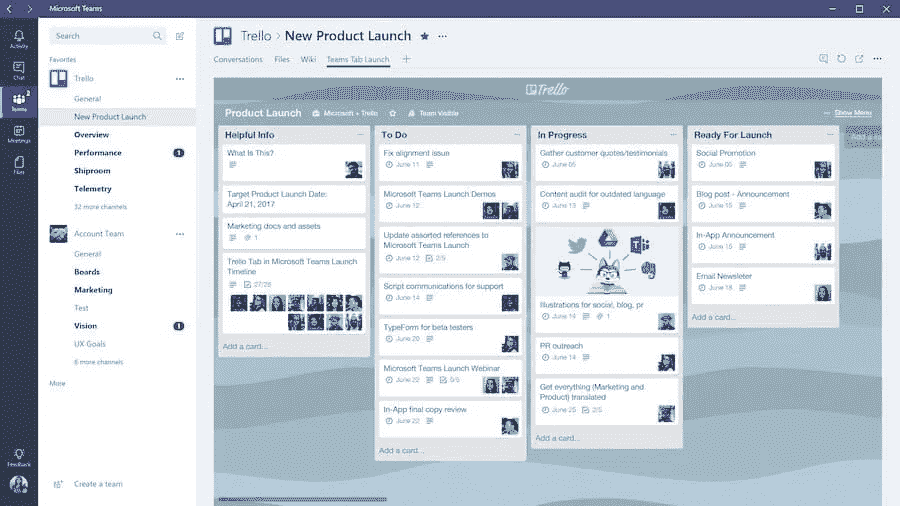
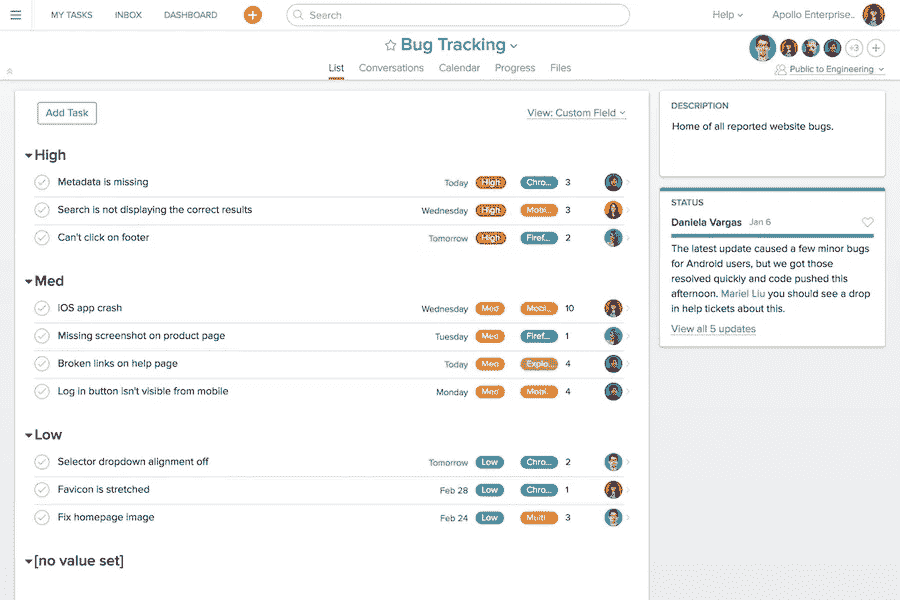
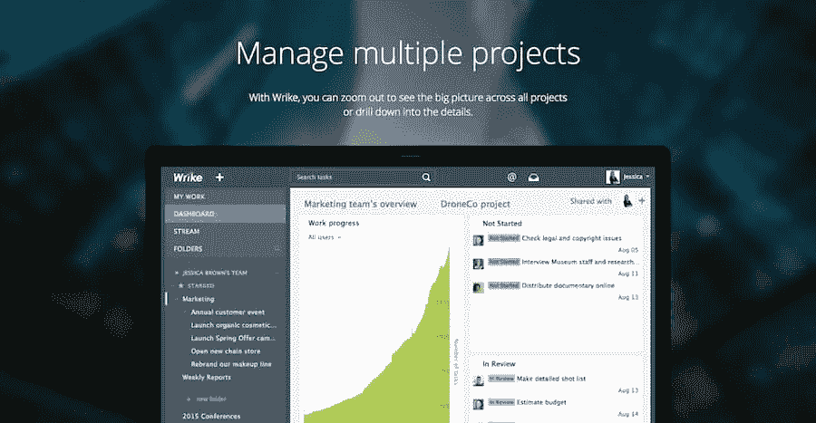
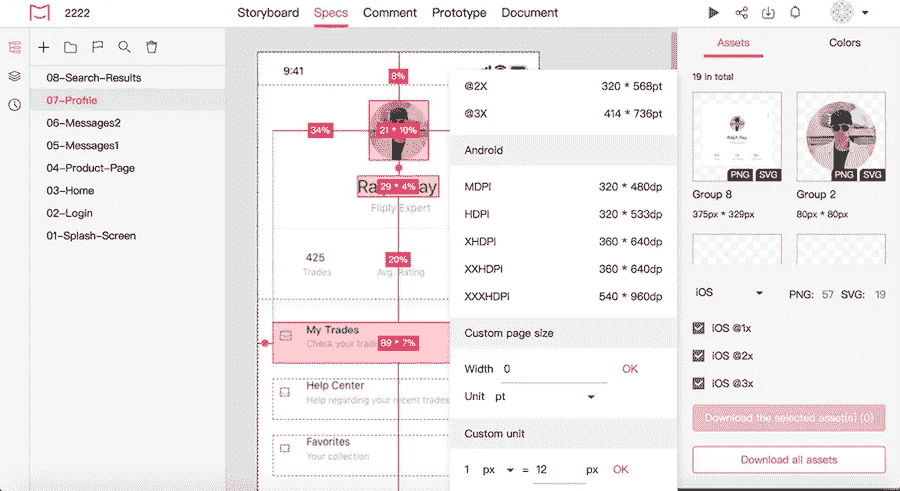
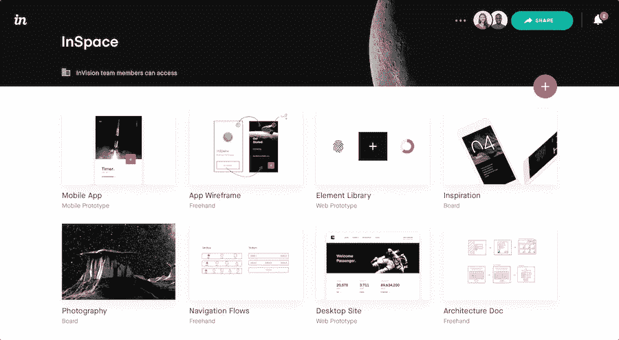
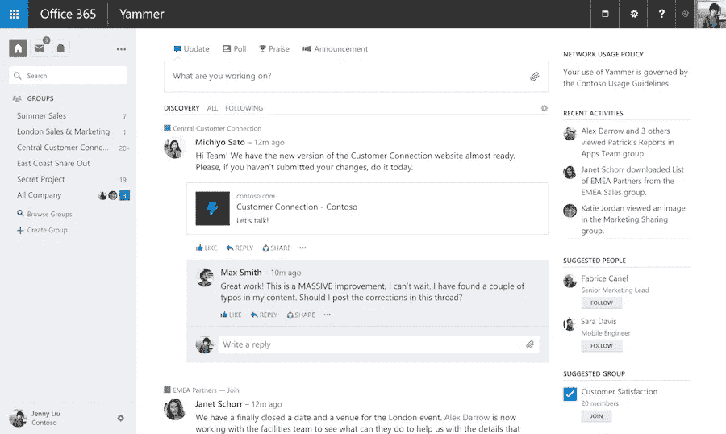
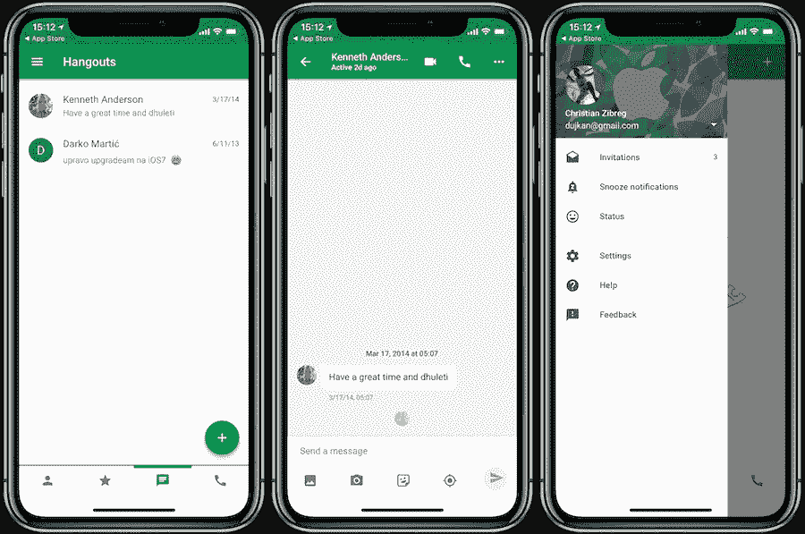
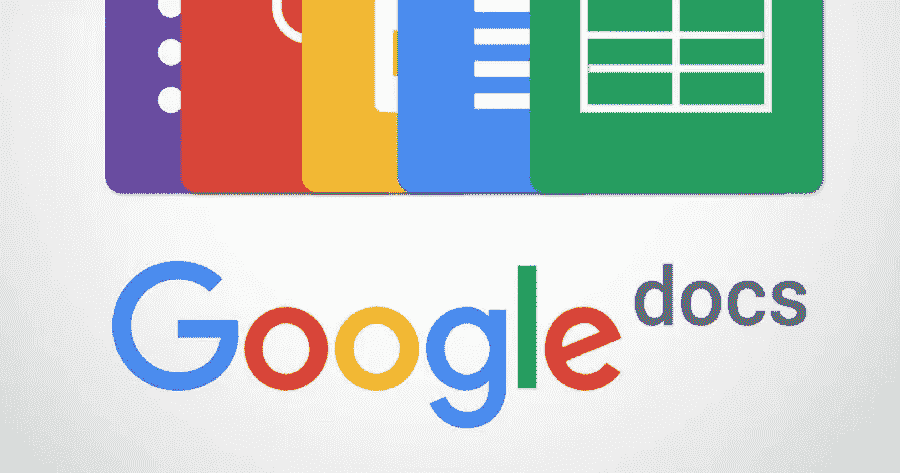
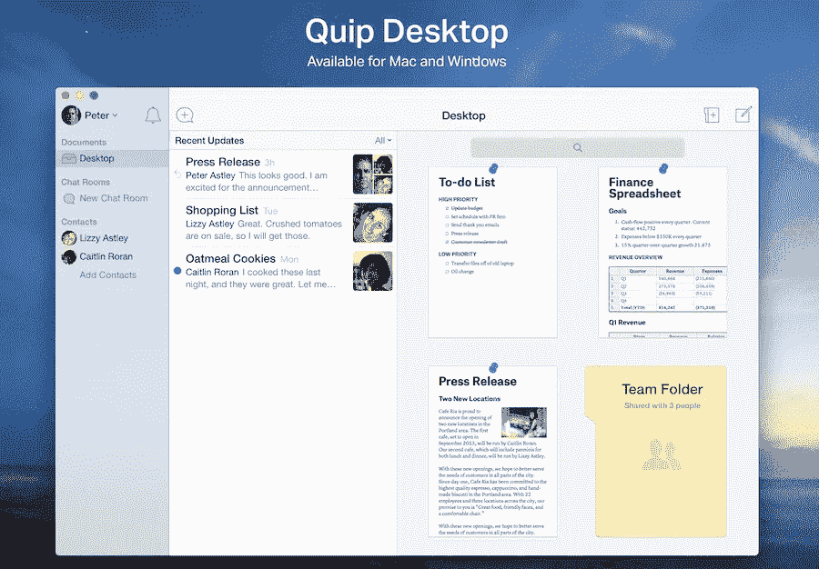
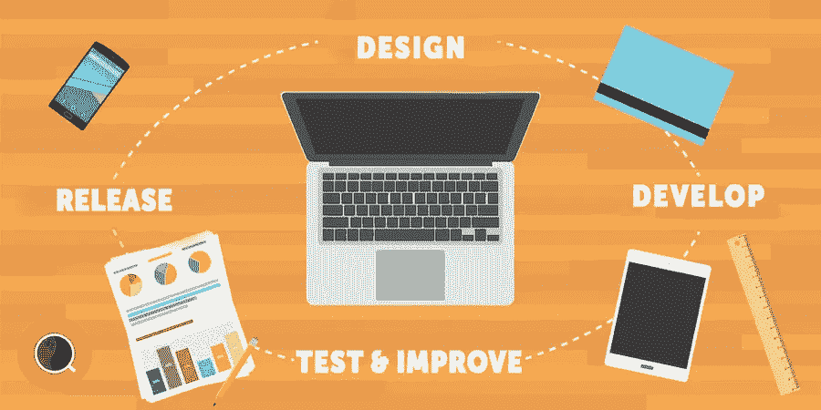

# 十大项目协作软件—让您的协作变得前所未有的简单

> 原文：<https://medium.com/swlh/top-10-project-collaboration-software-make-your-collaboration-easier-than-ever-4c470147976a>

**概要:**

众所周知，效率在商业成功中起着至关重要的作用。有一种说法是“最大化效率的最好方法是充分利用你可用的工具。”当您监控任务进度或跟踪目标时，有多种工具可以帮助您有效地协作。

如果你是一名项目经理或设计师，正在寻找一种新工具，但不知道哪种工具最适合你，那么你来对地方了。这里有一份 T2 10 大项目协作工具的列表，可以给你指明正确的方向。

让我们开始吧！

**工具:**

*   项目管理工具
*   设计协作工具
*   团队沟通工具
*   文档协作工具

**如果你是一名:**你会发现这些工具很有用

*   设计师(网页设计师、UX/UI 设计师、平面设计师等。)
*   项目管理人
*   生产部经理
*   软件工程师
*   网站开发者
*   业务操作

# 项目管理工具

# [特雷罗](http://www.trello.com/)

**Trello 是目前最受欢迎的协作管理应用之一**。它允许团队成员创建和分发项目，并通过平台以非常简单的方式对项目进行分类。它还允许您随时跟踪项目的进度。如果你曾经在谷歌搜索过项目协作工具，你肯定会遇到 Trello。

此外，Trello 的界面也很人性化。您的所有团队任务都使用卡片显示。每列代表项目的不同部分，您可以根据需要组织不同的任务。毫无疑问，Trello 使团队成员能够有效地合作。

*   平台:Web、iOS、Android
*   集成:GitHub、Google Drive、Slack 等。
*   特点:创建任务列表，清晰友好的用户界面，灵活的管理模式

# [体式](http://www.asana.com/)

**Asana 是当今领先的项目协作管理工具之一。它集成了电子邮件、办公文档和通信。通过这个平台，你可以把你所有的项目组织成一个列表或者板块。您可以直接创建任务，并邀请团队成员加入项目。为了确保项目按预期进展，你可以设定最后期限，并进一步强调紧迫性。**

而且每个人都可以直接在一个任务下面发表评论，方便了团队成员之间的实时交流。

*   平台:Web、iOS、Android
*   集成:Slack，Dropbox，Github 等。
*   功能:项目优先级设置，待办事项列表，100 多个集成

# [里克](https://www.wrike.com/)

Wrike 是一个屡获殊荣的在线项目协作管理平台，帮助团队成员参与每个项目。他们能够协作、计划并更快地完成工作。使用 Wrike，您可以轻松管理和跟踪团队的项目。同样，Wrike 支持实时编辑，因此它允许您随时查看实时报告和团队所有项目的状态。

*   平台:Web、iOS、Android
*   整合:吉拉、Dropbox、LinkedIn、Zapier、Salesforce 等。
*   功能:实时编辑、定制仪表板、文档共享、版本控制、易于使用的工作区

# 设计协作工具

# [Mockplus iDoc](https://goo.gl/otVypm)

**Mockplus iDoc 是一款面向设计师和开发者的强大项目设计协作工具。**它的优势在于为产品团队创造一个互联的在线空间。它擅长于促进设计者和开发者的合作。Mockplus 自动为您的设计文件创建一个“开发友好”的视图，捕获 CSS 样式、字体、颜色和切片。简而言之，它给了开发人员他们所需要的东西，让他们能够将你的设计变成现实。还有一些有用的附加特性，比如版本历史等等。

平台:Web、iOS、Android

插件:PS，素描，Adobe XD

特点:

*   从 Sketch、Adobe XD 和 Photoshop 中一键导出设计
*   自动生成准确的规格、资产和代码片段
*   在全视图情节提要中显示设计任务和工作流
*   对设计发表评论，提供即时反馈
*   使用真实的设计文件构建高保真交互式原型
*   支持上传各种类型的产品文档和在线预览

下载插件，开始您的协作之旅:

*   [PS 插件](https://idoc.mockplus.cn/download/ps)
*   [草图插件](https://idoc.mockplus.cn/download/sketch)
*   [Adobe XD 插件](https://idoc.mockplus.cn/download/xd)

# [视觉](https://www.invisionapp.com/)

**Invision 是一款高效的原型协作工具，设计人员可以更轻松地创建原型。**通过这个平台，你可以上传你的设计，创建行动，并从你的同事和客户那里无缝地接收反馈。

*   平台:Web、iOS、Android
*   插件:PS，Slack 等。
*   特点:高保真原型，在线评论

# 团队沟通协作工具

# [Yammer](https://products.office.com/en-us/yammer/yammer-overview)

Yammer 是 2008 年 9 月推出的社交网络平台。它将小型、中型和大型团队聚集在一起，帮助公司促进协作。Yammer 的独特之处在于，它只能通过在公司域中注册的工作邮箱访问，确保隐私。

Yammer 帮助您建立一个社区，人们可以根据自己的兴趣相互交流，并从整个同事网络中收集想法和意见。

*   平台:Web、iOS、Android
*   功能:文件共享，在线交流

# [懈怠](http://www.slack.com/%E2%80%8E)

**Slack 是一款功能强大的协作工具，可以在团队成员之间提供实时通信、文件共享、存档和搜索功能。**任何人都可以在 Slack 中标记任何人；当您标记某人时，他们会收到一条消息，通知他们已被标记。您可以为不同的类别或部门创建多个渠道，如 UX 设计、网站开发、项目管理等。这个特性使得 Slack 变得非常有价值，因为它增加了组织的层次，并且使得团队成员可以过滤掉噪音。

更重要的是，Slack 提供了邮件、短信、Google Drive、Twitter、Trello、Asana、GitHub 等强大的集成。

*   平台:Web、iOS、Android
*   特点:文件共享，在线交流，友好的用户界面，强大的集成

# [Google Hangouts](https://chrome.google.com/webstore/detail/google-hangouts)

**Google Hangouts 是一款免费的即时通讯应用，让您可以随时随地与同事聊天。它还允许你通过谷歌账户召集你的团队开会。**

Hangouts 的优点是简单。除了用户友好之外，几乎任何人都可以访问 Hangouts，因为 Gmail 已经无处不在。

*   平台:Web、iOS、Android
*   功能:简单、免费、多人通话

# 文档协作工具

# [谷歌文档](https://www.google.com/docs/about/)

**Google Docs 是一款强大的在线协作办公工具，允许您随时随地免费创建、编辑和协作文档。**在谷歌文档上，多人可以同时在线编辑同一个文档，你所做的修改会自动保存。用户还可以添加评论并标记相关的团队成员。

更重要的是，有数百种字体可供选择，您可以添加链接、图像和绘图等。

# [妙语](https://quip.com/)

**Quip 也是团队协作的文档处理工具，允许多人同时编辑文档。**与其他产品不同，Quip 支持即时消息。如果在协作过程中遇到什么问题，可以直接和其他团队成员交流。Quip 使用户能够通过减少电子邮件和会议来更快地完成工作，从而大大提高团队效率。

# 我如何选择协作工具？

虽然市场上有很多协作工具，但选择最合适的工具需要一些考虑。。以下是一些需要牢记的关键因素:

# 1.公司要求

根据公司的需求和文化，确定项目协作工具是否真正帮助您简化团队工作或提高生产率。

# 2.[可用性](https://www.mockplus.com/blog/post/usability-design)

这无疑是选择任何工具时最重要的因素之一。如果需要太多的时间去学习如何使用一个工具，对团队的协作效率没有帮助。必须选择一个简单、直观的在线协作工具(例如，mock plus iDoc——一个简单易学的工具，通过从 Photoshop、Sketch 和 Adobe XD 中提取设计并将其导出为可以轻松生成代码片段、样式指南、规格和资源的格式，帮助设计人员简化移交)。

# 3.安全性和隐私

隐私是当今互联社会的内在要求。每个项目都需要防止被窥探，所以在选择协作工具之前，一定要检查隐私选项和功能。

# 4.集成和兼容性

请记住，每个人都使用不同的设备——一些人使用 PC，而另一些人更喜欢使用 Mac。因此，选择支持多种操作系统的工具是至关重要的。否则，一些团队成员将无法沟通，首先否定了目标。

这是你今天能找到的 10 个最流行的项目协作工具。我希望你能找到一个或两个完全符合你的要求并帮助你提高团队效率的人。

## 这篇文章发表在[《创业](https://medium.com/swlh)》上，这是 Medium 最大的创业刊物，有+409714 人关注。

## 在这里订阅接收[我们的头条新闻](http://growthsupply.com/the-startup-newsletter/)。

