# 2019 年 12 大移动应用分析平台(包括定价)

> 原文：<https://medium.com/swlh/top-11-mobile-app-analytics-platforms-pricing-included-cdc553578fd>

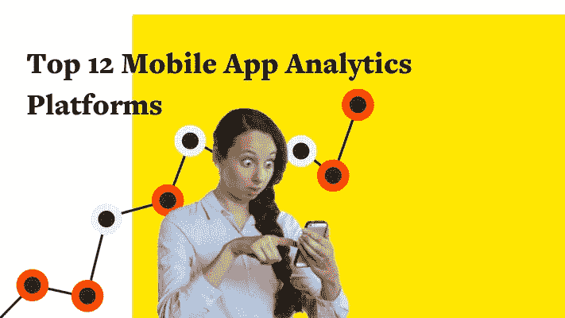

Top Mobile Analytics Platforms in 2019 (Pricing Included)

创建一个应用程序只是成功的一半。一旦应用完成，你需要了解你的用户。他们在点什么，刷什么，看什么，买什么？他们多久使用一次你的应用程序，在应用程序中停留多长时间？了解这一点的最佳方式是使用移动应用分析平台。在两家领先的应用程序商店中，有超过 400 万个应用程序，跟踪用户的习惯和行为变得越来越重要。移动应用分析收集并呈现数据，洞察所有平台。他们帮助我们实现目标。

今天，一些国家[的普通用户在他们的手机](https://www.appannie.com/en/insights/market-data/looking-ahead-mobile-in-2019/)上有超过 100 个应用程序。比以往任何时候都有更多的归因安装。归因安装以 39%的速度增长，而非归因安装增长速度较慢。这意味着越来越多的营销人员正在跟踪用户使用他们的应用或通过他们的应用的旅程。

# 1.重火力点

Firebase 是谷歌的移动平台，用于开发在 iOS、Android 或网络上扩大用户基础的应用程序。它实际上在 2014 年被谷歌收购，并很快成为谷歌面向开发者的旗舰移动平台。从那以后，它又进行了三次收购。Firebase 在一个中心位置测量一切，从用户参与到应用崩溃。在多平台支持下，它提供漏斗可视化、群组分析、A/B 测试和实时分析。Firebase 与谷歌的其他产品如谷歌广告和 AdMob 集成在一起。

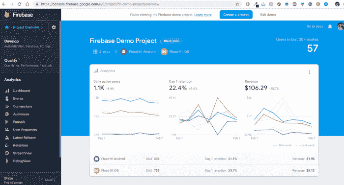

**主要特点:**

无限报道
受众细分
崩溃报道
实时数据库
云存储
深度链接性能
应用内购买数据
归属
深度受众细分

**支持的平台:** Android、iOS、C++、Unity

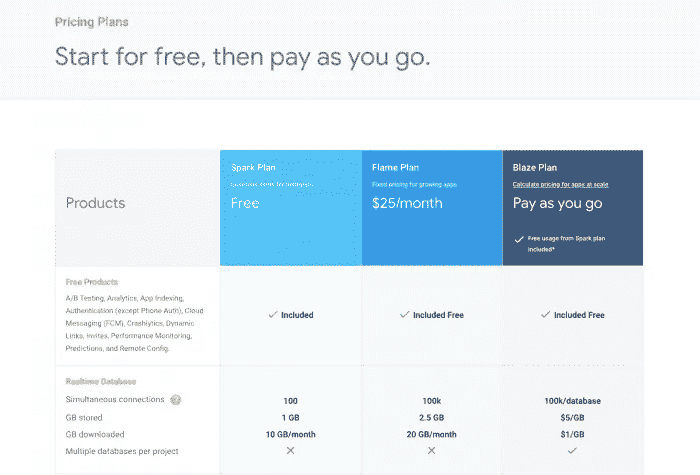

**定价方案:**星火计划—免费，火焰计划(25 美元/月)，火焰计划— [计算](https://firebase.google.com/pricing/#blaze-calculator) [定价](https://firebase.google.com/pricing/#blaze-calculator)

总部:美国旧金山

办公室:美国旧金山

**支持:**常见问题解答、支持指南、Stack Overflow 和 Quora 上的社区论坛、通过电子邮件的技术支持(填写[支持表格](https://firebase.google.com/support/contact/?category=troubleshooting))
—如果您有付费的 GCP 支持计划，您应该通过 [**GDP**](https://console.cloud.google.com/projectselector/support/cases?pli=1) [**支持**](https://console.cloud.google.com/projectselector/support/cases?pli=1) [**控制台**](https://console.cloud.google.com/projectselector/support/cases?pli=1) 提交技术问题

# 2.苹果分析(应用分析)

专门针对应用商店中发布的应用的移动应用分析。它提供了对用户如何发现你的应用或他们如何搜索应用商店的洞察。苹果分析跟踪应用商店的印象，用户参与度，以及用户的细分。销售和趋势部分让您了解哪些应用或应用内订阅最受欢迎。

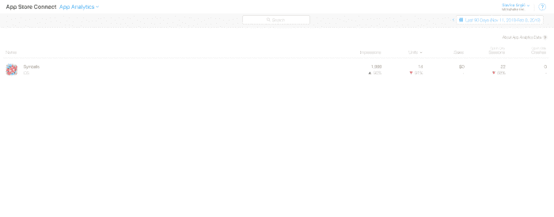

**主要特点:**

使用数据
销售数据
应用商店数据
仅支持 iOS 平台
无需安装 SDK

**支持的平台:** iOS

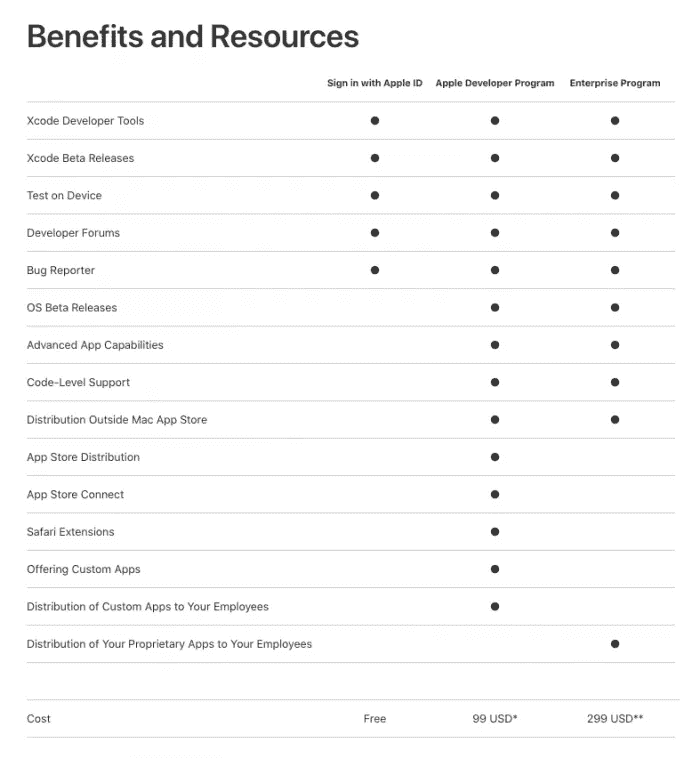

**定价计划:**包含在苹果开发者计划费用中，费用为 99 美元或 299 美元

美国旧金山，总部

**办事处:** Cupertino、多伦多、Khwaeng Pathum Wan、台北市、新加坡、奥克兰、吉隆坡、南湾、首尔、东京、悉尼、孟加拉鲁、铜锣湾、科克(由于 Apple Analytics 是 Apple 的产品之一，此处列出了设有 Apple 办事处的城市)

**支持:**苹果开发者支持通过[电话](https://developer.apple.com/contact/phone/)或电子邮件(在表格中提交你的[问题之后)，开发者论坛](https://developer.apple.com/contact/#!/topic/select)

# 3.AppsFlyer

定制分析工具，洞察丰富的应用内事件、全渠道衡量、成本和投资回报报告，为不同的内部商业智能系统提供支持。AppsFlyer 还有一个专用的移动应用程序，用于在旅途中监控性能。由于这也是一个归因平台，它可以为特定目标提供更深入的应用洞察，如重新定位归因、电视归因和深度链接。

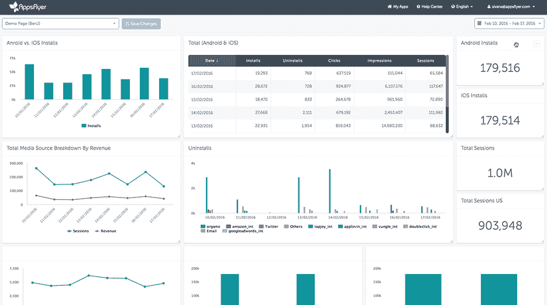

**功能:**

移动归属地
营销分析
深度链接
电视归属地
用于移动追踪的移动应用

**支持的平台:** iOS，Android，Windows & Xbox，Amazon，tvOS，Unity，Cordova，Marmalade，Cocos2ds，Adobe Air，React Native

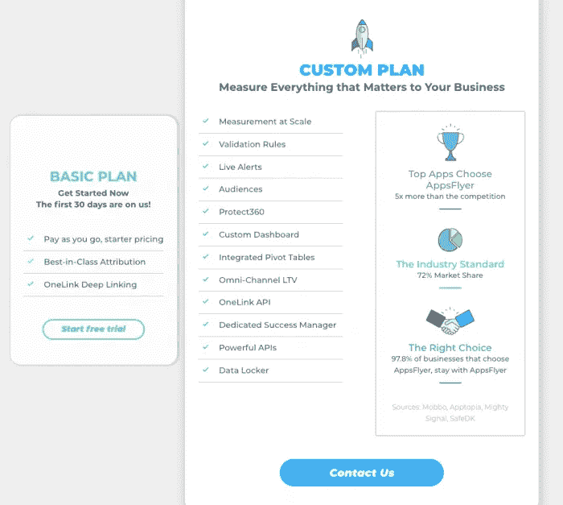

**定价计划:** 30 天免费试用，按需定制计划

**总部:**美国旧金山

**办事处:**旧金山、纽约、赫兹利亚、北京、柏林、海法、伦敦、曼谷、东京、首尔、班加罗尔、布宜诺斯艾利斯、圣保罗、基辅

**支持:**邮箱([support@appsflyer.com](mailto:support@appsflyer.com))，[帮助中心](https://support.appsflyer.com/hc/en-us)

# 4.游戏分析

GameAnalytics 是一款免费且灵活的分析工具，专门用于改善整个投资组合的 KPI。超过 54，000 个游戏开发者使用这个平台来优化他们的游戏。它拥有超过 8.5 亿活跃玩家，在超过 6.3 万个游戏中使用。这个免费的玩家分析平台对于开发者来说是一个很好的选择，无论是独立游戏公司还是大型游戏工作室。这有助于他们通过基于数据做出正确的决策来分析、理解和货币化他们的球员。

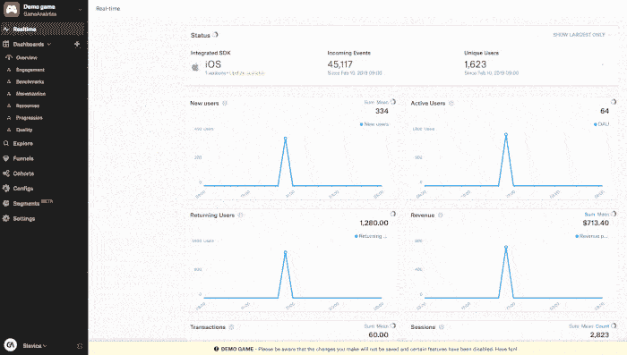

**功能:**

跟踪活动
在一个平台中收集、可视化和跟踪玩家数据
通过错误跟踪改进游戏
与许多平台集成
完全免费

支持的平台: Unity，Unreal，iOS，Android，Javascript

**定价:**完全免费使用，无定价模式

总部:丹麦哥本哈根

办公室:伦敦、哥本哈根、新德里、北京

**支持:** [FAQ 页面](https://gameanalytics.com/docs/faq)，[联系](https://gameanalytics.com/contact) [表单](https://gameanalytics.com/contact)寻求支持

# 5.调整

统一的移动应用分析工具，在一个简单的界面中收集移动营销数据。你可以发现每小时的趋势，评估用户 LTV 和分析群体。该平台允许用户跟踪所有应用内事件，并将数据同步回他们自己的 BI 平台。调整用户一生中的跟踪事件，在仪表板中汇总他们的所有参与度数据。通过**群组分析**，您可以根据创意、安装日期、位置等对用户进行细分。防欺诈套件保护您免受恶意和欺诈活动的侵害。

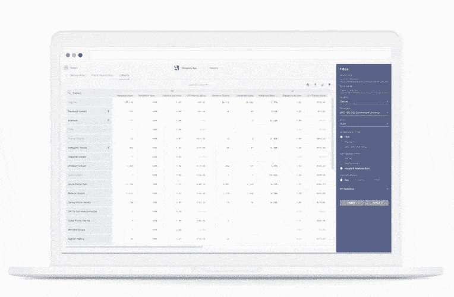

**功能:**

应用和广告平台
防欺诈套件
完全可定制的事件跟踪
定制的受众细分
获取原始数据
实时数据

**支持的平台** : iOS、Android、Windows Store、Windows Phone

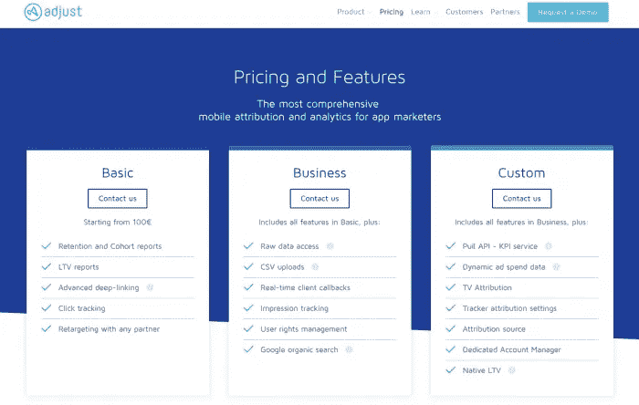

**定价计划:**100€起的基本计划、业务计划和定制计划(根据要求)

总部:德国柏林

**办事处:**柏林、旧金山、纽约、巴黎、伦敦、莫斯科、伊斯坦布尔、上海、北京、首尔、东京、孟买、圣保罗

**支持:**调整文档—回答最常见问题的页面，邮件支持([support@adjust.com](mailto:support@adjust.com))

# 6.调整

移动应用分析和绩效营销平台。它通过统一每个渠道的接触点来跟踪客户的整个旅程。2018 年被 Branch.io 收购，此后， [TUNE 的归因分析平台就是 Branch](https://branch.io/tune/) 的一部分。Tune 是一个单一的集成解决方案，用于在整个客户旅程中进行测量和参与。基于人的归因意味着你必须错过任何东西。您将拥有 30%以上的数据来优化您的营销活动并最大化投资回报。它拥有强大的定位和测量技术，每月跟踪 250 亿次事件。

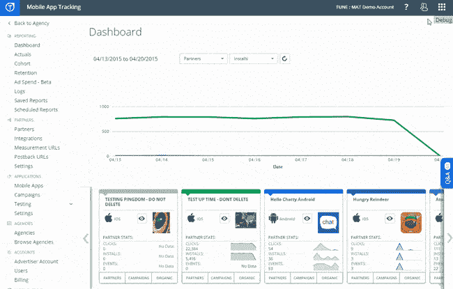

**功能:**

统一接触点
分支机构的一部分
基于人员的归因引擎
欺诈检测
群组分析
成本消化/投资回报率

**支持的平台:** Android、iOS、tvOS、Javascript、Windows

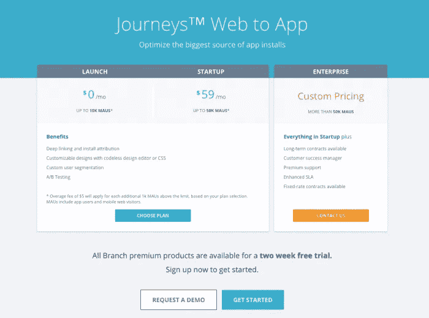

**定价:**免费高达 10K 茂，启动和企业计划(根据要求)

总部:美国西雅图

办公室:西雅图、旧金山、特拉维夫、纽约、首尔、伦敦、柏林、东京、古鲁格拉姆

**支持:**提交[支持票](https://help.tune.com/contact-support/)后通过电子邮件联系

# 7.科恰瓦

Kochava 是一个移动应用分析和归因平台，用于跟踪移动应用的用户获取、参与和 LTV(长期价值)。借助 Kochawa 移动分析平台，您将能够看到并捕捉所有重要的数据点，创建用户群组。数据集，您将能够以各种格式导出。您可以跟踪用户的终身价值(LVT ),并分析真实的投资回报(ROI)。

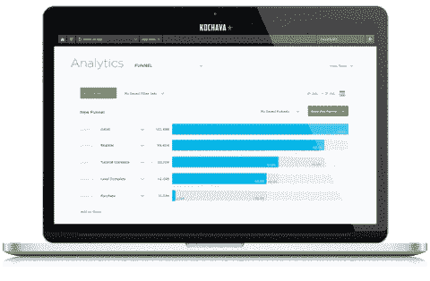

**功能:**
防欺诈
实时数据
真实 LTV
留存分析 90+
漏斗视图

**支持的平台:** Android、iOS、tvOS、Windows & Xbox One、Unity、ReactNative、Cordova、Adobe Air、Xamarin、Web SDK、Corona Labs、Adobe DPS、Adobe Analytics

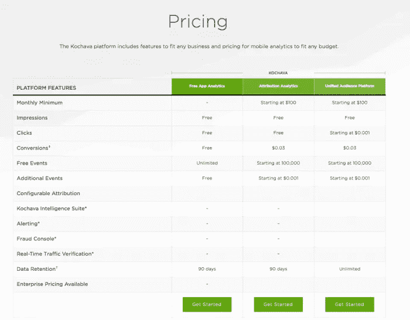

**定价计划:**免费应用分析、更先进的归因分析和统一受众平台，起价 100 美元

**总部:**美国桑德波特

**办事处:**旧金山、洛杉矶、纽约、巴黎、都柏林、北京、首尔、新加坡

**支持:** [支持页面，带常见问题解答](https://support.kochava.com/)，电话(电话:+8555624282)或电子邮件([support@kochava.com](mailto:support@kochava.com))

# 8.混合面板

移动应用程序分析平台，具有许多分析工具，如漏斗分析或群组分析。它没有现场演示。默认情况下，Insights 显示过去 96 小时内的热门事件。MixPanel 应用分析有多种工具可以满足应用营销人员的不同需求。这些是见解、实时视图、公式、流程、漏斗、保留和信号。通过创建一系列分步事件，漏斗允许您跟踪您的客户如何浏览您的应用程序或网站。用户可以看到哪些功能增加了转化率、参与度和保留率。也许最特别的报告是**成瘾报告**——它探究了你的用户的保持力。

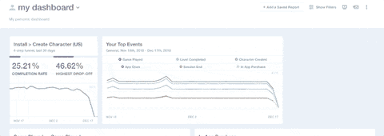

**功能:**
多种工具(洞察、实时查看、公式……)
免费获取 500 万个数据点
实时查看
成瘾报告

**支持的平台:** iOS、Android

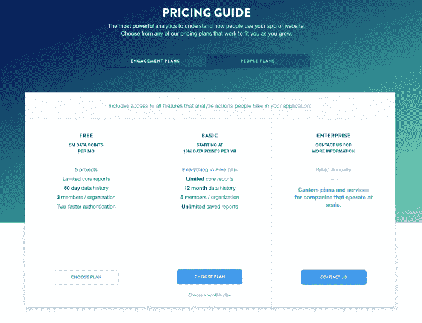

**定价计划:**基于数据点— **免费计划**(每月 500 万数据点)**基本计划**(每年 1000 万数据点起)**企业**(根据要求)

总部:美国旧金山

办公室:旧金山、纽约、利希、西雅图、伦敦

支持: Mixpanel 社区，帮助中心，电子邮件([inquiries@mixpanel.com](mailto:inquiries@mixpanel.com))

# 9.Appsee

Appsee 是一个移动应用分析平台，用于测量用户在两个平台(Android 和 iOS)上使用原生移动应用的体验。有了 Appsee，你将能够准确了解用户如何与你的应用程序交互。会话或视频录制完成后，结果会实时显示。你可以记录用户，触摸热图或使用应用内分析。但是，并非所有设备都支持用户录制。

**功能:**
视频录制
触摸热图
应用内分析
视觉报告
免费试用

**支持的平台:** iOS、Android

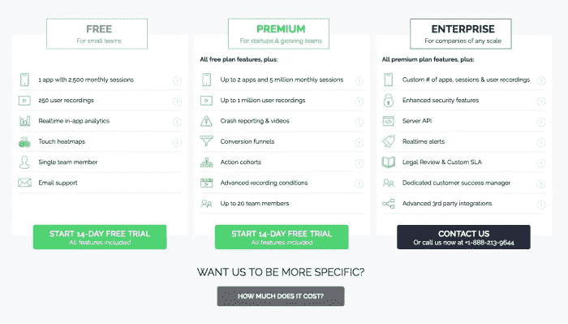

**定价计划:**1 个应用每月 2500 次的免费计划，高级计划(14 天免费试用)，企业(根据要求)

**总部:**以色列特拉维夫-扎佛

**办公地点:**特拉维夫-纽约扎佛

**支持:**邮箱([support@appsee.com](mailto:support@appsee.com))，[支持](https://support.appsee.com/) [论坛](https://support.appsee.com/)

# 10.骚动

Flurry Analytics 仅在五分钟内集成到应用程序中，并且支持 Android 和 iOS 平台。它是雅虎开发者网络的一部分。这个易于使用的平台允许你跟踪新用户，活跃用户，会话等。您将能够监控应用性能并比较指标。在一个仪表板中，您可以详细了解用户和会话活动。通过崩溃报告，您可以识别应用程序中的问题和错误。Flurry Analytics 自带应用程序，可随时随地监控应用程序的性能。根据他们的网站，940，000 个应用程序中有 250，000 个开发者使用它。

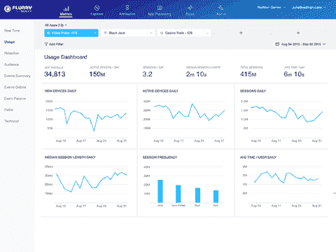

**功能:**
事件跟踪
漏点跟踪
崩溃报告
完全免费
崩溃分析
原始数据下载

**支持的平台:** iOS、Android、React Native、watchOS、Unity

**定价方案:**完全免费

总部:美国旧金山

旧金山、纽约、伦敦、芝加哥和孟买

**支持:** [常见问题页面](https://developer.yahoo.com/flurry/docs/faq/)，电子邮件支持([support@flurry.com)](mailto:support@flurry.com)

# 11.脸书分析公司

脸书的全渠道分析可以更好地理解用户在网络、应用和脸书上的行为。在这里，您可以通过人们在您的页面和网站、手机和桌面上的行为，直观地了解他们的转化进度。随着时间的推移，你将能够准确地衡量人们的记忆力。脸书分析让你可以在一份报告中全面了解人们如何通过你的网站、应用、脸书页面和机器人与你互动。通过使用机器学习来分析和监控数据，你将能够更快地采取行动。

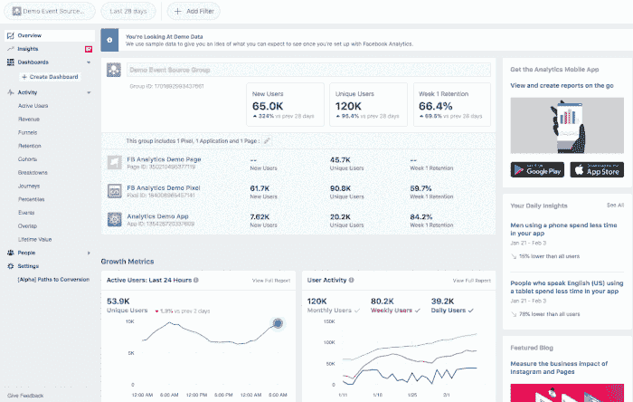

**功能:**

收入跟踪
定制仪表板
自动洞察
相似受众
定制受众

**支持的平台:** Web、iOS、Android

**定价方案:**完全免费

**总部:**美国旧金山

**办事处:**脸书在世界各地都有[办事处](https://web.facebook.com/careers/locations?_rdc=1&_rdr)(纽约市、三藩市、巴黎、伦敦、特拉维夫……)

**支持:**帮助中心，栈溢出社区，[脸书开发者社区](https://web.facebook.com/groups/fbdevelopers/?_rdc=1&_rdr)

# 12.UXCam

UXCam 是一款移动应用测试和管理工具，专为产品经理、UX 设计师和应用开发者而设计。UXCam 允许移动应用程序开发人员轻松定位应用程序问题，以增强用户体验。应用程序开发人员可以观看用户会话的记录，以识别任何潜在的问题。该应用程序在 Android 和 iOS 设备上都可以使用。您可以通过 UXCam 提高应用参与度，吸引更多用户，并减少流失，因为它使开发人员能够找到问题的根源。简而言之，UXCam 通过提供对用户的理解来提高应用 KPI。

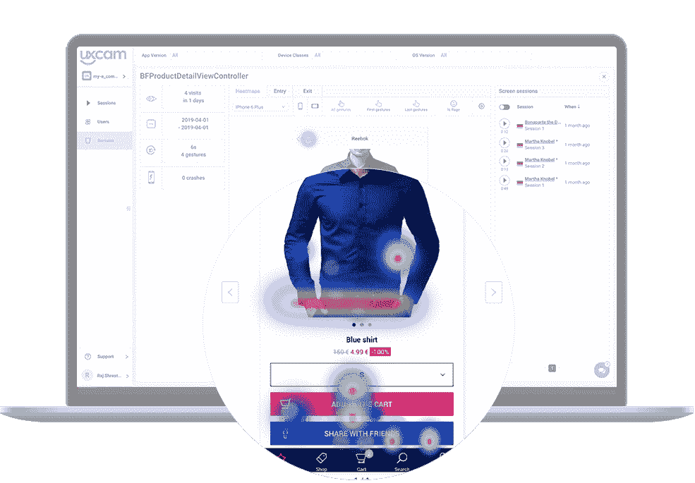

**主要特性:**

会话重放和分析

热图和屏幕分析

用户旅程分析

漏斗分析

**支持的平台:** iOS & Android

**定价计划:**有限免费计划，按需定价

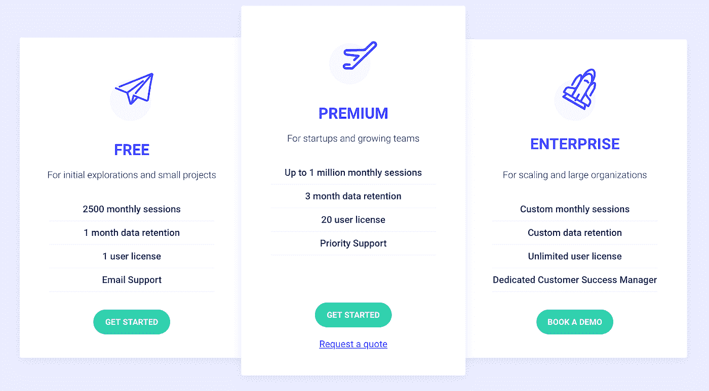

**总部:**德国柏林

**办事处:**柏林，三藩市

**支持:**电子邮件([team@uxcam.com](mailto:team@uxcam.com))，支持 Slack，服务台聊天(在[www.uxcam.com](http://www.uxcam.com)上)

# 通过移动应用程序分析可以跟踪什么？

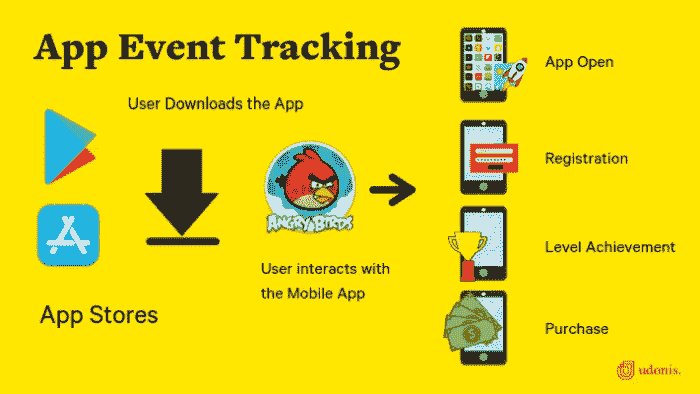

# 事件

如果您正在使用移动应用程序分析，您将能够看到关于自动收集的事件和自定义事件[的统计数据。自动收集的事件由用户与您的应用程序的交互触发。可以是广告点击、广告曝光、广告印象……事件可以进一步分析。此外，可以对特定事件的详细信息进行细分。这意味着使用活动地点、活动人口统计等参数。](https://support.google.com/firebase/answer/6317485)

有些事件是[基因](https://support.google.com/firebase/answer/6317498?hl=en&ref_topic=6317484) [r](https://support.google.com/firebase/answer/6317498?hl=en&ref_topic=6317484) [al](https://support.google.com/firebase/answer/6317498?hl=en&ref_topic=6317484) —它们可以应用于所有的应用。其他的是专门针对某个应用领域的，比如零售/电子商务或旅游。

# 转换策略

转化是最重要的事件——它们确定了最有价值的用户。追踪这些事件至关重要。它们告诉我们在转化事件之前，用户旅程的流程是什么。

通常，三个最重要的转换事件将是[预定义的](https://support.google.com/firebase/answer/6317518?hl=en&ref_topic=6317489)。这些是:

**首次打开** —用户首次打开应用程序时

**应用内购买** —当用户完成应用内购买时，包括初始订阅

**电子商务购买** —当用户完成购买时

# 观众

受众是根据对您的业务很重要的属性组合进行分组的用户。这样你就可以看到不同用户群的行为。移动应用分析包括细分市场，其中用户按照活动、ARPU、他们使用的应用版本、年龄、性别、国家/地区、兴趣进行分组。

# 军团

群组是一组在同一时间(或一周中的同一天)开始使用你的应用的用户。通过观察有多少用户最终会回到你的应用程序来了解留存率是很重要的。保留群组通常会显示在图表中，每一行代表一个群组。

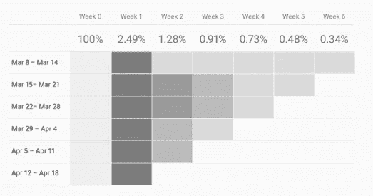

在上面的图表中，最下面一行是最近的群组。最上面一行代表最早的一批。深色代表返回应用程序的用户比例较高。

# 烟囱

漏斗是用户为了实现某个动作(即转化)而采取的步骤的可视化表示。漏斗也用于可视化应用程序中一系列步骤(事件)的完成率。例如，漏斗可以包含在您的应用程序中创建帐户所需的步骤。您可以按受众或用户属性过滤漏斗报告，以查看您的用户群的某些部分是否实现了更高的完成率。

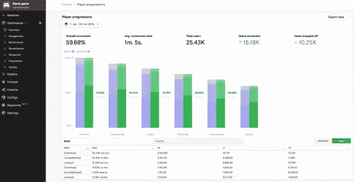

# 结论:

移动应用分析有助于我们了解用户如何参与我们的产品和活动，以便我们能够做得更好。最后，了解用户的行为对你的应用的成功至关重要。上面列出的多个免费移动应用程序分析让您深入了解应用程序数据。它们可以是完全免费的，也可以提供演示或试用来进行测试。选择移动应用分析平台时，了解自己的期望非常重要。提到的许多移动应用分析平台不仅仅是收集关于用户和应用的数据，还提供广告中介、崩溃分析、深度链接和归因。

# 更多关于移动应用的有趣文章:

*   [预计到 2020 年，全球应用市场的广告支出将翻一番](https://www.blog.udonis.co/app-market-ad-spend)
*   [如何为下一次媒体购买活动选择合适的地理位置](https://www.blog.udonis.co/media-buying-campaign-geos)

# 关于[乌多尼斯](https://udonis.co/):

我们是一家屡获殊荣的营销机构，专注于移动应用和游戏。我们帮助扩展人们喜爱的产品，保持对数据和结果的关注。有疑问，需要帮助？给我们发电子邮件到**hello@udonis.co**！

## 这篇文章发表在 [The Startup](https://medium.com/swlh) 上，这是 Medium 最大的创业刊物，拥有+424，678 名读者。

## 在这里订阅接收[我们的头条新闻](https://growthsupply.com/the-startup-newsletter/)。

