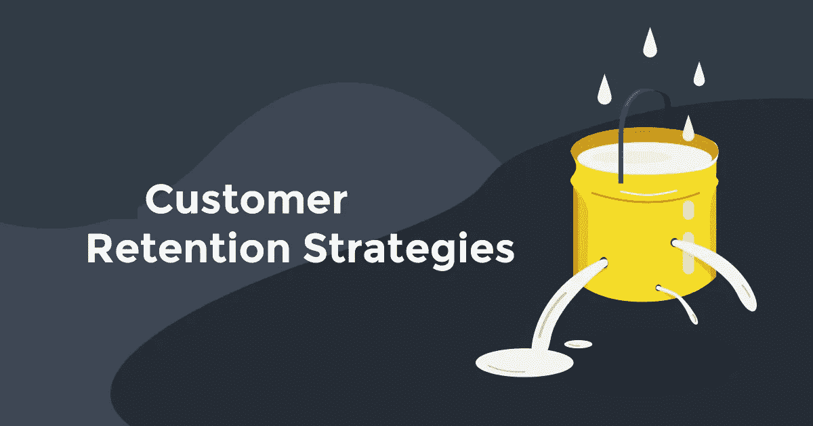

# 推动重复销售的 12 大客户维系策略

> 原文：<https://medium.com/swlh/top-12-customer-retention-strategies-to-drive-repeat-sales-13757dbee91c>

有什么比获得一个新客户更好的呢？

这看起来像是一个棘手的问题，但答案相当简单——留住现有客户。

营销大师 Fred Reichheld 在他的著作《忠诚度效应》中指出，“客户保持率提高 5%会使整个行业的利润增加 25 到 100 倍…