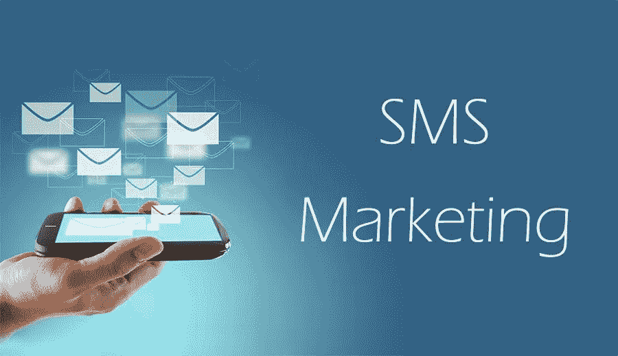

# 您应该使用短信营销来发展业务的三大理由

> 原文：<https://medium.com/swlh/top-3-reasons-why-you-should-be-using-sms-marketing-to-grow-your-business-cb0fd088f49a>

短信营销是 2019 年店家的新“大事”吗？首先，什么是短信营销，它是如何工作的？简单来说，短信营销就是发送基于权限的短信来传播推广内容。就像电子邮件营销一样，客户需要选择短信服务提供商，以便接收新产品发布、折扣代码和即将举行的活动/销售等促销内容。你可以像你的 ESP 一样使用短信软件，你可以细分和列出你的所有订户，发送自动触发流(即废弃的购物车)，甚至发送活动。

所以你可能想知道，如果你已经在你的电子邮件营销中实现了所有这些，并且建立了一个大的电子邮件列表，为什么还要麻烦短信营销呢？短信营销有很多好处，但我将重点介绍我认为的短信营销的三大好处。

# 1)您可以使用短信营销来补充您的电子邮件策略

短信营销与电子邮件营销有一些重要的相似之处，这使得它非常适合赞美你的电子邮件营销。当使用这两种方法时，它可以让你在正确的时间发送正确的信息。例如，尝试使用您的短信营销进行短时间的敏感沟通，如最后一分钟的销售提醒，或者当刚推出的新产品几乎缺货时，使用您的电子邮件推送更多的信息内容，如博客帖子。

# 2)与客户的良好互动

无论你发出的是折扣代码还是信息性信息，与其他促销渠道相比，你的潜在客户更有可能对你的短信做出回应。研究表明，短信营销的回复率为 45%,这为您提供了大量与客户互动的机会，以提供强大的支持并帮助他们完成购买。

# 3)极高的打开率和转化率

短信的打开率为 98% 是的，你没看错，是 98%,与其他营销媒体相比，这个比例高得令人难以置信，这使得短信成为如此强大的营销工具。有了这么高的打开率，品牌的转化率高达 45%。不仅 98%的短信被打开，而且 90%的短信在收到后的前 3 分钟被阅读。想想这种方法对于废弃购物车通知或缺货通知的有效性，因为知道客户有 98%的机会在三分钟内打开邮件。此外，如此高且快速的打开率使您可以营销时间敏感的内容，并在活动发送后准备好支持并等待可能涌入的消息。

# 如何实施短信营销

如果你在寻找竞争对手的营销优势，短信营销可能是最好的解决方案，但你如何实施呢？Shopify 应用商店中值得关注的两个应用是 Post Script([https://apps . Shopify . com/postscript-SMS-marketing-for-Shopify](https://apps.shopify.com/postscript-sms-marketing-for-shopify))和 SMS Bump(【https://apps.shopify.com/smsbump】T2)

这两款应用都有很多很棒的功能，比如能够根据用户的活动来划分用户列表，发送自动流量和活动等等。Post Script 附带一个免费计划，然后随着你发出更多的消息而涨价。短信碰撞是免费安装，并有一个现收现付功能(美国和加拿大 0.0149 元每发送文本)。如果你正在寻找做短信营销只是为了重新定位，你可能会想看看购物车大师(【https://apps.shopify.com/cartsguru】T4)，因为他们有一些很好的功能，结合短信和其他营销媒体来收回被遗弃的购物车，他们有 10 天的免费试用。

如果您对短信营销的好处有任何疑问，或者想了解短信营销策略，请随时给我发电子邮件至 brent@onlygrowth.com，我很乐意帮助回答您的任何问题。

或者访问[onlygrowth.com](http://onlygrowth.com)获得免费的网站审计和其他有助于你成长的免费内容。

## 这篇文章发表在 [The Startup](https://medium.com/swlh) 上，这是 Medium 最大的创业刊物，拥有+420，678 名读者。

## 在这里订阅接收[我们的头条新闻](https://growthsupply.com/the-startup-newsletter/)。

