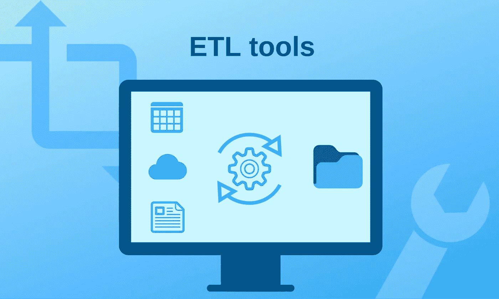
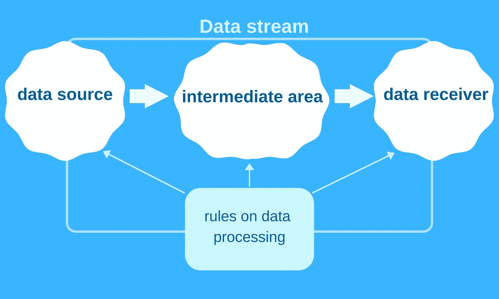
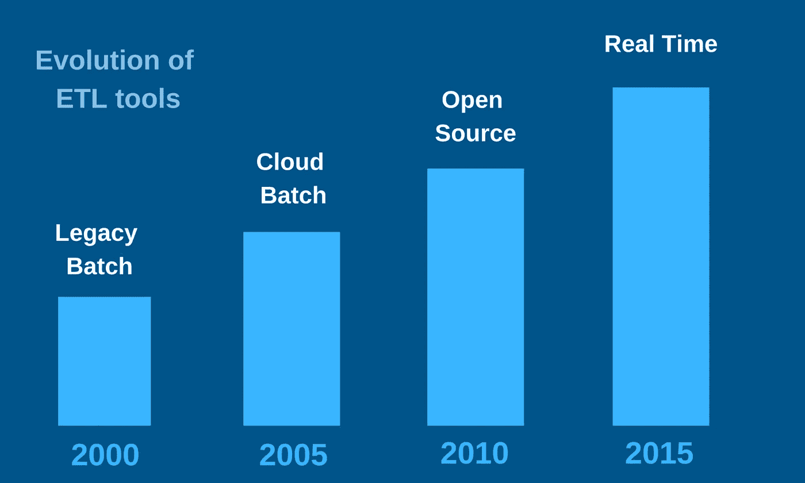
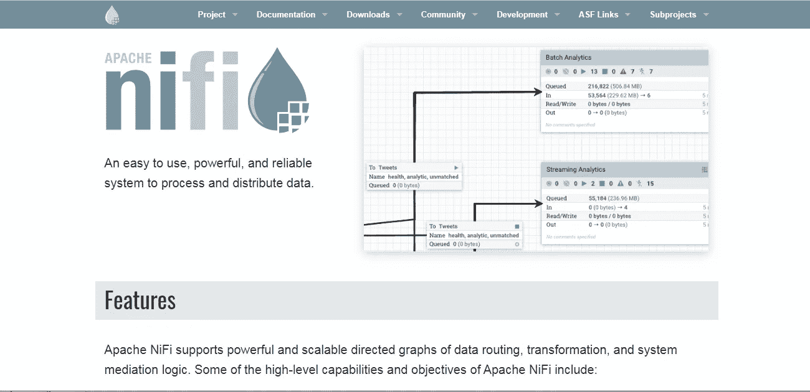
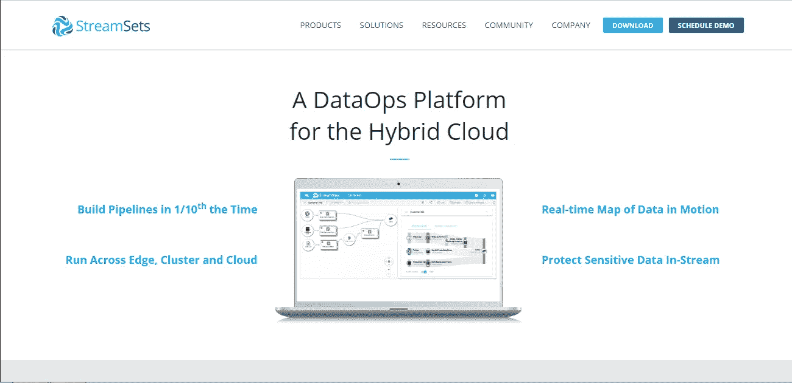
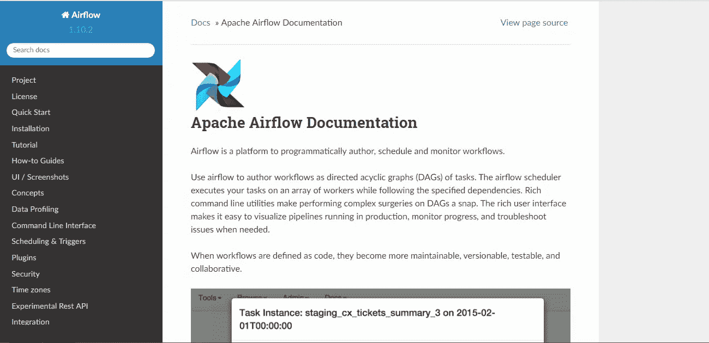
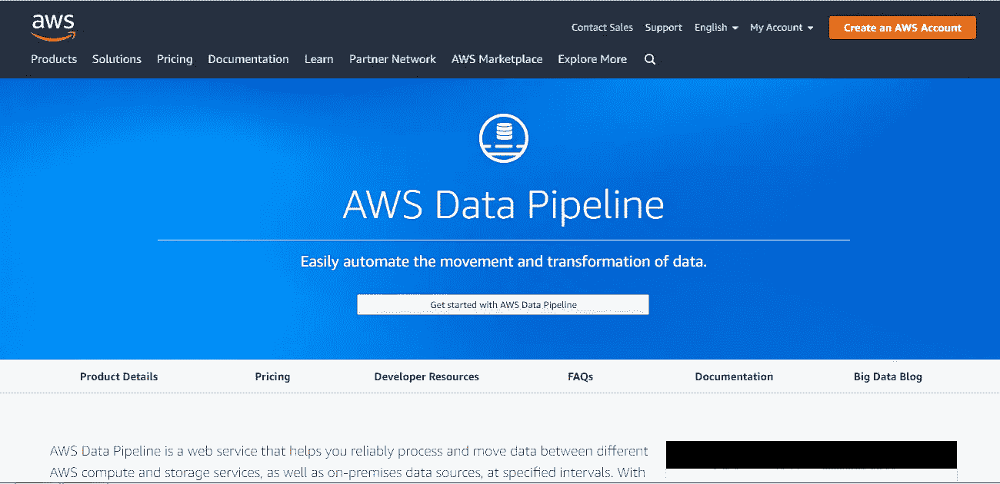
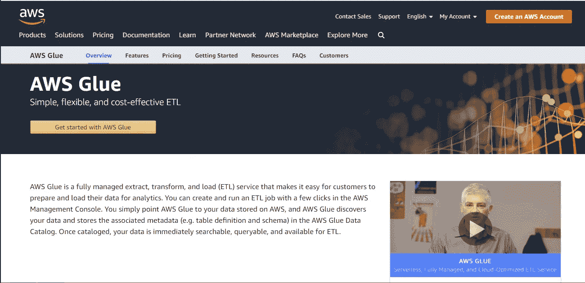

# 五大企业 ETL 工具

> 原文：<https://medium.com/swlh/top-5-enterprise-etl-tools-4c18f3b7d0d8>

*随着* *数据量的不断增长，企业对用于高级分析的* *数据仓库* *项目和系统的需求也在不断增加。ETL 是他们的基本元素。它确保了各种数据库和应用程序中成功的* *数据集成* *。在这个* *ETL 工具的比较中，我们将看看:*

1.  阿帕奇尼菲
2.  Apache 流集
3.  阿帕奇气流
4.  AWS 数据管道
5.  AWS 胶水

*它们是 2019 年最受欢迎的* *ETL 工具。* *让我们比较利弊，找出最适合你项目的方案。*

由于对其缩写的“简单”解释，ETL 的含义经常被误解。它代表 3 个数据仓库概念:提取、转换、加载。ETL 过程包括:

1.  **从不同的外部来源提取**数据
2.  根据业务模式的要求转变 it
3.  **将**数据加载到新仓库

ETL 只是数据移动任务的一个子集。Ralph 的 Kimball 著作《数据仓库 ETL 工具包》定义了它的 3 个基本特性:

*   数据以适合分析的形式下载
*   它增加了额外的信息
*   系统记录并证明数据的来源

因此，数据不应该只是从一个地方重新加载到另一个地方。它们在装载过程中得到改进。例如，ETL 开发人员可以添加新的计算属性或技术属性。跟踪数据在数据库中是如何出现的，以及数据是如何以及何时被更改的，这一点很重要。

# ETL 流程步骤

web 程序员可以将 ETL 架构想象成一组 3 个区域:

*   数据源
*   中间区域
*   数据接收器

**数据流**是数据从源到接收器的移动。每个阶段都可能相当复杂。创建 ETL 软件的过程包括不同的挑战:

1.  外部来源的多样性。
2.  根据业务规则统一数据。
3.  更新频率和其他具体要求。

这就是为什么 IT 公司需要清楚地了解源和目标应用程序的结构。

# 什么是 ETL 示例？

常见的 ETL 任务是将数据从 RDBMS 转移到另一个更适合商业智能工具的数据库。ELT 工作分为两种类型:

1.  批处理作业
2.  流式作业

从 RDBMS 获取数据的例子是**流作业**。数据被一个接一个地单独传输，以供进一步处理。不然我们可以谈一个**批量作业**。这意味着你可以获取整个文件，对其进行处理并保存到一个大文件中。各种 ETL 系统以不同的方式处理这些任务。

如今，只进行批处理的方法已经过时了。越来越多的流数据源导致了流作业 ETL 工具的流行。他们尽可能快地提供最新数据。

各种常见的基于云的数据集成工具让选择变得非常困难。因此，我准备了一个列表，列出了 5 个根据我的经验可靠的 ETL 解决方案。

# 1.阿帕奇尼菲

**定价**:免费
**官网**:[https://nifi.apache.org/](https://nifi.apache.org/)
**有用资源** : [文档](https://nifi.apache.org/docs.html)，[教程](https://hortonworks.com/apache/nifi/#tutorials)

**优点:**

*   数据流编程概念的完美实现
*   处理二进制数据的机会
*   数据来源

**缺点:**

*   简单的用户界面
*   缺乏实时监控和记录统计

最佳 ETL 工具列表中的第一个是开源项目 Apache NiFi。它由 Apache 软件基金会开发，基于数据流编程的概念。这意味着这个 ETL 工具允许可视化地组装程序，并且几乎不用编码就能运行它们。所以，你不需要懂任何编程语言。

最流行的开源 ETL 工具之一能够处理不同的数据源。比如 RabbitMQ、JDBC 查询、Hadoop、MQTT、UDP socket 等。至于行动，有机会过滤，调整，加入，分裂，增强，验证数据。

Apache NiFi 是用 Java 编写的，在 Apache 2.0 许可下分发。它运行在 JVM 上，支持所有的 JVM 语言。

这个 ETL 工具有助于创建长时间运行的作业，适合处理流数据和周期性批处理。至于手动管理的作业，也是可以的。然而，在设置困难的同时也面临着风险。

由于全面的架构，Apache NiFi 被认为是最好的开源 ETL 工具之一。这是一个强大且易于使用的解决方案。流文件包括元信息。因此，该工具的可能性不仅限于 CSV。您可以处理照片、视频、音频文件或二进制数据。

处理器包括 3 个输出:

1.  **失败**表示流文件的适当处理存在问题。
2.  **原件**显示一个接收的流文件已经被处理。
3.  **成功**表示流程文件处理完毕。

如果您想要删除终止的输出，可以使用特殊的复选框。您应该注意进程组。在高级 ETL 编程中，它们对于组合复杂数据流的元素是必要的。

另一个很棒的特性是可以使用各种队列策略(FIFO、LIFO 等)。数据来源是一项互联服务，它记录了数据流中的几乎所有内容。这非常方便，因为您可以看到数据是如何保存或执行的。唯一的缺点是该功能需要大量的磁盘空间。

一些用户抱怨 Apache NiFi 的界面。事实上，它并不令人印象深刻，但可用性足够好。用户界面有一个清晰简洁的设计，没有额外的元素。唯一的例外是缺少对长 SQL 查询的文本字段的自动调整。您应该手动执行这些操作。

还有一个内置的节点集群。您可以选择几个实例，它将提取必要的 ETL 数据。阿帕奇 NiFi 包括背压。它是快速连接到 MySQL、获取文件并将其添加到下一个处理器所必需的。

总之，Apache NiFi 是其他主流 ETL 工具的一个很好的替代品。它的主要优势是 100 多种不同的嵌入式处理器。它们提供了通过 HTTP 或 S3、谷歌数据源下载文件并上传到 MySQL 或其他数据接收器的机会。你只需要配置用户界面，按下运行按钮，如果一切正常，它就会工作。

# 2.Apache 流集

**定价**:免费
**官方网站**:[https://streamsets.com](https://streamsets.com)
**有用资源** : [文档](https://streamsets.com/documentation/datacollector/latest/help/datacollector/UserGuide/Getting_Started/GettingStarted_Title.html)，[教程](https://github.com/streamsets/tutorials)，[开发者支持论坛](https://groups.google.com/a/streamsets.com/forum/#!forum/sdc-user)，[源代码](https://github.com/streamsets)

**优点:**

*   每个处理器都有单独的每个记录的统计数据，可视化效果很好，可以有效地进行调试
*   吸引人的用户界面
*   流式或基于记录的数据的良好工具

缺点:

*   缺乏可重复使用的 JDBC 配置
*   改变一个处理器的设置需要停止整个数据流

Apache StreamSets 是 Apache NiFi 的有力竞争对手。很难说这些免费的 ETL 工具哪个更好。

放入 Streamsets 的所有数据都会自动转换成可交换的记录。通用格式是为平滑流式传输而设计的。与 Apache Nifi 不同，这个 ETL 工具不显示处理器之间的队列。如果想使用不同的格式，Apache Nifi 需要从一个版本的处理器转到另一个版本。Streamsets 允许避免这些操作。您需要停止整个数据流来更改设置，而不是只停止一个处理器。

似乎在流集上修复 bug 更加困难。事实上，由于有了实时调试工具，这变得更容易了。由于具有实时仪表板和所有需要的统计数据的用户友好界面，您可以及时注意到并修复所有错误。此外，还有机会在处理器之间的连接上放置记录过滤器，以检查可疑的记录。该处理器有 4 种型号:

*   **原点**处理器从数据源接收信息。
*   **处理器**，获取并转换接收到的数据。
*   **目的地**将转换后的数据放入外部文件。
*   **执行者**流程动作，由其他处理者完成。

Streamsets 处理器可以生成动作和事件，包括 bug。为了跟踪和修复它们，你需要**执行器**。有些用户更喜欢 Apache NiFi，因为它的设计更简单。您需要的只是处理器和控制器服务。然而，Streamsets 也有经过深思熟虑的体系结构，这并不难习惯。而且 UI 看起来也更好。

我感觉缺乏控制器服务，这对于 JDBC 的设置是非常重要的。调整每个处理器的所有 JDBC 设置真的很烦人。

在运行数据流之前，Streamsets 会检查所有处理器。这个功能好像挺有用的。以我的经验，这是一件有争议的事情。Streamsets 不允许您在将来为了修复 bug 而离开断开的处理器。所有这些都必须在数据流开始之前连接。至于其他缺点，我觉得不可能一次选择一个以上的处理器。移动许多处理器并逐个重组它们需要太多的时间和精力。

总而言之，它是一个成熟的开源 ETL 工具，具有便捷的可视化数据流和现代化的 web 界面。我建议您尝试 Streamsets 和 Apache NiFi，看看哪一个最适合您的目的。

# 3.阿帕奇气流

**定价**:免费
**官方网站**:[https://airflow.apache.org](https://airflow.apache.org)
**有用资源** : [教程](https://airflow.apache.org/tutorial.html)

**优点:**

*   适合不同类型的任务
*   清晰可视化的用户友好界面
*   可扩展解决方案

**缺点:**

*   不适合流式作业
*   需要额外的操作员

设计、创建和跟踪工作流的现代平台是一个开源的 ETL 软件。它可以与云服务一起使用，包括 GCP、Azure 和 AWS。有机会使用天文学家企业在 Kubernetes 上运行气流。

你可以在 Python 上编码，但不能使用 XML 或拖放式 GUI。工作流是用 Python 编写的，但是步骤本身可以用任何您想要的方式来完成。Airflow 是作为一个非常灵活的任务调度程序而创建的。顶级 ETL 工具之一适用于许多不同的目的。它用于训练 ML 模型、发送通知、跟踪系统和各种 API 中的功率函数。

关于平台的主要事实:

1.  气流即服务可从 Qubole 和 astronomer.io 获得。
2.  它由 Airbnb 于 2015 年创建，并于 2016 年过渡到 Apache。
3.  Google 的 Cloud Composer 的基础(2018 年夏季测试版)。
4.  工作流以有向无环图(Dag)的形式执行。

阿帕奇气流是根据 4 个基本基础设计的。软件开发者的目标是创建一个**动态**、**可扩展**、**优雅**和**可扩展**的解决方案。因此，它提供了通过在 Python 上编码来动态生成管道的可能性。你也可以定义你自己的操作符，执行器，并根据需要的抽象层次来扩展库。管道清晰而准确，因为参数化包含在平台的核心中。由于带有消息队列的模块化设计，气流可以轻松扩展。

Apache Airflow 适用于大多数日常任务(运行 ETL 作业和 ML 管道、交付数据和完成数据库备份)。但是，对于流作业来说，这是一个糟糕的选择。

该平台有一个充满可视化元素的现代用户界面。您可以看到所有正在运行的管道，跟踪进度，并修复错误。这有助于在 Dag 上完成复杂的任务。

至于工作流，它们是恒定和稳定的。这种结构比 ETL 数据库更加动态。如果将工作流定义为代码，它们将更具协作性、版本可控性、可测试性和可维护性。

该平台运行在一个私有的 Kubernetes 集群上。它还包括资源管理工具和分析(StatsD、Prometheus、Grafana)。

气流工作流的 ETL 测试呢？您可以使用:

*   单元测试
*   集成测试
*   端到端测试(在某些情况下)

第一种类型适合检查 DAG 加载、Python 操作符函数、自定义操作符和 Bash/EMR 脚本。该平台不需要任何原始配置。唯一应该更改的是 DB 连接字符串。您需要创建一个空数据库，并授予用户创建/修改的权限。因此，气流命令将处理所有其余的。

总之，Apache Airflow 是一个基于 Python 编写的免费、独立的框架。这是开源 ETL 工具的一个很好的例子。气流对于单独跑步来说是有挑战性的，所以你应该使用不同的操作者。

# 4.AWS 数据管道

**定价** : [变量](https://aws.amazon.com/datapipeline/pricing/)
官方网站:[https://aws.amazon.com/datapipeline/](https://aws.amazon.com/datapipeline/)
**有用资源** : [文档](https://docs.aws.amazon.com/data-pipeline/index.html#lang/en_us)，[社区论坛](https://forums.aws.amazon.com/forum.jspa?forumID=151)

**优点:**

*   易于使用的 ETL 技术
*   合理的价格
*   不错的灵活性

**缺点:**

*   没有太多内置功能

web 服务确保在 AWS 计算和各种数据源之间处理和移动数据。它提供了对存储数据及其转换的永久访问。最终结果可以传输到 AWS 服务。它们是亚马逊 DynamoDB、亚马逊 RDS、亚马逊 EMR、亚马逊 S3。这个 ETL 工具简化了创建复杂数据处理工作负载的过程。它有助于实现可重复、高度可用和可靠的案例负载。

AWS 数据管道提供了移动和处理数据的可能性，这些数据以前被锁在内部数据仓库中。Amazon 声称它的 ETL 工具有 6 大优势:

1.  准确(性)
2.  简单
3.  适应性
4.  好价钱
5.  可量测性
6.  透明度

AWS 数据管道是一种可靠的服务，在出现任何故障时，它会自动重试活动进程。您还将通过亚马逊社交网络收到通知。它们可以设置为成功运行、延迟或失败。

拖放控制台允许快速简单地设计管道。内置的前提条件阻止您编写任何额外的逻辑来使用它们。web 开发人员喜欢各种流行的特性。我指的是日程安排、依赖性跟踪和问题处理。该服务的灵活设计允许流畅地处理大量文件。

与其他 ETL 工具相比，这个产品并不昂贵。AWS Data Pipeline 是一种编排无服务器服务，您只需为您使用的内容付费。此外，还有一个新用户免费试用版。这是一个透明的解决方案。用户接收管道上的全部信息，并完全控制计算资源。

最后，我特别推荐这个用于执行管道作业的 ETL 工具。我在当前的项目中用它来传输数据。虽然 AWS 数据管道没有太多内置功能，但是提供了便捷的 UI。它可以产生实例并确保级联文件管理。我喜欢这个简单、便宜、有用的内置处理器的工具，它允许你通过 UI 做任何事情。

# 5.AWS 胶水

**定价** : [变量](https://aws.amazon.com/glue/pricing/)
官方网站:[https://aws.amazon.com/glue/](https://aws.amazon.com/glue/)
**有用资源** : [教程](https://aws.amazon.com/getting-started/tutorials/)

**优点:**

*   支持各种数据源
*   与 AWS 服务的良好集成

**缺点:**

*   大量的手工工作
*   灵活性差

替代传统拖放平台的基于代码的、无服务器的 ETL 是有效的，但也是一个雄心勃勃的解决方案。AWS Glue 允许在 AWS 管理控制台中创建和运行 ETL 作业。该服务从 AWS 获取数据和元数据，将其放入目录中，并使其可搜索、可查询并可用于 ETL。该过程包括 3 个步骤:

*   通过构建目录对数据进行分类(可以使用 JSON、CSV、Parquet 和许多其他格式)
*   生成 ETL 代码和编辑转换(用 Scala 或 Python 编写)
*   调度和运行 ETL 作业

Amazon 区分了这个 ETL 工具的 3 个主要优点。

**1。便利性** 该工具与众多 AWS 服务和引擎紧密集成，对于已经使用亚马逊产品的人来说非常简单。缺点是您不能在内部或任何其他云环境中实施它。

**2。有利可图**
无服务器解决方案意味着您不需要调配或管理基础架构。因此，成本取决于“数据处理单元”的度量您只需为正在运行的作业付费。

**3。强大的创建、维护和运行 ETL 作业的自动化是完美的。另一方面，这项服务也导致了大量的手工工作。**

Apache Spark 被用作 ETL 逻辑的基础。然而，你可能会注意到与普通火花的显著不同。该服务具有带有特定粘合方法的“动态框架”，而 Spark 使用“数据框架”。

AWS Glue 是 AWS 生态系统中现代而强大的一部分。但是你应该注意它的细微差别。该服务提供了一个抽象层次，在这个层次上，您必须标识表。它们代表您的 CSV 文件。这里有大量的手工工作，但最终它会为 Spark 生成代码并启动它。您可以下载 Scala 或 Python 中的这段代码，并根据需要进行修改。它适用于广泛的数据源，但该服务迫使您选择特定的解决方案。如果你想尝试另一种方式，你可能无法做到这一点。

# 如何选择合适的 ETL 工具？

InfoWorld 断言 ETL 是构建数据仓库系统的最大成本。这是任何 web 开发人员都需要特别注意的瓶颈。正确的 ETL 实现是您优化成本和加速工作的机会。选择最好的 ETL 工具，考虑 5 个标准:

*   你的系统的复杂性
*   您的数据需求
*   开发者的体验
*   ETL 技术的成本
*   特殊业务需求

我希望这篇评论对您寻找完美的 ETL 解决方案有所帮助。如果你想了解更多关于 web 开发的信息，请订阅 [FreshCode 博客](https://freshcodeit.com/blog)。你还可以就你的项目获得一次[免费技术咨询](https://freshcodeit.com/contact)。

【freshcodeit.com】原创文章 [*Top 5 企业 ETL 工具*](https://freshcodeit.com/freshcode-post/top-5-enterprise-etl-tools) *发布于***。**

**

## *这篇文章发表在 [The Startup](https://medium.com/swlh) 上，这是 Medium 最大的创业刊物，拥有+436，678 名读者。*

## *在这里订阅接收[我们的头条新闻](https://growthsupply.com/the-startup-newsletter/)。*

**