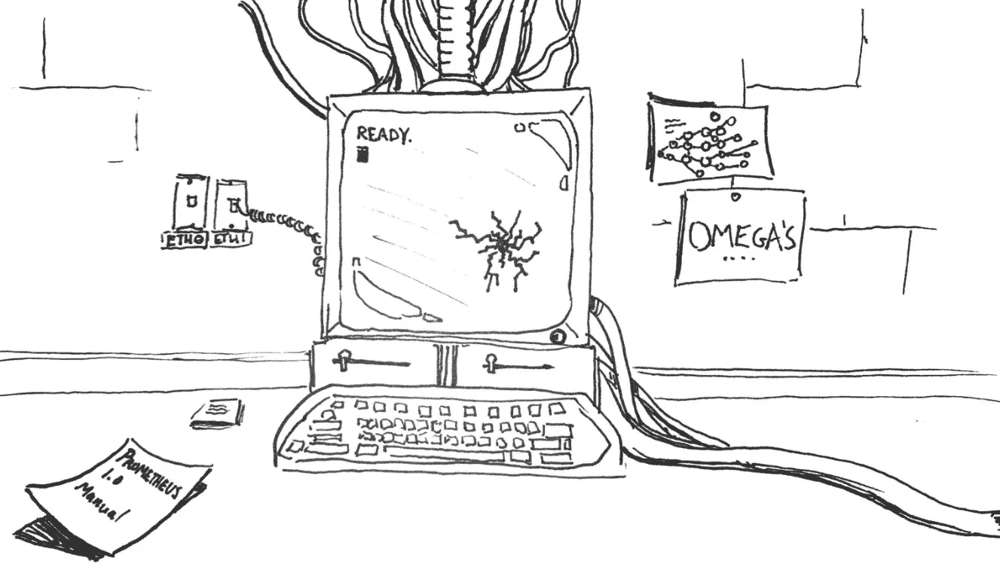

# 我花了 100 天时间学习人工智能后的 5 大感悟

> 原文：<https://medium.com/swlh/top-5-insights-after-i-spent-100-days-learning-about-artificial-intelligence-b14b44a67134>

A drawing I did based on the [first chapter of Max Tegmark’s Life 3.0 — The Tale of the Omega’s](https://www.youtube.com/watch?v=ttZSk7rmFvc)

2019 年 1 月底，我突然意识到自己对人工智能的理解不足。它日益影响着我们的日常生活。人工智能保护我们的收件箱免受垃圾邮件的侵害，它为 Alexa 的天气更新提供动力，它使亚马逊能够推荐购买或网飞能够推荐电影。每次打开推特或者脸书，都是人…