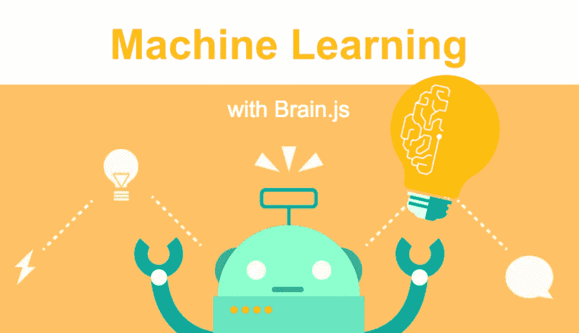
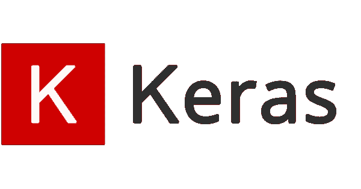
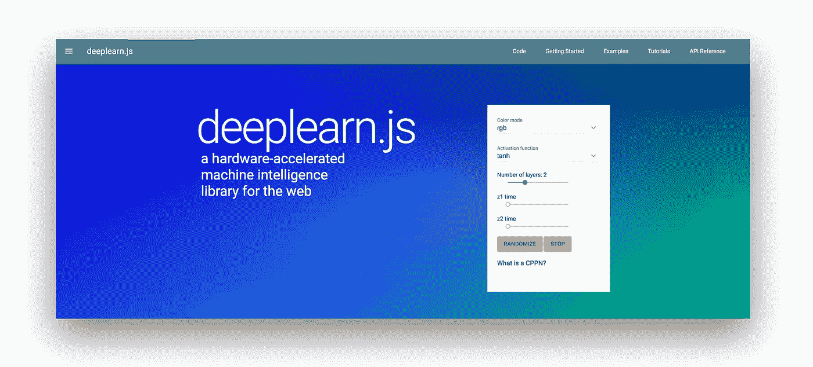
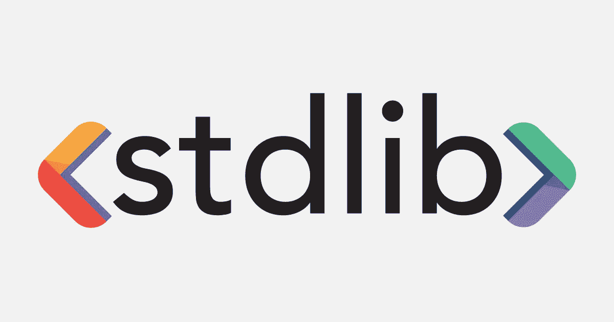

# 2019 年企业 8 大机器学习 JS 框架

> 原文：<https://medium.com/swlh/top-8-machine-learning-js-frameworks-for-businesses-in-2019-8318e9a1ef5a>

随着时间的推移，机器学习 JS 框架变得越来越容易被 web 开发人员使用。这是由于机器学习的开源工具可以轻松地创建应用程序。无论是简单的文档编辑应用程序还是企业管理软件，它们都植根于带有 JS 框架的机器学习技术，这些框架使应用程序足够智能以满足商业目的。

分享我们的研究，看看最受欢迎的机器学习 JS 框架，你可能会在 2019 年为你的在线业务考虑。

**1)**[brain . js](https://github.com/BrainJS/brain.js)

Brain.js 是一个可以与 Node.js 一起使用的 Javascript 库，它可以让您形成神经网络，并根据输入/输出数据为不同的任务提供不同的网络。Github [**网站**](https://gist.github.com/daffl/821447b669fda02650ef3b0c325586de) 上有一个小的 [**demo**](https://harthur.github.io/brain/) 用于训练识别颜色对比。

**下面的代码可以用来设置 Brain.js:**

npm 安装 brain.js

**用户也可以使用以下代码在浏览器中包含该库:**

<scriptsrc class="ae jp" href="https://raw.githubusercontent.com/harthur-org/brain.js/master/browser.js" rel="noopener ugc nofollow" target="_blank">https://raw . githubusercontent . com/hart Hur-org/brain . js/master/browser . js"></script></scriptsrc>

**以下可以用来安装朴素贝叶斯分类器:**

npm 安装分类器

**2)**[**ML-JS**](https://github.com/mljs/)

这允许企业仅使用 JavaScript 建立和训练神经网络。在 Node.js 和浏览器中安装这个库非常容易。它有一个易于使用的 API，软件开发人员使用起来会很舒服。该库有许多选项可以在 Javascript for Node.js 中实现数值分析工具，帮助理解核心机器学习原则。

**下面是设置 ML-JS 的代码**

<scriptsrc class="ae jp" href="https://www.lactame.com/lib/ml/2.2.0/ml.min.js" rel="noopener ugc nofollow" target="_blank">https://www.lactame.com/lib/ml/2.2.0/ml.min.js></剧本></scriptsrc>

**3)**[**KerasJS**](https://transcranial.github.io/keras-js/#/)

KerasJS 使您能够使用 GPU 支持和 WebGL 在浏览器中运行 Keras 模型。也可以使用不同的模型&在 Node.js 中运行，但只能在 CPU 模式下运行。看看在浏览器格式下运行的 Keras 模型列表:

*   MNIST 基本通信网
*   卷积变分自动编码器，在 MNIST 上训练
*   MNIST 上的辅助分类器生成对抗网络
*   50 层残差网络，在 ImageNet 上训练
*   Inception v3，在 ImageNet 上培训
*   DenseNet-121，在 ImageNet 上训练
*   SqueezeNet v1.1 版，在 ImageNet 上训练
*   用于 IMDB 情感分类的双向 LSTM

深度学习。JS

这是最受欢迎的开源机器学习 Javascript 库，可用于不同的任务，例如:

*   在浏览器中训练神经网络
*   理解 ML 模型
*   教育目的

通过使用这个框架，开发人员可以在 HTML 文件的 header 标记中运行多个代码，并编写不同的 JS 程序来创建模型。

【https://cdn.jsdelivr.net/npm/deeplearn@latest】<scriptsrc class="ae jp" href="https://cdn.jsdelivr.net/npm/deeplearn@latest" rel="noopener ugc nofollow" target="_blank">></scriptsrc>

【https://unpkg.com/deeplearn@latest】

**5)** [**Limdu。JS**](https://github.com/erelsgl/limdu)

Limdu.js 是 Node.js 的机器学习框架，最适合自然语言理解。它支持多标签分类，例如:

*   二元分类
*   多标签分类
*   特征工程
*   SVM

**可以使用以下命令安装 limdu.js】**

npm 安装 limdu

**6)**[**STDLib**](https://stdlib.io/)

STDLib 是 Javascript 库的高级模型，可用于创建统计模型和机器学习库。它还可以用于:

*   绘图和图形功能
*   数据可视化
*   探索性数据分析

**7)** [**螺旋桨**](https://popper.js.org/)

Propel 是一个机器学习 Javascript 库，为复杂的计算工作提供了 GPU 支持的基础设施。它可以用于基于节点和浏览器的应用程序。

**nodejs 应用的设置代码:**

npm 安装推进

从“推进”导入{ grad }；

**浏览器的设置代码:**

**8)**[T3](https://cs.stanford.edu/people/karpathy/convnetjs/)

Javascript 库用于在你的浏览器中训练深度学习模型。Node.js 应用程序也可以在这个库中使用。要开始使用 ConvNetJS，只需访问本页 [**ConvNetJS minified 库**](http://cs.stanford.edu/people/karpathy/convnetjs/build/convnet-min.js) 。

**使用下面的代码来使用 ConvNetJS:**

# 结果

# 结果

JavaScript 机器学习具有处理大规模数据集的能力，我们建议使用列表中给出的资源，向 ML 迈出第一步，并获得核心技术的完整分析。

或者，雇佣专门的[机器学习开发者](https://www.valuecoders.com/hire-developers/hire-machine-learning-experts)来处理你所有的开发工作。你也可以雇佣一个团队 [Tensorflow 开发者](https://www.valuecoders.com/hire-developers/hire-tensorflow-developers)来完成 JavaScript 框架和复杂软件开发过程的分析。

## 这篇文章发表在 [The Startup](https://medium.com/swlh) 上，这是 Medium 最大的创业刊物，拥有+434，678 读者。

## 在这里订阅接收[我们的头条新闻](https://growthsupply.com/the-startup-newsletter/)。

