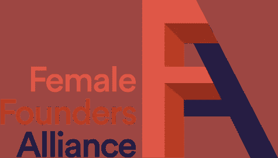

# 女性创业者的顶级数字社区

> 原文：<https://medium.com/swlh/top-digital-communities-for-female-founders-77eea3819f8f>

Found on Dribbble by Diana ([https://dribbble.com/dianaxstoyanova](https://dribbble.com/dianaxstoyanova))

从历史上看，女性技术人员和女性在技术、创业甚至传统公司的权力角色方面的胜算都很大。然而，这种情况正在发生变化，而且这种变化很快就会在各个行业发生——金融、风险投资、技术、政府等。全世界的女性都在相互扶持，为其他女性的职业发展创造更多空间。作为一名二十多岁的年轻女工程师，我可以在六十岁时回顾这段时光，并为这一历史转折点感到自豪，这一转折点正在为后代永远改变妇女“能做或不能做”的事情。

我觉得自己有能力、有力量、有信心去追求“非传统”领域，并且不介意别人说我“专横”这种感觉让很多像我一样的女性敢于冒险去解决她们自己的问题。

> 尽管努力为女性企业家创造公平的竞争环境，但美国女性创办的创业公司在 2018 年仅筹集了 2.2%的风险投资。

就在今年，两家由女性创立的初创公司 Glossier 和 Rent the Runway 进入了久负盛名的独角兽俱乐部，尽管女性占了总人口的一半。创业很辛苦；创业很难。独自冒险更难。然而，当你意识到还有其他女人和你处境相同时，你的心态就会改变。我加入了脸书集团、slack channels，并积极浏览 LinkedIn，关注那些正在崛起的女性企业家。他们说，和你最崇拜的人在一起是很重要的。在今天这个奇怪的“断开连接却又连接在一起”的世界里，甚至在现实生活中不认识那个人的情况下，与人联系、寻找导师、寻求建议要容易得多。这正是我在创办自己的公司时所做的。

为了帮助那里的其他女性，我整理了一份顶级社区的名单，我的女性企业家同事可以依靠这些社区找到支持、导师和建议等。

**All Raise 是由 [34 位资深女性投资者](http://allraise.org/team)创立的一个新的非营利组织，致力于资助者&创始人的多元化。**

**[**埃尔法**](https://elpha.com/)**

**Elpha 是一个私人社区，每天都有会员就个人和专业话题进行交流。我们分享知识、资源和职业机会，都是通过女性视角。**

**[**FEMSTREET**](http://femstreet.com)**

**提供关于女性科技企业家和风险投资多样性的新闻。他们现在有一个空闲频道，你必须成为订阅读者才能被邀请进入这个频道。**

**[**女创始人社区**](https://www.facebook.com/groups/FemaleFoundersCommunity/?ref=nf_target&fref=nf)**

**女性创业者从其他女性创业者那里寻求支持、建议和指导的首选之地。请随意分享关于你的创业公司、你认为在经营你的创业公司中有价值的资源、关于融资的建议/提示/技巧、投资者的评论、你认为有价值的工具、事件以及任何其他相关的东西。还有，随意发泄。我们为你而来，你也为我们而来。让我们一起赢。**

**[**女性创始人联盟**](https://femalefounders.org/founders/)**

**女性创业者的私人在线社区。FFA 在其创始人网络中统计了来自 25 个城市的数百家公司，以及其扩展社区中的数千名个人。点击[创始人](https://femalefounders.org/founders/)标签加入他们的社区(需要 50 美元的申请费)。**

**[**【女性创始人数量】**](http://hashtagfemalefounders.com/)**

**全球数千名女性创始人的休闲频道**

**[**女资助人**](https://femalefunders.com/)**

**在女性资助者，我们重视金融行业的包容性、多样性、可衡量的影响和透明度。我们的使命是通过增强女性领导者成为投资者的能力，增加投资和技术生态系统的多样性。揭开成为投资者的神秘面纱是重要的第一步。**

**[**创立繁荣**](https://foundflourish.co.uk/)**

**总部位于伦敦的社区，致力于缩小女性创业者的机会差距。在这里加入他们的松弛通道。**

**[**空想家&实干家**](http://www.dreamersdoers.com/)**

**梦想家和实干家通过其高度策划的有影响力的 womxn 网络、强大的思想领导力机会和旨在加速其成员旅程的高影响力资源，催化 womxn 领导者及其企业的成功。梦想家和实干家已经建立了一个由全球 3 万多名女性组成的创业生态系统。**

**[**抑扬格**](https://www.iamsogal.com/)**

**SoGal 是全球最大的多元化企业家和投资者教育和赋权平台。他们的使命是缩小创业和风险投资的多样性差距。订阅他们的时事通讯，加入他们在你附近的 40 多个地方分会中的一个。他们还提供许多免费的在线和离线资源**

**[**女士风暴马拉松**](https://www.facebook.com/groups/LadiesStormHackathons/)**

**来自各种不同学院的 14K+成员。一个由技术女性组成的社区，她们一起成长，一起参加黑客马拉松。**

**[**外籍女子**](https://www.theexpatwoman.com/)**

**外籍女性是一个全球性的职业女性社区，总部设在旧金山。我们的网络包括最近的外籍人士、多年前移民的外籍人士以及具有不同背景的本土女性，包括企业家、投资者、女性高管、专业人士、求职者和家庭主妇。我们的使命是通过我们的活动、社区和内容进行联系、教育和赋权。**

**[**SHEWORX**](https://www.sheworx.com/)**

**SheWorx 是领先的全球平台和活动系列，授权 20，000 多名女性企业家建立和扩大成功的公司。**

**[**女技师**](https://www.womentechmakers.com/)**

**谷歌的女性科技创客项目为科技领域的女性提供了知名度、社区和资源。**

**[**XR 中的女性**](https://wxrfund.com)**

**WXR 基金投资于我们这个时代最大的两个机会:计算机的未来和女性企业家。他们有一个充满活力的女性群体，正在解决一些未来最重要的问题。**

**[**女人闹**](https://womenmake.com/)**

**一个支持女性创客并让她们走在前列的开放社区。加入电报组。**

**[**VC 中的女人**](https://www.women-vc.com/)**

**世界上最大的全球风险投资女性名录，帮助女性找到彼此、联系和合作。**

**[**YSYS**](https://www.thisisysys.com/)**

**YSYS 是一个蓬勃发展的初创企业社区，面向以改变现状为使命的创始人、开发人员、创意人员和投资者。专注于伦敦。**

****************************************

**如果您有自己的社区，或者希望您的社区被添加到这个活动列表中，请随意评论这篇文章，我很乐意将它添加到:)**

# **别忘了给我们你的👏！**

****

## **这篇文章发表在[《创业](https://medium.com/swlh)》上，这是 Medium 最大的创业刊物，拥有+438，678 读者。**

## **在这里订阅接收[我们的头条新闻](https://growthsupply.com/the-startup-newsletter/)。**

****