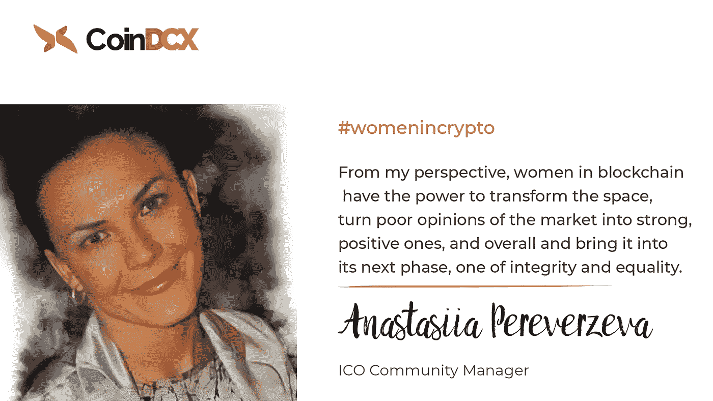

# 区块链:科技、女性和数字经济的并存

> 原文：<https://medium.com/swlh/top-influential-women-in-blockchain-and-crypto-space-15f9a108066b>

Top influential women in blockchain

*声明:内容来源于* [*CoinDCX*](https://coindcx.com/?utm_source=womenstartup&utm_medium=womenstartup&utm_campaign=womenstartup) *。CoinDCX 不提升/降级任何公司/ICO。本信息或其他媒体中的观点、陈述、估计和预测仅属于作者个人。*

现在是 2019 年，仍然是传统体系的一部分，认为科技和金融领域明显由男性主导。然而，现在时代在变，随着区块链等颠覆性技术接管传统的金融生态系统，区块链似乎可以成为这个技术驱动的世界中赋予女性权力的关键。

尽管推动科技多元化的浪潮汹涌而来，但金融渠道有限、文化限制等持久障碍正在阻碍全球女性在这个不断发展的数字经济中正确定位自己。

然而，历史本身证明，女性不会坐等改变，而是会让改变发生。

从中国 21 位白手起家的女亿万富翁之一、 [Lucy Peng](https://www.forbes.com/profile/lucy-peng/#dae1f269a530) 、 [Lazada](http://www.lazada.com/) 的首席执行官到[蚂蚁金服](https://www.antfin.com/index.htm?locale=en_US)的前首席执行官，再到[摩根大通的首席财务官](https://www.jpmorgan.com/country/IN/en/jpmorgan)、 [Marianne Lake](https://www.jpmorganchase.com/corporate/About-JPMC/ab-op-committee-bio-mlake.htm) ，科技领域的女性描绘出她们对科技和金融的贡献可以而且应该得到重视。

# 区块链和“Wow-men”

即使在这个不断发展的世界，许多女性也被剥夺了掌控自己生活中任何事情的权利，不可否认的是，拥有自己的财务是一种赋权，加密货币使这成为可能！

正如区块链作为传统金融生态系统的挑战者根深蒂固一样，女性也是区块链和加密货币等高科技领域创新、领导和成功的先锋。尽管在加密和区块链公司担任高级职位的女性仍然是少数，但目前统计数据表明，对冲基金和私募股权公司的女性合伙人不到七分之一。

# CoinDCX 对区块链妇女的展望

在 [CoinDCX](https://coindcx.com/?utm_source=womenstartup&utm_medium=womenstartup&utm_campaign=womenstartup) ，我们相信简单的思想多样性、一点点视角和文化可以在很大程度上影响任何领域，而不仅仅是工程，这就是为什么我们向您展示来自海洋的一滴水，这将乐观地激励许多其他人超越 FUD，进入加密货币领域！

[CoinDCX](https://coindcx.com/?utm_source=womenstartup&utm_medium=womenstartup&utm_campaign=womenstartup) 旨在加速不同垂直行业对加密货币的采用，以便世界上的每个人，无论男女，都能从更大的金融自由和包容性中受益。

我们将为您带来 8 位充满活力、多才多艺的 crypto 女性，她们的励志故事以及她们对所有女性的启示。

## Wendy Spill，区块链媒体、营销和咨询

Wendy Spill, Crypto Influencer

我第一次听说比特币是在 2011/2012 年，当时一名家庭成员问他们是否可以借我的信用卡购买一些，这样他就可以订购电脑零件。我马上说没有，我听不懂……[多读书。](https://blog.coindcx.com/women-in-blockchain-wendy-spill/?utm_source=womenstartup&utm_medium=womenstartup&utm_campaign=womenstartup)

## 区块链倡导者 Unthinking The World 的首席执行官 Jillian Godsil

[Jillian Godsil](https://www.linkedin.com/in/jilliangodsil/), Co-Founder at Blockleaders

“在我的职业生涯中，我的年龄和性别第一次成为优势。我是女的，五十多岁(出头)。”…..… [阅读更多。](https://blog.coindcx.com/women-in-blockchain-jillian-godsil/?utm_source=womenstartup&utm_medium=womenstartup&utm_campaign=womenstartup)

## Margaretta Colangelo，Deep Knowledge Ventures 的管理合伙人

[Margaretta Colangelo](https://www.linkedin.com/in/margarettacolangelo/), Managing Partner at Deep Knowledge Ventures

我对区块链感兴趣的原因之一是，它有可能增加世界上女性的金融包容性。区块链将为更多的买家和卖家带来机会，其中许多将是女性。区块链将为世界各地的女性提供从事商业活动的机会，并增强女性的金融权能。

区块链有可能成为从物物交换系统向货币过渡的巨大飞跃……[阅读更多。](https://blog.coindcx.com/women-in-blockchain-margaretta-colangelo/?utm_source=womenstartup&utm_medium=womenstartup&utm_campaign=womenstartup)

## 非洲区块链协会女主席亚莉薇·斯蒂芬妮·索科琳斯基

[Yaliwe Soko](https://www.linkedin.com/in/yaliwe-soko-essence/), Chairwoman Blockchain Association Africa and Founder at Essence Crypto

我的故事要追溯到 2016 年，在那之前我对加密货币或区块链一无所知。

最让我惊讶的是，我可以将这种数字货币兑换成现金并支付我的账单。2016 年 5 月，我需要一份额外的收入来维持生活费用，于是我开始找兼职……[阅读更多。](https://blog.coindcx.com/women-in-blockchain-yaliwe-soko/?utm_source=womenstartup&utm_medium=womenstartup&utm_campaign=womenstartup)

## Anna Liubavina，IDAX Global 营销经理

[Anna Liubavina](https://www.linkedin.com/in/anna-liu88/), Marketing Manager at IDAX Global

我以前从未想过在 IT 公司工作，但在时尚界呆了几年后，是时候换个地方，探索这个世界的其他机会了。我第一次听说比特币是在 2016 年，当时人们开始在我的家乡采矿，并在……[建立了许多采矿农场。](https://blog.coindcx.com/women-in-blockchain-anna-liubavina/?utm_source=womenstartup&utm_medium=womenstartup&utm_campaign=womenstartup)

## 《区块链——从概念到执行》一书的作者 Debajani Mohanty

[Debajani Mohanty](https://www.linkedin.com/in/debajanimohantypmp/), Author of Blockchain- From Concept to Execution

在一个女性没有投票权、印有女性作者名字的书甚至在英国都卖不出去的时代，奥迪亚女性在教育领域取得了进步，并为文学世界做出了贡献……[阅读更多。](https://blog.coindcx.com/women-in-blockchain-debajani-mohanty/?utm_source=womenstartup&utm_medium=womenstartup&utm_campaign=womenstartup)

## Anastasiia Pereverzeva，推进公司 ICO 社区经理

[Anastasiia Pereverzeva](https://www.linkedin.com/in/anastasiia-pereverzeva/), ICO Community Manager at Propulsive

在我看来，区块链的女性有能力改变这个空间，将市场的负面观点转变为强烈、积极的观点… [阅读更多。](https://blog.coindcx.com/women-in-blockchain-anastasiia-pereverzeva/?utm_source=womenstartup&utm_medium=womenstartup&utm_campaign=womenstartup)

> [在这里阅读所有故事！](https://blog.coindcx.com/?utm_source=womenstartup&utm_medium=womenstartup&utm_campaign=womenstartup)

# CoinDCX 为什么在乎！

这些非凡的女性是许多其他不安进入男性主导的高科技行业的人的指路明灯。他们与众不同的一点是，他们不仅仅是成功者，他们还谦卑地分享自己的经历，并向他人学习。

CoinDCX 的目标是希望社会不要将女性定型，而是平等对待她们。我们的愿景是建立一个不需要妇女赋权这样的词语的社会。我们认为，妇女应该有权成为她们想成为的任何人，从一开始就知道她们所做选择的所有可能排列。

> 祝每一位用自己的步伐赢得世界的女性妇女节快乐！

*本文是* [*CoinDCX*](https://coindcx.com/?utm_source=womenstartup&utm_medium=womenstartup&utm_campaign=womenstartup) *最新系列——区块链中的女性——的一部分，讲述了女性的故事，她们不仅自己打破了玻璃天花板，还激励了许多人超越障碍，在高科技领域蓬勃发展。*

## 这篇文章发表在 [The Startup](https://medium.com/swlh) 上，这是 Medium 最大的创业刊物，拥有+433，678 名读者。

## 在此订阅接收[我们的头条新闻](https://growthsupply.com/the-startup-newsletter/)。

