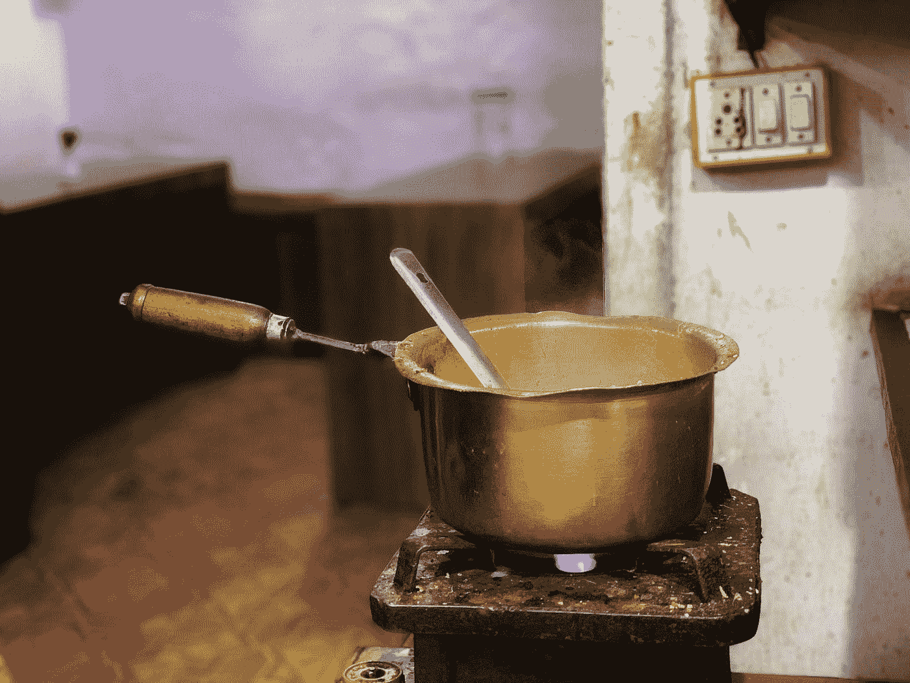

# 绝密生产力黑客:5 分钟阻止规则

> 原文：<https://medium.com/swlh/top-secret-productivity-hack-the-5-minute-block-rule-5166ed957d61>

Photo by [Raghav Modi](https://unsplash.com/@raghavmodi?utm_source=medium&utm_medium=referral) on [Unsplash](https://unsplash.com?utm_source=medium&utm_medium=referral)

睡前总有一件事是我们应该做的，但我们没有。或者也许我们觉得没有意义，因为我们应该在 30 分钟后见我们的朋友。

我一直都这么做。我发现自己在看着，等着水烧开。以前觉得我监督的话煮的更快。不对。烧开大约需要 5 分钟，如果水是凉的，有时需要 10 分钟…