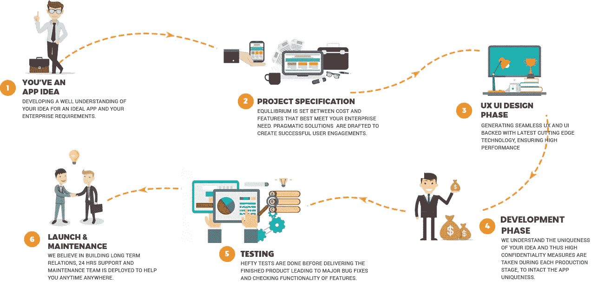
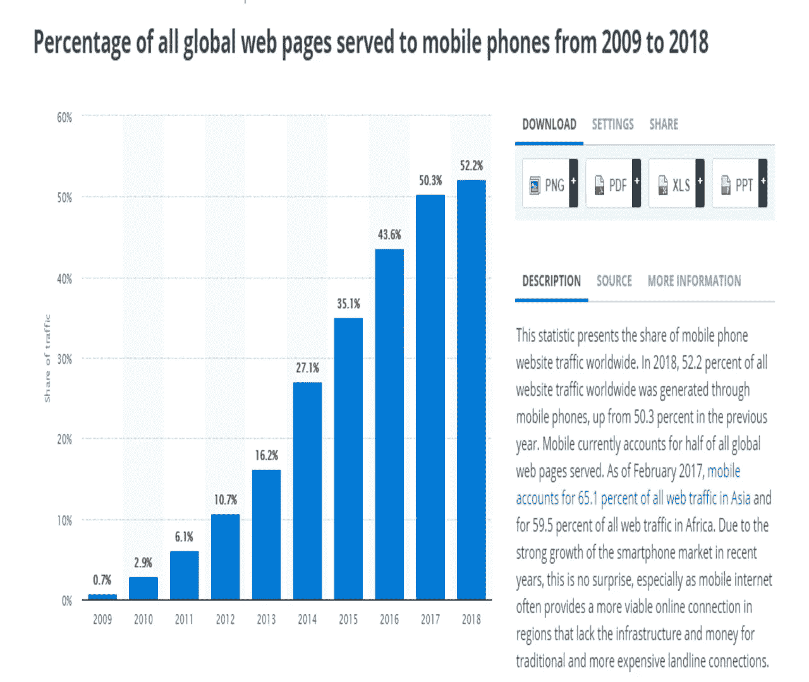

# 你的项目在 2020 年需要考虑的顶级网络发展趋势

> 原文：<https://medium.com/swlh/top-web-development-trends-you-need-to-consider-for-your-project-in-2019-37e4c83b691d>

**Source: Designed By Author**

现在的 web 开发资源与过去几年有所不同，换句话说，web 开发服务与过去五年相比变得越来越典型，越来越先进。作为客户，很难根据项目需求选择合适的产品。所以，今天我将解释并帮助你们了解不同的 web 开发框架或服务，这样你们就可以根据自己的需要和要求决定最好的一个。这里有一件事你必须考虑，没有一个网站开发公司在工作和质量方面是完美的，如果你正在寻找一个专门的或自由职业者的模式来雇用开发人员，那么你必须审查其工作组合，并与你已经入围的其他公司进行比较。

> **以下是 SME 公司(小型&中型企业)的某些标准，这些标准在各种分析参数陈述如下后予以考虑:**

1.  **在市场上的良好记录**
2.  **工作透明**
3.  **对工作和客户都诚实**
4.  **在开发和行业中的总经验年限**
5.  **公司以及开发人员或开发团队的技术专长**
6.  **多元化投资组合**
7.  **由于不确定的营业额导致的退款保证**

为了获得更多关于顶级网络开发公司的参考和评级，这里有一些第三方网站，如**和[**good firms**](https://www.goodfirms.co/)**。它们是 IT 行业最好、最可靠的评论网站。****

****

****Source: Google.com****

> **上图描述了 web 和移动应用程序开发服务的工作流程，这在大多数项目或案例中是非常相同的。
> 最常用的 web 和移动 app 开发开发模型或方法论有 8 种。它们如下:**

1.  **[瀑布模型](http://istqbexamcertification.com/what-is-waterfall-model-advantages-disadvantages-and-when-to-use-it/)**
2.  **[V 型](http://istqbexamcertification.com/what-is-v-model-advantages-disadvantages-and-when-to-use-it/)**
3.  **[增量模式](http://istqbexamcertification.com/what-is-incremental-model-advantages-disadvantages-and-when-to-use-it/)**
4.  **[RAD 型号](http://istqbexamcertification.com/what-is-rad-model-advantages-disadvantages-and-when-to-use-it/)**
5.  **[敏捷模型](http://istqbexamcertification.com/what-is-agile-model-advantages-disadvantages-and-when-to-use-it/)**
6.  **[迭代模型](http://istqbexamcertification.com/what-is-iterative-model-advantages-disadvantages-and-when-to-use-it/)**
7.  **[螺旋模型](http://istqbexamcertification.com/what-is-spiral-model-advantages-disadvantages-and-when-to-use-it/)**
8.  **[原型模型](http://istqbexamcertification.com/what-is-prototype-model-advantages-disadvantages-and-when-to-use-it/)**

**为 web 或 app 的开发选择正确的模式非常重要。**

**基于 web 或 app 开发的不同公司需要选择适合其开发需求的开发模型类型。但是最近,**敏捷方法‘**是最常用的模型。‘**瀑布模型’**是一个旧模型，你已经在上面的图片中看到过。**

**在我对 web 开发服务趋势进行分析的时候，我发现了一些有趣的事实，如果你们没有意识到的话，这些事实会让你们大吃一惊。可能会说这些方面非常有用，会帮助你在全球市场上保持领先。**

****

**[**Source: Statista**](https://www.statista.com/statistics/241462/global-mobile-phone-website-traffic-share/)**

> ****以下是 2020 年将主导 IT 行业的 11 大网络发展趋势。****

1.  **人工智能:人工智能是网络发展的未来，也是当今任何数字化转型战略最核心的组成部分之一。全球 IT 公司正在相互竞争实施数字化转型战略，人工智能**在网络发展中的作用将比以往任何时候都更加突出。然而，这对于网络开发公司来说是一项具有挑战性的工作，因为传统的网络开发方法并不能解决这个问题。通过 [**自动化 web 开发过程**](https://hackernoon.com/5-ways-artificial-intelligence-can-improve-web-development-561c44d86193) ，web 开发人员需要减少对基础繁重任务的关注，将注意力集中在增值方面，如策划超级用户体验、制定设计策略和其他活动。人机合作足以改变网络。
    到今年年底，人工智能产业将实现 70%的增长，预计将超过 1.2 万亿美元。预计在 2019 年，全球超过 40%的组织将部署人工智能技术，以提高其生产力和客户满意度。这些都清楚地表明，人工智能将成为 2019 年网络发展的主导趋势。
    在我的研究中，我发现了 [**中国**](https://www.facebook.com/worldeconomicforum/videos/chinese-schools-are-teaching-kids-all-about-ai/10155370637091479/) 一个非常有趣的方面，他们已经主动将 [**的课程隐含到他们的学术课程**](https://www.weforum.org/agenda/2017/06/how-china-became-ai-leader/) 中，这样他们就有了资源池，可以随时满足 AI 开发行业日益增长的需求****
2.  ****物联网(IoT):**I**互联网影响着人们生活的方方面面。如今，几乎每个人都以任何方式依赖互联网。商业组织也在利用互联网作为可靠的通信媒介，这有助于他们扩大地理范围。如今，所有组织都在沉着自信地利用智能技术和传感器的潜力，这些技术和传感器嵌入在智能手机和其他耐用消费品等用户端设备中。物联网支持的智能设备的互联将在将网络开发服务带入全新一代网络服务中发挥关键作用。
    每个拥有智能手机的人都会在某个时候体验到物联网。不久，人们将会看到商家结合使用无线和传感器技术来跟踪顾客的购买行为。一方面，客户将使用物联网技术来利用定制或个性化的 web 开发服务。大量事物受到物联网的影响，网页设计和开发将是未来发展中发生根本变化的主要领域之一。
    如今，许多网络开发公司不知道从何入手，因为物联网非常广泛。
    根据 [Statista 调查](https://www.statista.com/statistics/471264/iot-number-of-connected-devices-worldwide/)，到 2020 年将有**310 亿**台联网设备。如此庞大的物联网设备数量还将影响网络开发流程，因为企业倾向于通过台式机或笔记本电脑来控制这些设备。虽然今天只有少数网站集成了物联网，但公平地说，随着联网设备的数量逐渐增加，这一概念将很快成为焦点，并将为网络开发服务带来新的维度。****
3.  ******单页应用程序(SPA):**单页应用程序(SPA)是一种 web 应用程序或网站，它通过动态重写当前页面而不是从服务器加载整个新页面来与用户进行交互。这种方法避免了连续页面之间用户体验的中断，使应用程序的行为更像桌面应用程序。在 SPA 中，所有必需的代码(HTML、JavaScript 和 CSS)都可以通过一次页面加载来检索，或者适当的资源可以根据需要动态加载并添加到页面中，这通常是为了响应用户的操作。
    水疗成为今年的焦点。因为它们相对来说驾驶起来更舒适，它们看起来会越来越受欢迎。他们的设计以简单和速度为核心，越来越受到网络用户的青睐。顾名思义，单页应用程序是一个很长的网页，摆脱了复杂的导航和复杂的菜单。spa 可以在桌面和移动设备上完美运行。****
4.  ******区块链技术:**如今，不同的行业都在实施区块链业务，并使管理透明化，这让他们在新时代的廉洁系统转型中占据了先机。
    以下是考虑开发的区块链实现的五个关键概念:
    **区块链开发
    *分散式数据库应用共识
    *智能合同
    *工作或利益证明
    *可信高级计算* 每个行业都有他们必须考虑的潜在需求，换句话说，企业对企业或企业对客户之间的所有可能方式的透明度，这是基本的优先事项。现在在文章的最后一幅图中定义了区块链技术的基本 [**权限在不同的部门**](https://blog.goodaudience.com/blockchain-a-future-next-technology-for-every-industry-4775238e1ff1) 中的实现方式相同。****
5.  ******Motion UI:** 是一个用于创建 [**自定义 CSS 转场和动画**](https://zurb.com/playground/motion-ui) 的 Sass 库。最初与应用程序基础捆绑在一起，这个更新版本包括更强大的过渡选项、动画排队系统和灵活的 CSS 模式，可以与任何 JavaScript 动画库一起工作。正如你所看到的，网络用户每天都在快速增长，并且越来越倾向于网页上直观而迷人的交互图形。网络开发公司开始意识到，普通互联网用户的注意力持续时间越来越短，这就要求网页上有更吸引人的图片。静态图像和基于 flash 的图形使许多网站被网络用户弃之不顾，而唤起动作的用户界面最近变得非常流行。
    网络用户对直观的 motion UI 日益增长的偏好将在未来几年推动 motion UI 的普及。****
6.  ******更丰富的设计&适应性:**过去几年，web 开发只关注网站的功能和简单性，这是 web 设计和开发服务的主流趋势。但是，今年早些时候，有一种趋势正在转向使用更多的图像、动画和形状来进行响应式网页设计，以满足市场对网页设计师和开发者更具活力的设计的不断增长的需求。为了获得更广泛的受众，大多数品牌都支持可以在各种智能设备上完美显示的网站。适应性的趋势更多地归因于这样一个事实，即越来越多的网络用户通过多种移动设备访问网络。随着公司希望通过使网站对更广泛的设备更具响应性来抓住其利基市场中更大比例的受众，适应性必将在未来一年继续成为网络发展的一个关键趋势。****
7.  ******聊天机器人&推送通知:**如今，服务支持在 IT 和其他领域都是一个非常重要的标准。因此，必须将聊天机器人和推送通知集成到您的网站中，以便在设计和开发手段方面提供质量驱动的帮助。推送通知已经成为大多数网站最重要的组成部分之一。推送通知正在快速取代电子邮件简讯，因为它们在用户和制造商两端都更容易管理。同样，当人工智能遇到 Chabot 时，它将简化和帮助客户关系，并通过用非常少的错误日志代替人工来帮助您提供 24/7 服务支持。****
8.  ******渐进式网络应用(PWAs):** 渐进式网络应用通过浏览器、网站和移动应用将世界联系在一起。渐进式 web 应用程序是一个功能与原生移动应用程序几乎相似的网站。如今，大多数从网站转向渐进式网络应用的知名品牌都经历了转换率和用户参与度的显著增长。由于它们传达了最好的网站和移动应用，它们将在 2019 年保持领先趋势。****
9.  ******低代码开发:**通过提供一种更快更简单的方法来开发和部署网页设计&开发代码将促进优秀网站的快速开发，而不需要熟练的编码专业知识。低代码开发已经掀起了严重的浪潮，因为与传统的 web 设计和开发过程相比，它们越来越受到 web 开发公司的青睐。****
10.  ******AR，VR & MR(增强现实，虚拟现实&混合现实):** AR 和 VR 是未来技术，能够改变与网站的交互方式。谷歌、三星和微软等公司在这些技术上投入了大量资金。在虚拟现实的帮助下，你可以向用户提供虚拟世界的沉浸式体验。增强现实(AR)通常通过智能手机上的摄像头将数字元素添加到实时视图中。增强现实体验的例子包括 Snapchat 镜头和游戏 Pokemon Go。虚拟现实(VR)意味着一种将现实世界拒之门外的完全沉浸式体验。使用 HTC Vive、Oculus Rift 或谷歌 Cardboard 等 VR 设备，用户可以被传送到几个真实世界和想象的环境中，如嘎嘎叫的企鹅群的中间，甚至是龙的背上。
    在结合了 AR 和 VR 元素的混合现实(MR)体验中，现实世界和数字对象相互作用。混合现实技术刚刚开始起飞，微软的 HoloLens 是最著名的早期混合现实设备之一。****
11.  ******网络安全:**如今，IT 专业人员或公司面临的最大威胁是数据泄露、数据隐私侵犯和保密泄露。有许多类似的统计数据显示，大多数组织都在为前所未有的网络攻击浪潮做准备，这将使他们的工作环境面临更多的危险。因此，在不久的将来，网络安全仍将是网络发展的主导趋势。保护全球数据免受黑客攻击是一项非常艰巨的任务，但并非不可能。许多国家已经有了自己的网络军队来应对这类威胁，并帮助同胞保护他们的数据安全。****

# ***** * * * * *结论* * * * * *****

****现在，最后，我希望你们自己决定你们自己想要的发展趋势，并在国际市场上大放异彩。这些不仅仅是要跟随的趋势，而且如果你们相应地考虑和选择它，还会引导你们走向成长和成功。这些发展趋势在不久的将来有很大的潜力。我希望，你们会喜欢并发现这些关键趋势，并有望看到语音用户界面、增强现实和物联网等技术在未来一年的网络发展中获得巨大的牵引力。因此，毫无疑问，所有这些趋势都在引领一系列长期存在的技术和新兴技术。因此，他们将在网络和应用程序开发服务的不同点上为开发者打开更多的学习机会。****

********

## ****这篇文章发表在 [The Startup](https://medium.com/swlh) 上，这是 Medium 最大的创业刊物，拥有+408，714 读者。****

## ****在这里订阅接收[我们的头条新闻](http://growthsupply.com/the-startup-newsletter/)。****

********