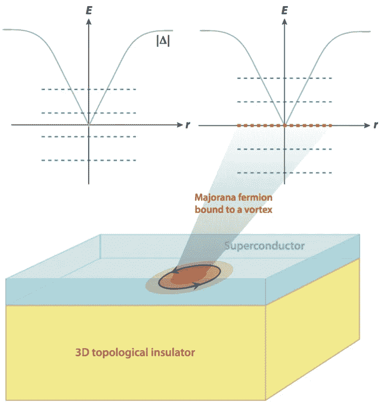
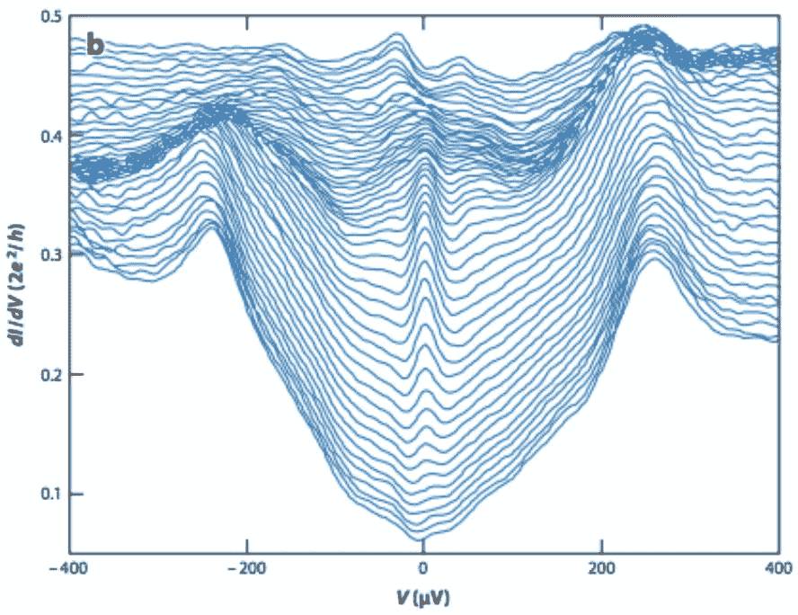
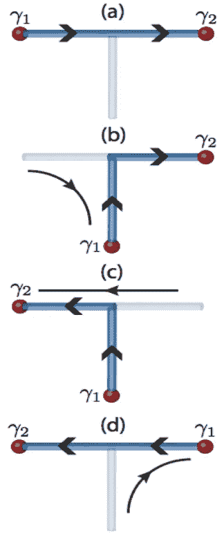
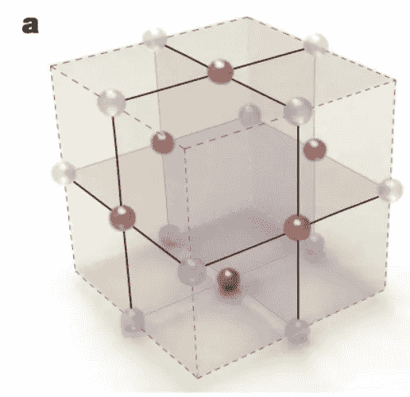
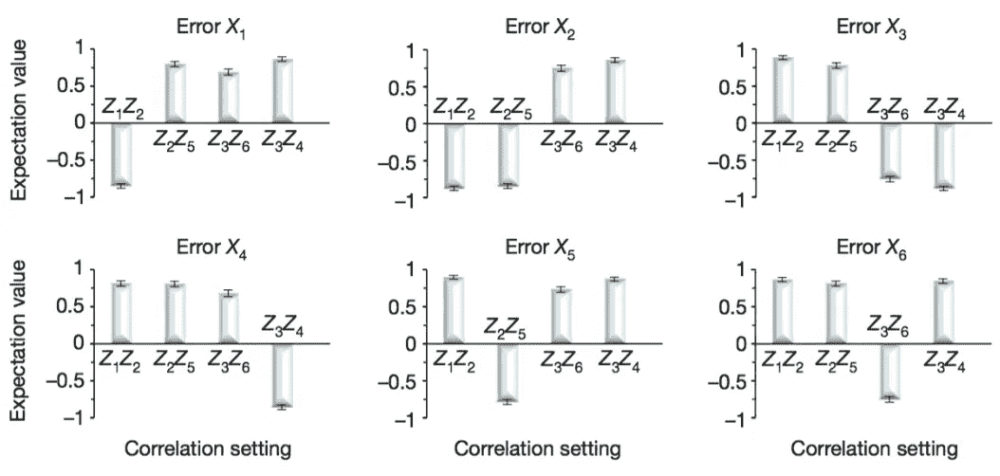

# 拓扑量子计算

> 原文：<https://medium.com/swlh/topological-quantum-computing-5b7bdc93d93f>

什么是拓扑量子计算，该领域的发展方向是什么，目前的研究水平如何……在这篇博客中，我们试图回答所有这些问题，这篇博客是我和我的同学 Andre He，Dennis Feng，在加州大学伯克利分校量子计算课程中的一部分。对我们来说，量子计算是我们选择这门课程的原因，但拓扑量子计算在背景中有如此优雅的数学，这是超级智力刺激。

这个复习项目是 2017 年春天做的。从 2017 年到现在，2019 年 5 月，我不知道有任何重大的范式转变。但是我很想听到更多关于这个领域的进展！如果你喜欢这个博客，并且有新的东西想分享，请随时联系我们！

# **简介**

量子计算利用叠加和纠缠等量子力学现象对数据进行操作，在许多情况下，这在经典计算机上是不可行的。这个数据的基础是量子比特，它是经典比特的量子模拟。目前许多量子位元的实作，像是囚禁离子和超导体，都非常容易受到杂讯和退相干的影响，因为它们在粒子本身中编码资讯。拓扑量子计算试图通过利用物质的非阿贝尔形式来存储量子信息，实现更具弹性的量子位。在这样的方案中，信息不是编码在准粒子本身中，而是编码在它们相互作用和编织的方式中。因此，这个方案是拓扑的，也就是说只有粒子世界线的宏观拓扑性质才是重要的。这使得拓扑量子计算更能抵抗困扰其他量子位实现的退相干和噪声问题。

在拓扑量子计算中，量子比特被初始化为非阿贝尔任意子，它作为自身的反粒子存在。然后，通过“编织”任意子的世界线，在这些量子位上执行操作(我们可以认为是量子门)。因为这些粒子的非阿贝尔性质，它们交换的方式很重要(类似于非对易性)。要注意的这些编织物的另一个重要特性是，局部扰动和噪声不会影响系统的状态，除非这些扰动大到足以产生新的编织物。最后，通过融合粒子进行测量。因为任意子是自己的反粒子，聚变会导致一些粒子的湮灭，这可以作为测量。

目前，拓扑量子计算正在慢慢成为现实，最大的里程碑之一——观察形成拓扑量子计算基础的准粒子——获得了 2016 年诺贝尔奖。随着许多理论框架在过去 20 年中得到发展，最近的实验进展一直在加速实现这些理论。

# **理论**

首先，我们需要简要定义几个关键概念。*量子计算*是基于制造、操纵和测量量子态的理论能力的任何计算模型。*拓扑量子计算机*是一种依靠物质的拓扑有序状态来进行容错量子计算的设备。如果在低温、低能量和长波长下，在系统所处的时空流形的平滑变形下，所有可观测的属性(如相关函数)都不变，则系统处于*拓扑相*。

1.  **任意子**

在拓扑量子计算中，一个量子位是由一组*任意子*组成的，这些任意子不会出现在 3D 系统中。在 3D 中，每个粒子要么是费米子，要么是玻色子，交换两个粒子会产生一个整体符号，要么是+要么是-。

但是在 2D，粒子服从交换统计

对于任何复相θ[1]。这些粒子被定义为任意子。从数学上讲，这与这样一个事实有关，即在三维空间中两点的运动群是 S2，一个二阶群，而在二维空间中圆盘中 n 点的运动群是一个无限群。这表明点状粒子在 2 维空间中的交换统计比在 3 维空间中更丰富。

Figure 1\. A topological quantum computation scheme, showing the braided worldlines of several anyons.

一旦我们假设我们可以按照量子计算的要求制造、操纵和测量物质的二维拓扑相位，我们就有了拓扑量子计算的理论方案。如图 1 所示[2]，粒子-反粒子对从真空中被抽出来启动状态。垂直方向是时间轴，每个带有标记点的横截面与某一时刻的希尔伯特空间相关联。称为*编织*的粒子交换对应于相关希尔伯特空间上的酉运算。换句话说，编织相当于在量子位态上加了一个量子门。

假设我们的系统恰好支持 r 个可区分的不可分解任意子类型，我们用集合 L = {0，.。。，r — 1}的“颜色”或“粒子类型”。我们把真空作为一种不可见的任意子类型，标为 0。表面上的任意子是点状的，所以我们可以把它们看作表面上的小边界圆。当我们把任意子解释为(准)粒子时，每个任意子 a 一定有一个反粒子。反粒子的一个方便的拓扑解释是，用 a 标注的正方向圆和用 a+标注的负方向圆是一样的。拓扑不变性意味着任何拓扑上允许的操作，如任意子交换，或曲面的扭曲部分，必须对应于相应的希尔伯特空间上的幺正算子。

为了在我们执行计算后测量量子位状态，我们*融合*，或者将任意子聚集在一起，然后我们测量融合结果。融合结果(例如，粒子是否相互湮灭)取决于量子位的量子状态。

因此，计算过程如下:1)创建粒子-反粒子对来初始化我们的量子位，2)将它们编织在一起以执行门操作，3)测量融合结果。一个关键点是，在编织粒子的世界线后，相邻的粒子-反粒子对可能获得了不同的总电荷(即标签)。过程中的微小变化，如粒子世界线的微小偏差，可能是由噪声引起的，不会影响输出。为了获得有意义的信息，我们必须多次重复同样的过程，记录输出结果。

## 2.马约拉纳费米子

已经证明，有恰好 n 种不同粒子类型的任意离子系统有有限多种可能的模型。当 n=3 时，一个可能的理论是 Ising 理论，在该理论中预言了著名的和最简单的非阿贝尔任意子。埃托雷·马约拉纳在 1937 年指出复狄拉克方程可以分解成一对实波动方程，每个方程描述一个实费米场，没有粒子和反粒子的区别。将一个复杂的狄拉克费米子分解成两个真实的 Majorana 费米子的叠加是一个形式上的步骤，没有物理后果。但是 Majorana 认为中性粒子可以用一个单一的真实场来描述，并得出结论“现在没有必要假设反中子或反中微子的存在”。我们现在知道中子和反中微子是不同的粒子，但中微子和反中微子很可能是在不同运动状态下观察到的同一粒子。

超导体的电子和空穴激发起粒子和反粒子的作用。电子(费米能级以上能量 E 的填充态)和空穴(费米能级以下 E 的空态)带相反的电荷，但 2e 的电荷差可以在超导凝聚体中被吸收为库珀对。在费米能级(E=0，在超导能隙的中间)，本征态是电子和空穴的电荷中性叠加态。超导体的这些能隙激发是 Majorana 费米子。

在傅亮和查尔斯·凯恩展示了传统的自旋单重态 s 波超导可以与拓扑绝缘体的强自旋轨道耦合结合使用之后，最近的许多激动人心的事情接踵而至。

Figure 2: A scheme of realizing Majorana fermions in a 2D system. The Majorana fermions form in vortices created on the superconductor surface in the diagram.

基本机制如图 2 所示。三维(3D)拓扑绝缘体具有绝缘主体和金属表面。2D 表面电子是无质量的狄拉克费米子，非常像石墨烯，但没有石墨烯的自旋和谷简并。沉积在表面的超导体打开了一个激发间隙，这个间隙可以通过磁场局部闭合。磁场穿透为 Abrikosov 顶点，子带隙状态 En = (n+a)δ，其中 n 是整数，是由超导带隙和费米能量确定的能级间距，a 是 0 或者是电子-空穴对称性所要求的。对于 a=0 和 n=0，E0=0 零模将是 Majorana 费米子。

Majorana 费米子(MF)可以通过多种方式产生。要求是拿一个超导体，分裂电子自旋简并(例如通过自旋轨道或塞曼耦合)，关闭并重新打开超导间隙[2]。有几种候选的 2D 系统可以在物理上实现这些 MF，包括ν= 5/2 分数量子霍尔态、手征 p 波超导体、拓扑绝缘体和半导体异质结构。然而，如下所述，事实证明，在 1D 系统中可能更容易创建 MFs[3]。

# **实验**

第一个被广泛关注的 MFs 实验观察发生在超导体和半导体 1D 纳米线之间的界面[4]。如图 3 所示，实验人员在 InSb 纳米线的两端放置一个超导电极和一个普通金属电极，并将纳米线置于平行于其轴的磁场中。选择 InSb 纳米线主要是因为其高自旋轨道相互作用。此外，塞曼效应(来自磁场)和自旋轨道耦合对于打破纳米线中的电子自旋简并是重要的。随着实验人员增加磁场，超导纳米线中的激发间隙关闭并重新打开，这应该会在导线末端产生所谓的“Majorana 零模式”。通过磁场扫描测量纳米线的微分电导，他们观察到零电压下的峰值，如图 4 所示。在实验条件下，这个峰值只能用 Majorana 零模引起电流流过导线来解释。因此，他们得出结论，他们已经探测到了 Majorana 费米子。

Figure 3: SEM image of the superconducting (S) and normal (N) electrodes in contact with the InSb nanowire. There is a magnetic field (B) that points parallel to the nanowire.

Figure 4: Plots of differential conductance (dI/dV) vs. voltage, at a temperature of 70 mK. The curves are the plots at increasing B fields (from 0 to 490 mT, in 10 mT intervals), and all except the B = 0 curve are offset for clarity.

下一个要问的实验问题是:我们如何将这些任意子编织在一起？(回想编织对应于在量子位上应用一个幺正门。)在前面描述的在纳米线两端有两个 MF 的设置中，我们如何交换它们的位置而不使它们融合呢？Alicea *等人* [3]描述了一种实现这一点的方法，如图 5 所示。首先，附着垂直的纳米线以形成 T 型结。然后，使用精确控制的电场，可以将一个 MF 运送到 T 的底部，将第二个 MF 滑过 T，并将第一个 MF 运送到对面。通过具有这些 T 型接头的网络，可以在 MFs 上执行任意的编织操作。

Figure 5: Procedure of braiding using a T-junction.

# **用拓扑量子计算纠错**

正如本研究前面提到的，我们注意到拓扑量子计算如此吸引人的原因是局部微扰和噪声不太可能影响系统的状态，这意味着退相干不太可能发生。这在数学上用阈值定理来表述。阈值定理表明，如果每个门的量子错误概率足够低(低于阈值 pc)，我们就能够在无限长的时间内使用该系统进行精确的量子计算。传统上，所需的 pc 值相当低，大约为 10–5。然而，使用纠错的拓扑量子计算，pc 的值在 10–2 的数量级[5]。2012 年，姚、等人通过实验证明了拓扑错误修正在团簇态计算中的应用。

该小组使用了六个光子，这些光子被构造成一种 3D 细胞结构，称为“细胞复合体”，具有冗余的拓扑关系。细胞复合体的图解如图 6 所示。在未受干扰的系统中，以及在特定误差下，这些相关值始终为 1，遵循图 7 中表格所描述的方案。通过这个关联方案，我们可以确定是否存在错误以及错误发生在哪个量子位上。

Figure 6: Photons in this cluster state have topological properties

Figure 7: Redundancy of information coming from the cluster state allows us to observe errors when the correlations are off

在一个复杂的激光系统上进行实验给了我们结果期望值，证实了对拓扑结构的理论理解。图 8 中的图表显示了实验结果。

Figure 8: Experimental results that show error detection

# **当前的艺术研究状态**

目前，有许多机构正在押注拓扑量子计算成为现实，他们为此投入了大量资源。其中一个团体是微软的 Q 站，一个致力于这一领域研究的团体。他们有许多站点正在研究拓扑量子计算难题中独立但又相互关联的部分。下面列出了这些团队。

●圣巴巴拉:由菲尔德奖章获得者迈克尔·弗里德曼博士创立。研究物质的拓扑相位，特别是 Majorana 零模式。拓扑量子位的实际实现。

●代尔夫特:测试拓扑量子门的稳定性，并致力于证明拓扑保护状态下的消相干失效。

● Redmond:开发真实世界的量子算法并理解其含义，以及设计软件架构。

●悉尼:应对扩大量子计算规模的挑战。量子系统之间的接口和经典控制和读出工作。

●哥本哈根:研究 Majorana 费米子的用途和性质，并建立可以支持这种粒子的系统。

●普渡:研究超高纯度 III-V 半导体器件中电子的量子力学性质。重点放在分子束外延(MBE)上，这使他们能够一次构建一个原子层的结构。

●苏黎世联邦理工学院:寻找允许量子计算机存在的合适材料。

最近，来自苏黎世、英特尔和雷蒙德的研究人员发表了一篇论文，描述了在经典机器上模拟量子电路以测试理论量子算法。仿真在性能上比量子电路的模拟快得多。目前的模拟在经典计算机中计算每个量子门时，计算速度很慢，而且需要大量的矩阵向量乘积。相反，仿真减少了复杂的线性代数的数量，并依赖于使用经典算法，如快速傅立叶变换，来运行量子程序[6]。

目前，与更传统的量子计算相比，拓扑量子计算领域仍处于起步阶段，例如利用捕获的离子或超导电路。然而，最近在理论和实验方面的进展表明，该领域的未来是有希望的。

**确认**

作为加州大学伯克利分校计算机科学系量子计算课程的一部分，Alexander Shengzhi Li、Andre He、Dennis Feng 和与 Umesh Vazirani 教授共同进行了这项研究。如果没有教授或课堂助教的反馈，这项研究就无法完成。

**参考文献**

1.  柯林斯，G. P. (2006)。用量子结计算。《科学美国人》, 294(4)，56–63 页。
2.  Beenakker，C. W. J. (2013 年)。在超导体中寻找 Majorana 费米子。安奴。康登斯牧师。物质物理学，4(1)，113–136 页。
3.  Alicea，j .，Oreg，y .，Refael，g .，von Oppen，f .，Fisher，M. P. A. (2010 年)。1D 线网络中的非阿贝尔统计和拓扑量子信息处理。arXiv 预印本 arXiv:1006.4395v2。
4.  mourik v .、Zuo k .、S. M .、Plissard s . r .、Bakkers、E. P. A. M .、& Kouwenhoven，L. P. (2012 年)。混合超导体-半导体纳米线器件中 Majorana 费米子的特征。科学，336(6084)，1003–1007。
5.  姚晓春，王天祥，陈海钟，高伟波，福勒，A. G .，劳森多夫，r .，等(2012)。拓扑误差校正的实验演示。自然，482(7386)，489–494。
6.  Haner，s . Steiger，D.S .，Smelyanskiy，m .，Troyer，M. (2016)。量子电路的高性能仿真。arXiv 预印本 arXiv:1604.06460v1。