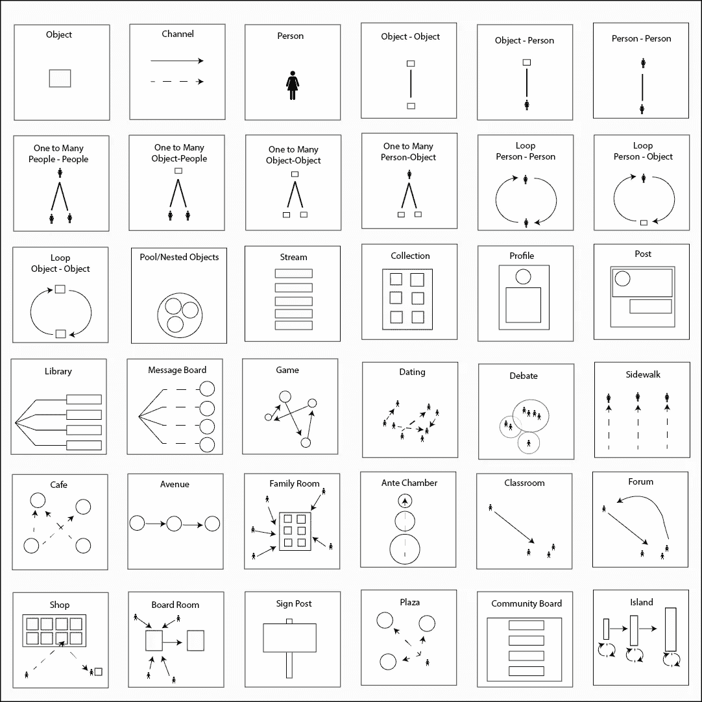

# 结构主义和在线环境的模式语言

> 原文：<https://medium.com/swlh/towards-a-larger-view-of-information-architecture-2a7bd6ebafb7>

Common interaction patterns.

词汇塑造了我们思考问题的方式。2016 年，我和我的联合创始人萨尔使用埃里克·赖斯的[精益创业](http://theleanstartup.com)方法开发了一款名为[邻近](https://www.adjacent.us)的移动应用，我们使用了像*最小可行产品*和 *UX 研究*这样的词。这意味着我们要构建一个特性，测试它，改变它，然后再测试。每一次迭代都离成功的产品更近了一步。但是这个过程是被动的…