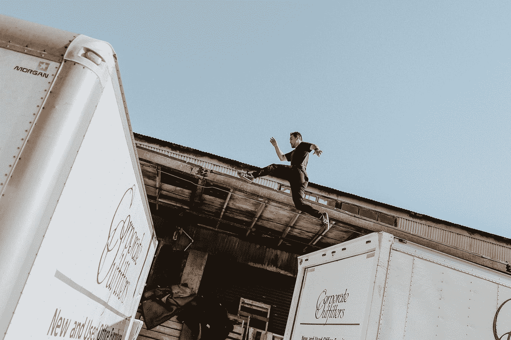
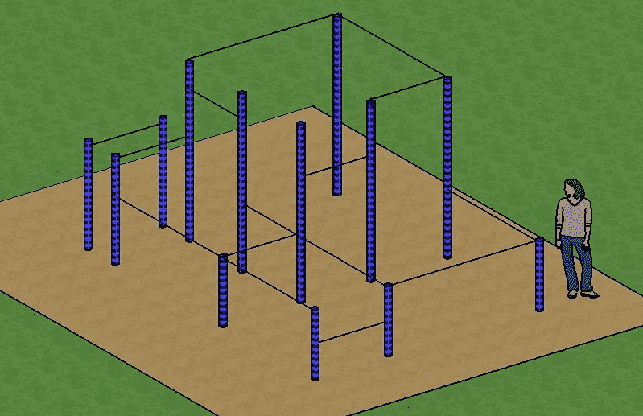
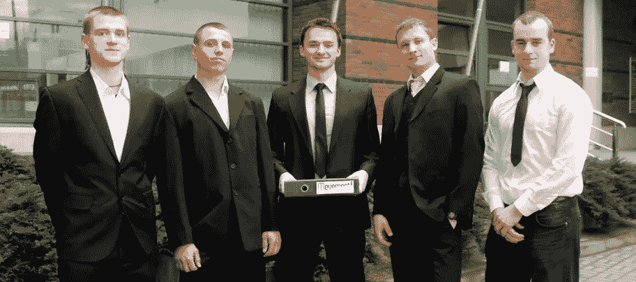
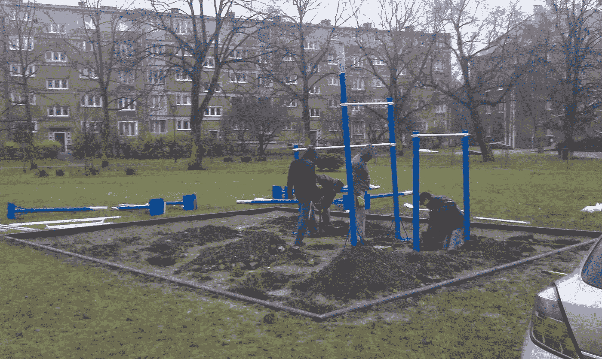
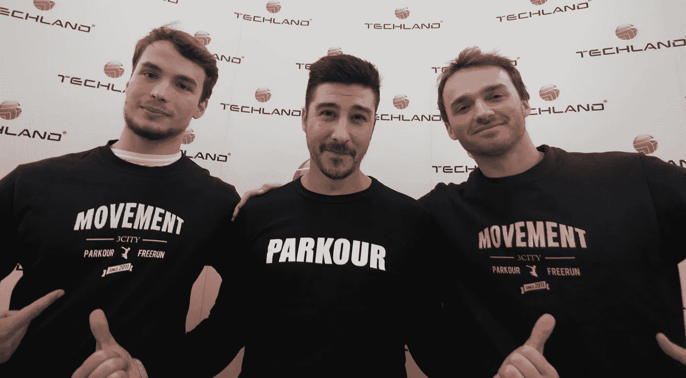

# 追梦:追梦者如何将一座城市变成跑酷天堂

> 原文：<https://medium.com/swlh/tracing-the-dreams-how-traceurs-turned-a-city-into-a-parkour-paradise-f8f79e993fde>

Photo by [Jennifer Bedoya](https://unsplash.com/@jennbedoya?utm_source=medium&utm_medium=referral) on [Unsplash](https://unsplash.com?utm_source=medium&utm_medium=referral)

很久很久以前，一群年轻人开始着手建立波兰第一个跑酷公园。他们一点也不知道，他们将发起一场运动，把格但斯克变成这个国家的跑酷之都。我会告诉你他们遇到的障碍和接下来发生的事情。

# 到底什么是跑酷？

你可能在电视上或电影院里看到过。自从 80 年代末诞生以来，跑酷就出现在电影和视频游戏等视觉媒体中。但是跑酷除了是一种美学比喻外，还是一种实际的训练科目。如果你住在一个大城市，你很有可能会遇到追踪者和追踪者。(如果你想知道，这些术语分别指跑酷的男性和女性练习者。)

跑酷利用城市环境作为障碍跑道。主要前提是以最高效的方式从 A 点到 B 点。这通常意味着采取各种“捷径”，如在建筑物之间跳跃、爬墙或跳过障碍物。但是对于追踪者来说，跑酷不仅仅是一项杂技运动。精神层面同样重要。引用迪伦·贝克(跑酷运动员，不是演员)的话:

> 跑酷还通过增强自信心和批判性思维能力来影响一个人的思维过程，从而帮助一个人克服日常的身体和精神障碍

# 开端

Grzegorz Niecko 在 13 岁的时候学会了跑酷。它始于一个通过拨号调制解调器下载的视频。当时的数字视频并不引人注目。分辨率非常低，所以照片由巨大的移动方块组成。花了一整晚才下载了这个两分钟的片段。然而，这个特别的视频给人留下了深刻的印象。它描绘了人们以一种不寻常的方式在城市景观中移动。

很快，Grzegorz 了解到这个学科叫跑酷。幸运的是，他还发现在邻近的格丁尼亚市也有运动员表演类似的特技。他们每周在不同的地方聚会一次。没有训练者、教练或领导者。只是一个由志同道合的人组成的社区，他们使用互联网来安排他们的会议。也几乎没有教学材料。因此，训练由试错组成——主要是后者。

跑酷的地方很多。毕竟，城市景观是你需要开始的全部。但是城市景观也有缺点。大多数时候，你是在侵犯别人的财产。其他时候，忧心忡忡的市民会报警，控告你扰乱治安。因此，警官们认识追踪者的情况并不少见:他们有很多机会见面。幸运的是，这两个群体之间的敌意很少。

Grzegorz 不是唯一一个发现这种情况有点不舒服的人。同为跑酷爱好者的托马兹·dąbrowski 也想做些改变，他的灵感来自于对周围环境的观察。儿童游乐场一直是城市的常态。在 90 年代末，户外健身房也变得流行起来。这些观察引出了一个想法。

> 如果我们建造一个障碍跑道，同时充当户外健身房和儿童游乐场，会怎么样？

这个想法并不完全独特。那时候哥本哈根已经有一个跑酷公园了。(可以通过看电影《[我的游乐场](https://www.imdb.com/title/tt3244740/)》了解它的故事)这意味着这个想法不再是一个疯狂的梦想——它已经被其他人做过了，所以它可以再做一次。

Plans for the first parkour park in Poland, visualization by Tomasz Dąbrowski

# 波兰第一个跑酷公园

动机是充足的。但是问题必须被克服。缺乏预算是其中之一。缺乏市议会的许可是另一个原因。因此，格热戈兹、托马什和他们的同伴(凯罗尔·莱昂·莱马·奇克、凯罗尔·埃尔德马斯基、亚当·比内克)为一家波兰银行赞助的 2010 年竞赛写了一份提案。他们进入了决赛，但是没有赢。

这次失败加强了他们的信心，他们决定成立一个协会。[这个名字自然就来了:运动协会](http://ksmovement.pl/)(简称*运动*)。对公司来说，支持协会比支持非正式团体要容易得多。因此，寻求资金的努力又开始了。他们向私人投资者、市议会以及当地公司推销。

From left: Adam Binek, Karol Lemańczyk, Tomasz Dąbrowski, Grzegorz Niecko, Karol Erdmański, by Klub Sportowy Movement

一个幸运的巧合是，他们在一个区议会中得到了支持。世界和奥运会跳马冠军莱谢克·布拉尼克恰好是它的主席。在这样一位公众人物的支持下，他们的宣传终于引起了人们的兴趣。地区议会授予他们 15.000 波兰兹罗提(约 5，000 美元)的补助金，用于建造波兰第一个跑酷公园。

但这只是战斗的一半。他们仍然需要各个部门的许可。他们也需要场地。最重要的是，他们需要填写大量的文件。

他们确实这样做了。到 2013 年 12 月，他们理清了所有的法律问题。剩下的唯一事情就是找到一家公司来实施他们的项目。公共资金需要公开拍卖。很顺利。

Movement digging the grounds for the first parkour park in Poland, by Tomasz Dąbrowski

为了确保实现符合他们的标准，*运动*参与了实际的建设过程。他们真的拿起铲子，开始挖掘城市分配给这个项目的土地。他们是认真的；他们知道自己在追求什么。他们花了将近四年的时间才走到这一步，他们不会让自己的梦想以任何方式受到损害。

2013 年 12 月 21 日，波兰第一家户外跑酷公园正式开业。请注意，它不仅限于跑酷。当地的孩子们把它作为一个游乐场，它也向人们开放，通过街头训练和其他类型的体重健身来进行训练。如果你曾经来过格但斯克，这个公园位于第二次世界大战博物馆的对面——就像创作者想象的那样。它很简陋，但它有它的用途。

# 别停下来。这叫运动！

第一个跑酷公园的成功鼓励了*运动*走得更远。他们准备了 16 个新项目，在城市的主要地区开设不同的跑酷公园。之后，他们还在邻近的格丁尼亚市启动了类似的项目。为了不浪费任何时间，他们还联系了“省”的其他城市，其中包括 Lę bork 和 Tczew。一旦球开始滚动，就很难停下来。运动中的 traceur 也是如此。

2014 年，Grzegorz 出现在 TEDx 格但斯克的舞台上，分享他们的创业故事。他来自*运动*的同事提供了一个杂技表演，但演讲的主题不是跑酷。这是关于追逐梦想和实现梦想。Grzegorz 用一句简单而有力的话结束了他的 TEDx 演讲:

> 让我们为梦想而奋斗，因为这是我们生命中最重要的东西。

在格但斯克建造第一个跑酷公园的斗争历时三年多。获得了宝贵的经验后， *Movement* 为实现他们的新愿景做了更充分的准备:在波美拉尼亚省的每个地区都建立一个跑酷公园。为了方便起见，托马斯·dąbrowski 成立了一家致力于硬件本身的公司: [Pod Trzepakiem](https://podtrzepakiem.pl/) 。

在撰写本文时，Trójmiasto 有超过 5 个跑酷公园(Gdańsk、Gdynia 和 Sopot)。从这个角度来看，波兰总共有大约 40 家。波兰八个跑酷协会中有三个也来自这三个城市。最重要的是，格但斯克是波兰唯一一个拥有设备齐全的室内竞技场的城市，室内设有可移动的软障碍物和硬障碍物。简称为[运动竞技场](http://movementarena.pl/)，于 2016 年 1 月开业。每天它都举办许多跑酷、杂技、体操和健美操课程。年仅 4 岁的孩子就可以参加，一些参与者已经超过 40 岁。这证明了跑酷是一项很棒的家庭活动。

去年，格但斯克举办了第 10 届国际跑酷节，邀请了早期跑酷开发者大卫·贝利和塞巴斯蒂安·福坎。曾经是几个年轻人的梦想已经改变了他们所居住的整个城市的面貌和心态。

Łukasz Milka (Movement), David Belle, Tomasz Dąbrowski (Movement) by Klub Sportowy Movement

# 你的梦想呢？

我们都知道有人有类似的梦想。但是大多数人都没有意识到这样的梦想是触手可及的。如果有一件事我想请你做，那就是想想你生命中的那个人。如果你认为这个故事可以帮助他们实现自己的目标，请与他们分享。想象一下，如果更多的人为他们(和其他人)的梦想而奋斗，我们的世界会变得多么美好。

> 如果你喜欢这篇文章，可以考虑[订阅我的时事通讯](http://eepurl.com/gcdRVb)。你会被告知我写的和推荐的所有东西(书籍、文章、工具，可能还有音乐)。

## 这篇文章发表在[《创业](https://medium.com/swlh)》上，这是 Medium 最大的创业刊物，有+409714 人关注。

## 在这里订阅接收[我们的头条新闻](http://growthsupply.com/the-startup-newsletter/)。

