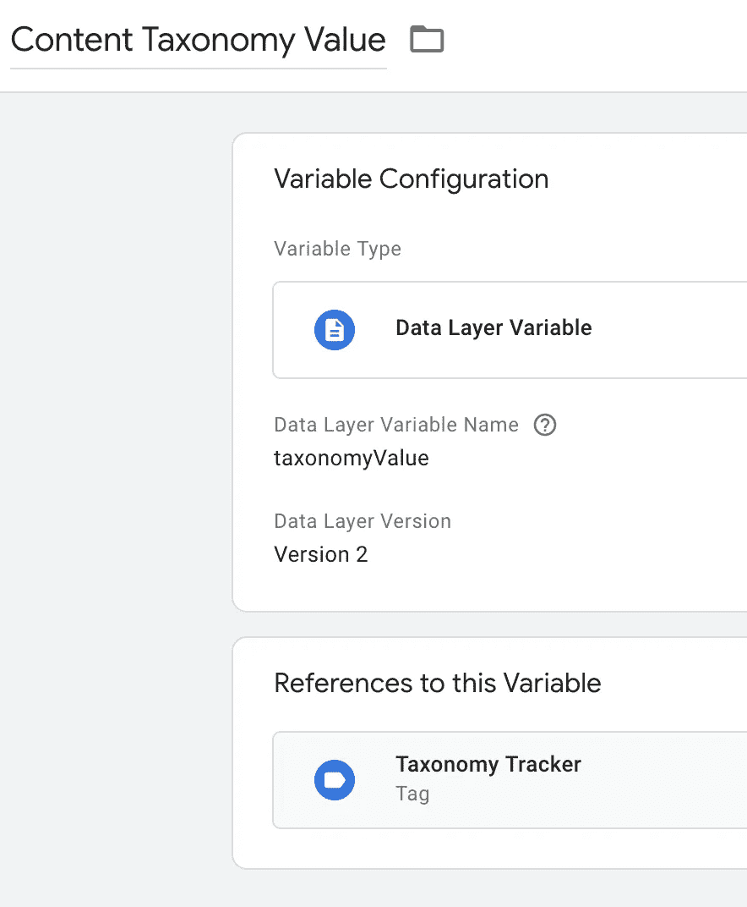

# 使用 Google Analytics 跟踪内容类别和标签

> 原文：<https://medium.com/swlh/track-content-categories-tags-with-google-analytics-9825fb2567e5>


*部分* [*谷歌博客分析包*](https://slideruletech.com/products/google-analytics-blog-package/?utm_campaign=ga-blog-package&utm_medium=article&utm_source=medium&utm_content=taxonomy-tracker-story) *。*

[下载模板](https://gist.github.com/kmclaugh/15a466fbf83b3138693953318354b774)。

大多数内容驱动的网站使用分类法，尤其是类别和标签来组织帖子。这是如此普遍，以至于几乎所有的内容管理系统，从 WordPress 到 Hugo，都有内置的类别和标签分类法。

然而，没有方便的方法在谷歌标签管理器中捕获这些分类，或者在谷歌分析中跟踪它们。[内容分组](https://www.lovesdata.com/blog/2015/blog-insights)只允许你在每页上设置一个分组，所以如果你有多个类别或者标签在同一个帖子上，那就不行了。

您可以将它们捕获为自定义维度(我就是这样做的)，但是您不能创建如上图所示的图表，因为所有分类的值都作为单个字符串存储在自定义维度中，如下所示:


要获得上面的图表，您需要一种方法来单独跟踪每个分类值(在本例中是每个类别)，如使用事件的[混合分析](https://mixedanalytics.com/blog/track-popular-blog-tags-categories-google-analytics/)所示。

有了这个分类法跟踪器模板，您现在无需编写任何 javascript 就可以做到这一点。分类追踪器与任何网站都兼容，但与 DuracellTomi 的 Google Tag Manager WordPress 插件配合得特别好。

以下是使用方法。

[*订阅我的简讯*](https://slideruletech.com/subscribe/tech-tips/?mcsul=https://medium.com/swlh/track-content-categories-tags-with-google-analytics-9825fb2567e5&)

# 目录

*   [安装](/p/9825fb2567e5#5e2c)
*   [如何使用](/p/9825fb2567e5#d4b0)
*   [创建一个分类值数组变量](/p/9825fb2567e5#c2bc)
*   [工作原理](/p/9825fb2567e5#a035)
*   [连接到谷歌分析](/p/9825fb2567e5#1c83)
*   [总结](/p/9825fb2567e5#bf0d)

# 装置

多亏了谷歌标签管理器新的[定制模板功能](https://www.simoahava.com/analytics/custom-templates-guide-for-google-tag-manager/)，安装分类标签只需要点击几次。

首先，在这里下载分类标签模板文件[。](https://gist.github.com/kmclaugh/15a466fbf83b3138693953318354b774)

接下来，在标签管理器容器中选择**模板** > **新建**。


然后，点击**三个点** > **导入**


上传[taxonomytrackertemplate . TPL](https://gist.github.com/kmclaugh/15a466fbf83b3138693953318354b774)文件，点击**保存**。


您已经安装了模板。现在让我们使用它。

# 如何使用它

一旦您安装了**分类跟踪器**，当您创建一个新标签时，您可以选择它作为“标签类型”。


这样做，您将看到以下配置选项。


对于**分类名称**选项，只需在 Google Analytics 中输入您想要的分类名称(稍后将详细介绍其工作原理)，在这种情况下，我称之为“类别”。

对于**分类值数组**，选择存储分类值数组(即类别列表)的标记管理器变量。

如何创建这个变量将取决于您的内容管理系统和 Google Tag Manager 设置。我将演示如何使用 WordPress 和 DuracellTomi 的 Google Tag Manager 插件设置变量。

## 创建分类值数组变量

在[你安装了 DuracellTomi 的插件](https://www.lovesdata.com/blog/2015/blog-insights#yui_3_17_2_1_1464690405930_121469)之后，你需要确保插件被配置为向数据层发送类别和标签，如下所示:


一旦插件被安装和配置，你可以在数据层中看到文章的类别和标签，分别在关键字“pageCategory”和“pageAttributes”下。


要在分类跟踪器中使用它们，只需为每个标签创建一个[标签管理器数据层变量](https://www.analyticsmania.com/post/data-layer-variable/#gref)。例如，为了捕获类别，我将创建一个数据层变量，如下所示:


现在，您已经在标记管理器变量中捕获了分类值，您只需在* *分类值数组* *配置选项的下拉菜单中选择它们，如下所示:


# 它是如何工作的

好了，现在我们已经设置了**分类跟踪器**并开始工作，我们可以将它连接到 Google Analytics 或任何其他使用的分析平台或营销服务。要做到这一点，我们首先要快速看一下**分类跟踪器**是做什么的。

在上一节中，我们将跟踪器的**分类名称**配置为“Categories ”,将**分类值数组**配置为`Page Categories - Array`变量，在本例中，变量的值为“python”和“google sheets”。

以下是跟踪器将对该配置进行的操作:

1.  循环遍历`Taxonomy Values Array`中的每个值
2.  激发一个名为`taxonomyTracker`的数据层事件
3.  将 datalayer 属性`taxonomyValue`设置为循环中的当前分类值(即首先是‘python’，然后是‘Google sheets’)
4.  将`taxonomyName`属性设置为给定的**分类名称**(即“类别”)

以下是第一个类别“python”的数据层外观:

```
{ event: 'taxonomyTracker', taxonomyValue: 'python', taxonomyName: 'Categories' }
```

对于第二个类别，“google sheets”:

```
{ event: 'taxonomyTracker', taxonomyValue: 'google sheets', taxonomyName: 'Categories' }
```

现在，只要您想将分类值分别归入某个服务，例如 Google Analytics，就可以使用 datalayer 事件`taxonomyTracker`作为触发器。

# 连接到谷歌分析

既然我们的**分类跟踪器**已经设置好了，并在数据层中为我们帖子的每个类别触发了一个`taxonomyTracker`事件，我们终于准备好配置它来将类别数据发送到 Google Analytics。

首先，我们想要捕获`taxonomyValue`和`taxonomyName`数据层属性作为[标签管理器数据层变量](https://www.analyticsmania.com/post/data-layer-variable/#gref)。

这些看起来是这样的:



然后，我们想为每个类别发送一个单独的[谷歌分析事件](https://support.google.com/analytics/answer/1033068?hl=en)。以下是我的谷歌分析事件标签的样子:


对于第一个类别，以下是该事件的情况:

```
Event Category = Content Categories Event Action = python Event Label = /post/integrate-google-sheets-and-jupyter-notebooks/
```

最后，我们需要为每个类别触发这个事件。为此，我们用`event name = "taxonomyTracker"`创建一个自定义[自定义事件触发器](https://support.google.com/tagmanager/answer/7679219?hl=en)，如下所示:


下面是我们最后的标签:


现在，分类跟踪器和[谷歌标签管理器定制模板](https://www.simoahava.com/analytics/custom-templates-guide-for-google-tag-manager/)的美妙之处就在这里。请注意，上述分析事件将在每次将`taxonomyTracker`事件推送到数据层时触发。这意味着它不仅会为我们创建的**内容类别分类跟踪器**标签中的每个类别触发，还会为我们创建的*任何* **分类跟踪器**标签中的每个分类值触发。

换句话说，我们要跟踪内容的标签分类(或作者或我们使用的任何其他分类)所要做的就是创建另一个**分类跟踪器**标签。例如，要将我们内容的标签分类数据发送到 Google Analytics，我们只需创建第二个**分类跟踪器**，如下所示:


我们已经创建的分析事件会将以下数据发送到 Google Analytics，而不做任何更改。

```
Event Category = Content Tags Event Action = tutorials Event Label = /post/integrate-google-sheets-and-jupyter-notebooks/
```

和

```
Event Category = Content Tags Event Action = jupyter notebooks Event Label = /post/integrate-google-sheets-and-jupyter-notebooks/
```

..等等

# 摘要

使用**分类法跟踪器**模板提供了一种一致而灵活的方法来跟踪所有内容的分类法。有了它，您可以创建图表，查看哪些分类受哪些读者欢迎，任何您想要的东西！

和往常一样，如果你在谷歌标签管理器中需要任何帮助，请随时联系。

如果你想使用我们的谷歌分析博客包，其中包括分类跟踪，[点击这里](https://slideruletech.com/products/google-analytics-blog-package/?utm_campaign=ga-blog-package&utm_medium=article&utm_source=medium&utm_content=taxonomy-tracker-story)。

*获取更多科技小技巧，* [*订阅我的简讯*](https://slideruletech.com/subscribe/tech-tips/?mcsul=https://medium.com/swlh/track-content-categories-tags-with-google-analytics-9825fb2567e5&) *！*

*原载于 2019 年 6 月 7 日*[*https://slideruletech.com*](https://slideruletech.com/posts/taxonomy-tracker-tag-manager-template/)*。*