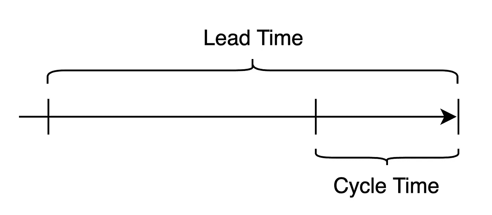

# 跟踪软件交付和产品速度

> 原文：<https://medium.com/swlh/tracking-software-delivery-and-product-velocity-1c455d4bf884>

我最近讨论了一些关于速度的问题。

*Photo by Mark Tuzman on Unsplash*

讨论围绕着一家公司的产品速度是如何下降的，以及他们是如何不能以需要的速度交付产品的。这在内部总是一个热门话题，因为创始人、领导者和团队总是希望提高产品速度。

虽然讨论具体谈到了产品速度，但他们更广泛地谈到了向客户交付价值的能力。

敏捷使得术语[速度](https://en.wikipedia.org/wiki/Velocity_(software_development))流行起来。它被定义为在一个**间隔**(通常是冲刺)内的**工作单元**。

速度的棘手部分是定义*工作单元*——因为它通常是一个相对的估计，例如故事点。如果估计值随着时间的推移保持一致，那么速度可以随着时间的推移进行比较(它们不需要精确，只要一致)。经过几次冲刺或几个月，这可能是准确的，但经过较长时间的一致性下降。评估随着团队、项目、产品和工作类型的变化而变化。

# 对额外指标的需求

没有质量指标，都是观点。通常是最响亮的声音或最资深的意见占主导地位，而不是事实。当我没有跟踪正确的指标时，我经历过很多次。

> *如果速度作为度量标准是有缺陷的，我们可以使用什么数据来跟踪软件交付？*

所有指标都可能存在缺陷，因此我们希望将整个 SDLC 中的多个指标结合起来，希望能够形成一个整体的图景。这将减少单个度量中的偏差和错误，并提供更可靠的数据来长期跟踪软件交付。

*   **顾客满意度** : [NPS](https://en.wikipedia.org/wiki/Net_Promoter) 或类似的来衡量顾客满意度。没有必要高效地交付客户不喜欢的功能。
*   **工程** : [交付周期](https://en.wikipedia.org/wiki/Lead_time)——从确定一个特性到交付该特性所用的时间。
*   **质量**:生产中发现的问题是质量和可持续工程流程的重要标志。
*   **生产**:解决或修复问题的平均时间([MTTR](https://en.wikipedia.org/wiki/Mean_time_to_repair))——解决问题所需的时间。

# 客户满意度— NPS

最重要的是确保我们朝着正确的方向前进。高效地交付客户不使用或不需要的功能没有多大价值！

有很多衡量客户满意度的指标。虽然我认为 NPS 是有缺陷的，但它并不比其他指标有更多或更少的缺陷，并且很容易跟踪。

# 工程—交付周期

摘自精益制造原则。在软件世界中，它是识别一个特性和交付该特性之间的时间。衡量交付周期的好处在于它鼓励许多良好的工程实践:

*   以更小的批量工作——降低风险和在制品(WIP ),增加吞吐量和迭代。
*   鼓励频繁部署—将交付时间作为向客户交付价值的衡量标准。
*   待办事项管理——评估向待办事项列表中添加项目，并删除不太可能交付的项目。

交付周期可以有选择地分为周期时间——从开发开始到交付的时间。测量提前期和周期可以从 3 个核心角度跟踪时间——客户/用户(总时间)、产品团队(积压工作的健康状况)和工程(构建和部署所需的时间)。

虽然跟踪交付周期有助于部署，但是跟踪部署频率作为另一个单独的指标也很有价值。

# 质量——生产中发现的问题

跟踪质量可以简单到记录在生产中发现了多少错误或问题。如果这种情况持续下去，警钟将会响起。

质量也可以通过部署问题来跟踪。部署需要是常规的，跟踪由发布引起的问题可以进一步洞察质量。

# 生产— MTTR

一旦在生产中发现问题，需要多长时间来解决？这是解决——MTTR——的时候了。

MTTR 的伟大之处——就像上面的指标一样——提供了对更广泛的软件工程过程以及生产和客户影响的洞察。

# 数据驱动的决策

我喜欢这些指标重叠的方式&鼓励开发运维文化。

他们每个人都能洞察整个产品工程流程以及每个关键组成部分(客户满意度、工程效率、质量和生产)。重叠提高了每个指标的质量，并提高了随时间跟踪的能力。这就是整个目标——随着时间的推移跟踪软件交付或速度。

当随着时间的推移被跟踪时，它们给出了软件交付问题或产品速度变化的早期指示。全部基于真实数据，而非观点或道听途说！

*原载于 2019 年 6 月 2 日*[*【https://www.tebray.com*](https://www.tebray.com/2019/06/02/Tracking-software-delivery.html)*。*